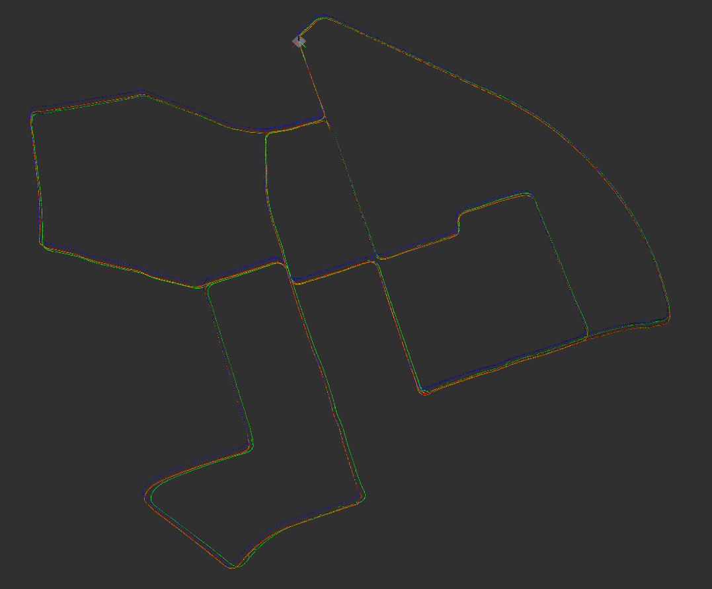

#### <font color='green'>按照课程讲述的模型，在提供的工程框架中，补全基于滑动窗口的融合定位方法的实现（整体思路本章第三小节已给出，代码实现可借鉴lio-mapping），并分别与不加融合、EKF融合的效果做对比。</font>

## 评价标准：

## 1）及格：补全代码，且功能正常。

## 2）良好：实现功能的基础上，性能在部分路段比EKF有改善。

## 3）优秀：由于基于滑窗的方法中，窗口长度对最终的性能有很大的影响，请在良好的基础上，提供不同窗口长度下的融合结果，并对效果及原因做对比分析。

## 1）及格：

#### 基于地图定位的滑动窗口模型，图优化模型中，窗口优化模型表示如下：

$$
\mathbf{J}^{\top} \boldsymbol{\Sigma} \mathbf{J} \delta \boldsymbol{x}=-\mathbf{J}^{\top} \boldsymbol{\Sigma} \mathbf{r}
$$
#### 其中，$r$是残差，$J$是残差关于状态量的雅可比，$\sum$是信息矩阵。

#### 在kitti工程中，基于地图定位的滑动窗口，其残差包括：

#### 1）地图匹配位姿和优化变量的残差

#### 2）激光里程计相对位姿和优化变量的残差

#### 3） IMU预积分和优化变量的残差

#### 4）边缘化形成的先验因子对应的残差

#### 残差模块：

### （1）Relative Pose from Lidar Frontend:

#### 激光里程计相对位姿和优化变量的残差，该残差对应的因子为激光里程计因子，一个因子约束两个位姿，其模型如下：


#### 残差关于优化变量的雅可比，表示如下：


#### 所以，对应的Hessian矩阵可看作：


#### 公式推导：


#### 代码补充<font color='green'>（/lidar_localization/include/lidar_localization/models/sliding_window/factors/factor_prvag_relative_pose.hpp）：</font>

```c++
    //
    // TODO: get square root of information matrix:
    //
    Eigen::Matrix<double, 6, 6> sqrt_info = Eigen::LLT<Eigen::Matrix<double, 6, 6>>(I_).matrixL().transpose();

    //
    // TODO: compute residual:
    //
    Eigen::Map<Eigen::Matrix<double, 6, 1>> residual(residuals);

    residual.block(INDEX_P, 0, 3, 1) = ori_i.inverse() * (pos_j - pos_i) - pos_ij;
    residual.block(INDEX_R, 0, 3, 1) = (ori_i.inverse() * ori_j * ori_ij.inverse()).log();
    //
    // TODO: compute jacobians:
    //
    if ( jacobians ) {
      // compute shared intermediate results:
      const Eigen::Matrix3d R_i_inv = ori_i.inverse().matrix();
      const Eigen::Matrix3d J_r_inv = JacobianRInv(residual.block(INDEX_R, 0, 3, 1));
      if ( jacobians[0] ) {
        // implement computing:
        Eigen::Map<Eigen::Matrix<double, 6,15, Eigen::RowMajor>> jacobian_i(jacobians[0]);
        jacobian_i.setZero();

        jacobian_i.block<3, 3>(INDEX_P, INDEX_P) = -R_i_inv;
        jacobian_i.block<3, 3>(INDEX_R, INDEX_R) = -J_r_inv * (ori_ij * ori_j.inverse() * ori_j).matrix();

        jacobian_i = sqrt_info * jacobian_i;
      }

      if ( jacobians[1] ) {
        // implement computing:
        Eigen::Map<Eigen::Matrix<double, 6, 15, Eigen::RowMajor>> jacobian_j(jacobians[1]);
        jacobian_j.setZero();

        jacobian_j.block<3, 3>(INDEX_P, INDEX_P) = R_i_inv;
        jacobian_j.block<3, 3>(INDEX_R, INDEX_R) = J_r_inv * ori_ij.matrix();

        jacobian_j = sqrt_info * jacobian_j;
      }
    }

    //
    // TODO: correct residual by square root of information matrix:
    //
    residual = sqrt_info * residual;
    
    return true;
  }

```

### （2）Map Matching

#### 地图匹配位姿和优化变量的残差，该残差对应的因子为地图先验因子，一个因子仅仅约束一个位姿，其模型如下：


#### 残差关于优化变量的雅可比，可视化如下：


#### 因此，对应的Hessian矩阵可视觉化：


#### 公式推导：


#### 代码补充：<font color='green'>(/lidar_localization/include/lidar_localization/models/sliding_window/factors/factor_prvag_map_matching_pose.hpp)</font>

```c++
    //
    // TODO: get square root of information matrix:
    //
    Eigen::Matrix<double, 6, 6> sqrt_info = Eigen::LLT<Eigen::Matrix<double, 6, 6>>(I_).matrixL().transpose();

    //
    // TODO: compute residual:
    //
    Eigen::Map<Eigen::Matrix<double, 6, 1>> residual(residuals);

    residual.block(INDEX_P, 0, 3, 1) = pos - pos_prior;
    residual.block(INDEX_R, 0, 3, 1) = (ori * ori_prior.inverse()).log();

    //
    // TODO: compute jacobians:
    //
    if ( jacobians ) {
      if ( jacobians[0] ) {
        // implement jacobian computing:
        Eigen::Map<Eigen::Matrix<double, 6, 15, Eigen::RowMajor>> jacobian_prior(jacobians[0]);
        jacobian_prior.setZero();

        jacobian_prior.block<3, 3>(INDEX_P, INDEX_P) = Eigen::Matrix3d::Identity();
        jacobian_prior.block<3, 3>(INDEX_R, INDEX_R) = JacobianRInv(residual.block(INDEX_R, 0, 3, 1)) * ori_prior.matrix();

        jacobian_prior = sqrt_info * jacobian_prior;
      }
    }

    //
    // TODO: correct residual by square root of information matrix:
    //
		residual = sqrt_info * residual;
    
    return true;
```


## （3）IMU pre-integration

#### 该残差对应的因子为IMU因子，一个因子约束两个位姿，并约束两个时刻IMU的速度和bias。


#### 残差关于优化变量的雅可比，可视化如下：


#### 因此，对应的Hessian矩阵可视化为：


#### 公式推导：


#### 代码补充：<font color='green'>(lidar_localization/include/lidar_localization/models/sliding_window/factors/factor_prvag_imu_pre_integration.hpp)</font>

```c++
//
    // TODO: get square root of information matrix:
    //
    Eigen::Matrix<double, 15, 15> sqrt_info = Eigen::LLT<Eigen::Matrix<double, 15, 15>>(I_).matrixL().transpose();

    //
    // TODO: compute residual:
    //
    Eigen::Map<Eigen::Matrix<double, 15, 1>> residual(residuals);

    residual.block<3, 1>(INDEX_P, 0) = ori_i.inverse().matrix() * (pos_j - pos_i - (vel_i - 0.5 * g_ * T_) * T_) - alpha_ij;
    residual.block<3, 1>(INDEX_R, 0) = (Sophus::SO3d::exp(theta_ij).inverse() * ori_i.inverse() * ori_j).log();
    residual.block<3, 1>(INDEX_V, 0) = ori_i.inverse().matrix() * (vel_j - vel_i + g_ * T_) - beta_ij;
    residual.block<3, 1>(INDEX_A, 0) = b_a_j - b_a_i;
    residual.block<3, 1>(INDEX_G, 0) = b_g_j - b_g_i;
    //
    // TODO: compute jacobians:
    //
    if ( jacobians ) {
      // compute shared intermediate results:
      const Eigen::Matrix3d R_i_inv = ori_i.inverse().matrix();
      const Eigen::Matrix3d J_r_inv = JacobianRInv(residual.block(INDEX_R, 0, 3, 1));

      if ( jacobians[0] ) {
        Eigen::Map<Eigen::Matrix<double, 15, 15, Eigen::RowMajor>> jacobian_i(jacobians[0]);
        jacobian_i.setZero();

        // a. residual, position:
        jacobian_i.block<3, 3>(INDEX_P, INDEX_P) = -R_i_inv;
        jacobian_i.block<3, 3>(INDEX_P, INDEX_R) = Sophus::SO3d::hat(ori_i.inverse() * (pos_j - pos_i - (vel_i - 0.5 * g_ * T_) * T_));
        jacobian_i.block<3, 3>(INDEX_P, INDEX_V) = -T_ * R_i_inv;
        jacobian_i.block<3, 3>(INDEX_P, INDEX_A) = -J_.block<3, 3>(INDEX_P, INDEX_A);
        jacobian_i.block<3, 3>(INDEX_P, INDEX_G) = -J_.block<3, 3>(INDEX_P, INDEX_G);

        // b. residual, orientation:
        jacobian_i.block<3, 3>(INDEX_R, INDEX_R) = -J_r_inv * (ori_j.inverse() * ori_i).matrix();
        jacobian_i.block<3, 3>(INDEX_R, INDEX_G) = -J_r_inv * (Sophus::SO3d::exp(residual.block<3, 1>(INDEX_R, 0)).matrix().inverse() * J_.block<3, 3>(INDEX_R, INDEX_G));
        
        // c. residual, velocity:
        jacobian_i.block<3, 3>(INDEX_V, INDEX_R) = Sophus::SO3d::hat(ori_i.inverse() * (vel_j - vel_i + g_ * T_));
        jacobian_i.block<3, 3>(INDEX_V, INDEX_V) = -R_i_inv;
        jacobian_i.block<3, 3>(INDEX_V, INDEX_A) = -J_.block<3, 3>(INDEX_V, INDEX_A);
        jacobian_i.block<3, 3>(INDEX_V, INDEX_G) = -J_.block<3, 3>(INDEX_V, INDEX_G);

        // d. residual, bias accel:
        jacobian_i.block<3, 3>(INDEX_A, INDEX_A) = -Eigen::Matrix3d::Identity();

        // d. residual, bias accel:
        jacobian_i.block<3, 3>(INDEX_G, INDEX_G) = -Eigen::Matrix3d::Identity();

        jacobian_i = sqrt_info * jacobian_i;
      }

      if ( jacobians[1] ) {
        Eigen::Map<Eigen::Matrix<double, 15, 15, Eigen::RowMajor>> jacobian_j(jacobians[1]);
        jacobian_j.setZero();

        // a. residual, position:
        jacobian_j.block<3, 3>(INDEX_P, INDEX_P) = R_i_inv;

        // b. residual, orientation:
        jacobian_j.block<3, 3>(INDEX_R, INDEX_R) = J_r_inv;

        // c. residual, velocity:
        jacobian_j.block<3, 3>(INDEX_V, INDEX_V) = R_i_inv;

        // d. residual, bias accel:
        jacobian_j.block<3, 3>(INDEX_A, INDEX_A) = Eigen::Matrix3d::Identity();

        // d. residual, bias accel:
        jacobian_j.block<3, 3>(INDEX_G, INDEX_G) = Eigen::Matrix3d::Identity();

        jacobian_j = sqrt_info * jacobian_j;
      }
    }

    //
    // TODO: correct residual by square root of information matrix:
    //
		residual = sqrt_info * residual;
    
    return true;
  }
```

## （4）Sliding Window Marginalization

#### 1）移除老的帧

#### 上述过程，通过可视化可以表示为：


#### Marginalization的实现理念参考关键计算步骤的推导：


#### 代码补充：<font color='green'>(/lidar_localization/include/lidar_localization/models/sliding_window/factors/factor_prvag_marginalization.hpp)</font>

```c++
    //
    // TODO: Update H:
    //
    // a. H_mm:
    H_.block<15, 15>(INDEX_M, INDEX_M) += J_m.transpose() * J_m;

    //
    // TODO: Update b:
    //
    // a. b_m:
    b_.block<15, 1>(INDEX_M, 0) += J_m.transpose() * residuals;
  }

  void SetResRelativePose(
    const ceres::CostFunction *residual,
    const std::vector<double *> &parameter_blocks
  ) {
    // init:
    ResidualBlockInfo res_relative_pose(residual, parameter_blocks);
    Eigen::VectorXd residuals;
    std::vector<Eigen::Matrix<double, Eigen::Dynamic, Eigen::Dynamic, Eigen::RowMajor>> jacobians;

    // compute:
    Evaluate(res_relative_pose, residuals, jacobians);
    const Eigen::MatrixXd &J_m = jacobians.at(0);
    const Eigen::MatrixXd &J_r = jacobians.at(1);

    //
    // TODO: Update H:
    //
    // a. H_mm:
    H_.block<15, 15>(INDEX_M, INDEX_M) += J_m.transpose() * J_m;

    // b. H_mr:
    H_.block<15, 15>(INDEX_M, INDEX_R) += J_m.transpose() * J_r;

    // c. H_rm:
    H_.block<15, 15>(INDEX_R, INDEX_M) += J_r.transpose() * J_m;

    // d. H_rr:
    H_.block<15, 15>(INDEX_R, INDEX_R) += J_r.transpose() * J_r;

    //
    // TODO: Update b:
    //
    // a. b_m:
    b_.block<15, 1>(INDEX_M, 0) += J_m.transpose() * residuals;

    // a. b_r:
    b_.block<15, 1>(INDEX_R, 0) += J_r.transpose() * residuals;
  }

  void SetResIMUPreIntegration(
    const ceres::CostFunction *residual,
    const std::vector<double *> &parameter_blocks
  ) {
    // init:
    ResidualBlockInfo res_imu_pre_integration(residual, parameter_blocks);
    Eigen::VectorXd residuals;
    std::vector<Eigen::Matrix<double, Eigen::Dynamic, Eigen::Dynamic, Eigen::RowMajor>> jacobians;

    // compute:
    Evaluate(res_imu_pre_integration, residuals, jacobians);
    const Eigen::MatrixXd &J_m = jacobians.at(0);
    const Eigen::MatrixXd &J_r = jacobians.at(1);

    //
    // TODO: Update H:
    //
    // a. H_mm:
    H_.block<15, 15>(INDEX_M, INDEX_M) += J_m.transpose() * J_m;

    // b. H_mr:
    H_.block<15, 15>(INDEX_M, INDEX_R) += J_m.transpose() * J_r;
    
    // c. H_rm:
    H_.block<15, 15>(INDEX_R, INDEX_M) += J_r.transpose() * J_m;

    // d. H_rr:
    H_.block<15, 15>(INDEX_R, INDEX_R) += J_r.transpose() * J_r;

    //
    // Update b:
    //
    // a. b_m:
    b_.block<15, 1>(INDEX_M, 0) += J_m.transpose() * residuals;

    // b. b_r:
    b_.block<15, 1>(INDEX_R, 0) += J_r.transpose() * residuals;

  }

  void Marginalize(
    const double *raw_param_r_0
  ) {
    // TODO: implement marginalization logic
    Eigen::Map<const Eigen::Matrix<double, 15, 1>> x_0(raw_param_r_0);
    x_0_ = x_0;

    const Eigen::MatrixXd &H_mm = H_.block<15, 15>(INDEX_M, INDEX_M);
    const Eigen::MatrixXd &H_mr = H_.block<15, 15>(INDEX_M, INDEX_R);
    const Eigen::MatrixXd &H_rm = H_.block<15, 15>(INDEX_R, INDEX_M);
    const Eigen::MatrixXd &H_rr = H_.block<15, 15>(INDEX_R, INDEX_R);

    const Eigen::VectorXd &b_m = b_.block<15, 1>(INDEX_M, 0);
    const Eigen::VectorXd &b_r = b<font color='green'>_.block<15, 1>(INDEX_R, 0);

    Eigen::MatrixXd H_mm_inv = H_mm.inverse();
    Eigen::MatrixXd H_marginalized = H_rr - H_rm * H_mm_inv * H_mr;
    Eigen::MatrixXd b_marginalized = b_r - H_rm * H_mm_inv * b_m;

    Eigen::SelfAdjointEigenSolver<Eigen::MatrixXd> saes(H_marginalized);
    Eigen::VectorXd S = Eigen::VectorXd((saes.eigenvalues().array() > 1.0e-5).select(saes.eigenvalues().array(), 0));
    Eigen::VectorXd S_inv = Eigen::VectorXd((saes.eigenvalues().array() > 1.0e-5).select(saes.eigenvalues().array().inverse(), 0));

    Eigen::VectorXd S_sqrt = S.cwiseSqrt();
    Eigen::VectorXd S_inv_sqrt = S_inv.cwiseSqrt();

    J_ = S_sqrt.asDiagonal() * saes.eigenvectors().transpose();
    e_ = S_inv_sqrt.asDiagonal() * saes.eigenvectors().transpose() * b_marginalized;
  }

  virtual bool Evaluate(double const *const *parameters, double *residuals, double **jacobians) const {	
    //
    // parse parameters:
    //
    Eigen::Map<const Eigen::Matrix<double, 15, 1>> x(parameters[0]);
    Eigen::VectorXd dx = x - x_0_;

    //
    // TODO: compute residual:
    //
    Eigen::Map<Eigen::Matrix<double, 15, 1>> residual(residuals);
    residual = e_ + J_ * dx;

    //
    // TODO: compute jacobian:
    //
    if ( jacobians ) {
      if ( jacobians[0] ) {
        // implement computing:
        Eigen::Map<Eigen::Matrix<double, 15, 15, Eigen::RowMajor>> jacobian_marginalization(jacobians[0]);
        jacobian_marginalization.setZero();

        jacobian_marginalization = J_;
      }
    }

    return true;
  }

```

#### 代码补充：<font color='green'>(/lidar_localization/src/matching/back_end/sliding_window.cpp)</font>

```c++
// TODO: add init key frame
        sliding_window_ptr_->AddPRVAGParam(last_key_frame_, true);
    } else {
        // TODO: add current key frame
        sliding_window_ptr_->AddPRVAGParam(last_key_frame_, false);c++
    }

    // get num. of vertices:
    const int N = sliding_window_ptr_->GetNumParamBlocks();
    // get param block ID, current:
    const int param_index_j = N - 1;

    //
    // add unary constraints:
    //
    //c++
    // a. map matching / GNSS position:
    //
    if ( N > 0 && measurement_config_.source.map_matching ) {
        // get prior position measurement:
        Eigen::Matrix4d prior_pose = current_map_matching_pose_.pose.cast<double>();

        // TODO: add constraint, GNSS position:
        sliding_window_ptr_->AddPRVAGMapMatchingPoseFactor(param_index_j, prior_pose, measurement_config_.noise.map_matching);
    }

    //
    // add binary constraints:
    //
    if ( N > 1 ) {
        // get param block ID, previous:
        const int param_index_i = N - 2;
        
        //
        // a. lidar frontend:
        //
        // get relative pose measurement:
        Eigen::Matrix4d relative_pose = (last_key_frame_.pose.inverse() * current_key_frame_.pose).cast<double>();
        // TODO: add constraint, lidar frontend / loop closure detection:
        sliding_window_ptr_->AddPRVAGRelativePoseFactor(param_index_i, param_index_j, relative_pose, measurement_config_.noise.lidar_odometry);
        c++
        //
        // b. IMU pre-integration:
        //
        if ( measurement_config_.source.imu_pre_integration ) {
            // TODO: add constraint, IMU pre-integraion:
            sliding_window_ptr_->AddPRVAGIMUPreIntegrationFactor(param_index_i, param_index_j, imu_pre_integration_);
        }
    }

    // move forward:
    last_key_frame_ = current_key_frame_;

    return true;
```

#### 代码补充：<font color='green'>(lidar_localization/src/models/sliding_window/ceres_sliding_window.cpp)</font>

```c++
// TODO: create new sliding window optimization problem:
        ceres::Problem problem;

        // TODO: a. add parameter blocks:
        for ( int i = 1; i <= kWindowSize + 1; ++i) {
            auto &target_key_frame = optimized_key_frames_.at(N - i);

            ceres::LocalParameterization *local_parameterization = new sliding_window::ParamPRVAG();

            // TODO: add parameter block:
            problem.AddParameterBlock(target_key_frame.prvag, 15, local_parameterization);

            if(target_key_frame.fixed){
                problem.SetParameterBlockConstant(target_key_frame.prvag);
            }
        }

        // TODO: add residual blocks:
        // b.1. marginalization constraint:
        if (
            !residual_blocks_.map_matching_pose.empty() && 
            !residual_blocks_.relative_pose.empty() && 
            !residual_blocks_.imu_pre_integration.empty()
        ) {
            auto &key_frame_m = optimized_key_frames_.at(N - kWindowSize - 1);
            auto &key_frame_r = optimized_key_frames_.at(N - kWindowSize - 0);

            const ceres::CostFunction *factor_map_matching_pose = GetResMapMatchingPose(
                residual_blocks_.map_matching_pose.front()
            );
            const ceres::CostFunction *factor_relative_pose = GetResRelativePose(
                residual_blocks_.relative_pose.front()
            );
            const ceres::CostFunction *factor_imu_pre_integration = GetResIMUPreIntegration(
                residual_blocks_.imu_pre_integration.front()
            );

            sliding_window::FactorPRVAGMarginalization *factor_marginalization = new sliding_window::FactorPRVAGMarginalization();

            factor_marginalization->SetResMapMatchingPose(
                factor_map_matching_pose, 
                std::vector<double *>{key_frame_m.prvag}
            );
            factor_marginalization->SetResRelativePose(
                factor_relative_pose,
                std::vector<double *>{key_frame_m.prvag, key_frame_r.prvag}
            );
            factor_marginalization->SetResIMUPreIntegration(
                factor_imu_pre_integration,
                std::vector<double *>{key_frame_m.prvag, key_frame_r.prvag}
            );
            factor_marginalization->Marginalize(key_frame_r.prvag);

            // add marginalization factor into sliding window
            problem.AddResidualBlock(
                factor_marginalization,
                NULL,
                key_frame_r.prvag
            );

            residual_blocks_.map_matching_pose.pop_front();
            residual_blocks_.relative_pose.pop_front();
            residual_blocks_.imu_pre_integration.pop_front();
        }

        // TODO: b.2. map matching pose constraint:
        if ( !residual_blocks_.map_matching_pose.empty() ) {
            for ( const auto &residual_map_matching_pose: residual_blocks_.map_matching_pose ) {
                auto &key_frame = optimized_key_frames_.at(residual_map_matching_pose.param_index);

                sliding_window::FactorPRVAGMapMatchingPose *factor_map_matching_pose = GetResMapMatchingPose(
                    residual_map_matching_pose
                );

                // TODO: add map matching factor into sliding window
                problem.AddResidualBlock(
                    factor_map_matching_pose,
                    NULL,
                    key_frame.prvag
                );
            }            
        }

        // TODO: b.3. relative pose constraint:
        if ( !residual_blocks_.relative_pose.empty() ) {
            for ( const auto &residual_relative_pose: residual_blocks_.relative_pose ) {
                auto &key_frame_i = optimized_key_frames_.at(residual_relative_pose.param_index_i);
                auto &key_frame_j = optimized_key_frames_.at(residual_relative_pose.param_index_j);

                sliding_window::FactorPRVAGRelativePose *factor_relative_pose = GetResRelativePose(
                    residual_relative_pose
                );

                // TODO: add relative pose factor into sliding window
                problem.AddResidualBlock(
                    factor_relative_pose,
                    NULL,
                    key_frame_i.prvag, 
                    key_frame_j.prvag
                );
            }
        }

        // TODO: b.4. IMU pre-integration constraint
        if ( !residual_blocks_.imu_pre_integration.empty() ) {
            for ( const auto &residual_imu_pre_integration: residual_blocks_.imu_pre_integration ) {
                auto &key_frame_i = optimized_key_frames_.at(residual_imu_pre_integration.param_index_i);
                auto &key_frame_j = optimized_key_frames_.at(residual_imu_pre_integration.param_index_j);

                sliding_window::FactorPRVAGIMUPreIntegration *factor_imu_pre_integration = GetResIMUPreIntegration(
                    residual_imu_pre_integration
                );

                // TODO: add IMU factor into sliding window
                problem.AddResidualBlock(
                    factor_imu_pre_integration,
                    NULL,
                    key_frame_i.prvag, 
                    key_frame_j.prvag
                );
            }
        }
```


#### 运行结果：

#### 轨迹图：



#### 使用下面命令比较优化算法得到的定位结果和真实值的比较：

```bash
$ evo_ape kitti ground_truth.txt optimized.txt -r full --plot --plot_mode xyz -a
APE w.r.t. full transformation (unit-less)
(with SE(3) Umeyama alignment)

       max	3.081405
      mean	0.938404
    median	0.803200
       min	0.038019
      rmse	1.078757
       sse	5286.767707
       std	0.532086

```


 

