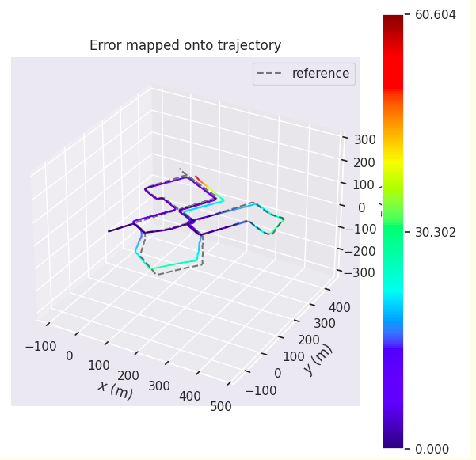

内容：

在提供的工程框架上，结合实际数据集，实现前端激光里程计，并使用evo测试其精度

评价标准：

1）及格：跑通提供的工程框架

2）良好：使用evo计算出分段统计误差和整体轨迹误差

3）优秀：自己实现点云匹配方法，而不是直接调用pcl库的匹配方法，并使用evo计算出指标。


*1）及格*

使用命令保存全局地图：

```bash
rosservice call /save_map
```

使用命令查看保存地图：

```bash
pcl_viewer map.pcd
```

PCL_NDT:

全局地图：


局部地图：


PCL_ICP:

全局地图：


局部地图：


黄色线表示真实值GNSS的定位结果，红色线表示激光里程计的定位结果。

*2）良好*

分段统计误差运行指令：

```bash
evo_rpe kitti -a ground_truth.txt laser_odom.txt -r trans_part --delta 100 --plot --plot_mode xyz 
```

ICP和NDT结果对比：

<div class="wiz-table-container" style="position: relative; padding: 0px;" contenteditable="false"><div class="wiz-table-body" contenteditable="false"><table style="width: 1195px;"><tbody><tr><td align="left" valign="middle" style="width: 197px;"><div>分段统计误差</div></td><td align="left" valign="middle" style="width: 141px;"><div>max</div></td><td align="left" valign="middle" style="width: 140px;"><div>mean</div></td><td align="left" valign="middle" style="width: 142px;"><div>median</div></td><td align="left" valign="middle" style="width: 140px;"><div>min</div></td><td align="left" valign="middle" style="width: 137px;"><div>rmse</div></td><td align="left" valign="middle" style="width: 154px;"><div>sse</div></td><td align="left" valign="middle" style="width: 143px;"><div>std</div></td></tr><tr><td align="left" valign="middle" style="width: 197px;"><div>PCL_NDT</div></td><td align="left" valign="middle" style="width: 141px;"><div>2.558918</div></td><td align="left" valign="middle" style="width: 140px;"><div>0.869240</div></td><td align="left" valign="middle" style="width: 142px;"><div>0.763856</div></td><td align="left" valign="middle" style="width: 140px;"><div>0.176107</div></td><td align="left" valign="middle" style="width: 137px;"><div>0.993275</div></td><td align="left" valign="middle" style="width: 154px;"><div>38.477235</div></td><td align="left" valign="middle" style="width: 143px;"><div>0.480643</div></td></tr><tr><td align="left" valign="middle" style="width: 197px;"><div>PCL_ICP</div></td><td align="left" valign="middle" style="width: 141px;"><div>277.272412</div></td><td align="left" valign="middle" style="width: 140px;"><div> 59.495329</div></td><td align="left" valign="middle" style="width: 142px;"><div>28.539019</div></td><td align="left" valign="middle" style="width: 140px;"><div>0.348698</div></td><td align="left" valign="middle" style="width: 137px;"><div>92.620375</div></td><td align="left" valign="middle" style="width: 154px;"><div>386034.025493</div></td><td align="left" valign="middle" style="width: 143px;"><div>70.984785</div></td></tr></tbody></table></div></div>


PCL_ICP:


PCL_NDT:


整体轨迹误差运行指令：

```bash
evo_ape kitti ground_truth.txt laser_odom.txt -r full --plot --plot_mode xyz
```

ICP和NDT结果对比：

<div class="wiz-table-container" style="position: relative; padding: 0px;" contenteditable="false"><div class="wiz-table-body" contenteditable="false"><table style="width: 1195px;"><tbody><tr><td align="left" valign="middle" style="width: 197px;"><div>分段统计误差</div></td><td align="left" valign="middle" style="width: 141px;"><div>max</div></td><td align="left" valign="middle" style="width: 140px;"><div>mean</div></td><td align="left" valign="middle" style="width: 142px;"><div>median</div></td><td align="left" valign="middle" style="width: 140px;"><div>min</div></td><td align="left" valign="middle" style="width: 137px;"><div>rmse</div></td><td align="left" valign="middle" style="width: 154px;"><div>sse</div></td><td align="left" valign="middle" style="width: 143px;"><div>std</div></td></tr><tr><td align="left" valign="middle" style="width: 197px;"><div>PCL_NDT</div></td><td align="left" valign="middle" style="width: 141px;"><div>60.603878</div></td><td align="left" valign="middle" style="width: 140px;"><div>14.424296</div></td><td align="left" valign="middle" style="width: 142px;"><div>10.515596</div></td><td align="left" valign="middle" style="width: 140px;"><div>0.000001</div></td><td align="left" valign="middle" style="width: 137px;"><div>17.728936</div></td><td align="left" valign="middle" style="width: 154px;"><div>1224886.225163</div></td><td align="left" valign="middle" style="width: 143px;"><div>10.30799</div></td></tr><tr><td align="left" valign="middle" style="width: 197px;"><div>PCL_ICP</div></td><td align="left" valign="middle" style="width: 141px;"><div>1023.246462</div></td><td align="left" valign="middle" style="width: 140px;"><div>352.875745</div></td><td align="left" valign="middle" style="width: 142px;"><div>304.895038</div></td><td align="left" valign="middle" style="width: 140px;"><div>0.000001</div></td><td align="left" valign="middle" style="width: 137px;"><div>480.564659</div></td><td align="left" valign="middle" style="width: 154px;"><div>941552128.918073</div></td><td align="left" valign="middle" style="width: 143px;"><div>326.222470</div></td></tr></tbody></table></div></div>

PCL_ICP:


PCL_NDT:




*3）优秀*

这里，PCL_ICP使用的是基于SVD的方法来求解。作业部分考虑使用高斯牛顿法来求解ICP问题。

*编程思路：*

这里用到了李代数，基于优化的ICP对应的雅可比推导在李代数模式下会更加简洁，所以会用到sophus库。将sophus库放到了lidar_localization/modules里面，并且在lidar_localization/cmake里面添加sophus.cmake，并在lidar_localization文件夹的cmakelists.txt里面添加include(cmake/sophus.cmake)。


*新建立icp_manual_registration.hpp以及icp_manual_registration.cpp*

```c++
//
// Created by sjl on 21-1-27.
//

#ifndef LIDAR_LOCALIZATION_MODELS_REGISTRATION_ICP_MANUA_REGISTRATIONL_HPP_
#define LIDAR_LOCALIZATION_MODELS_REGISTRATION_ICP_MANUAL_REGISTRATION_HPP_

#include <pcl/registration/icp.h>
#include <pcl/kdtree/kdtree_flann.h>
#include "lidar_localization/models/registration/registration_interface.hpp" ///配准接口
#include "se3.hpp"

namespace lidar_localization {
    class ICPManualRegistration: public RegistrationInterface {
    public:
        ICPManualRegistration(const YAML::Node  &node);
        ICPManualRegistration(float max_correspond_dis,  int max_iter);

        bool SetInputTarget(const CloudData::CLOUD_PTR   &input_target) override;
        bool ScanMatch(const CloudData::CLOUD_PTR   &input_source,
                       const Eigen::Matrix4f    &predict_pose,
                       CloudData::CLOUD_PTR   &result_cloud_ptr,
                       Eigen::Matrix4f   &result_pose) override;

    private:
        bool SetRegistrationParam(float max_correspond_dis,int  max_iter);
        void calculateTrans(const CloudData::CLOUD_PTR   &input_cloud );///计算旋转矩阵

    private:
        CloudData::CLOUD_PTR target_cloud_;
        pcl::KdTreeFLANN<CloudData::POINT>::Ptr  kdtree_ptr_;
        float max_correspond_distance_;     ///阈值
        int max_iterator_;                                     ///最大迭代次数

        Eigen::Matrix3f  rotation_matrix_;       ///旋转矩阵
        Eigen::Vector3f  translation_;                 ///平移矩阵
        Eigen::Matrix4f  transformation_;       ///转换矩阵

    };
}

#endif
```


```c++
//
// Created by sjl on 21-1-27.
//

#include "lidar_localization/models/registration/icp_manual_registration.hpp"
#include "glog/logging.h"
#include <Eigen/Dense>

namespace lidar_localization {

    ICPManualRegistration::ICPManualRegistration(const YAML::Node& node)
            :  kdtree_ptr_(new pcl::KdTreeFLANN<CloudData::POINT>)  {
        float max_correspond_dis  =  node["max_correspondence_distance"].as<float>(); ///获取参数
        int  max_iter  =  node["max_iter"].as<int>();      ///最大迭代次数
        SetRegistrationParam(max_correspond_dis,  max_iter);
    }

    ICPManualRegistration::ICPManualRegistration(float max_correspond_dis,
                                                   int max_iter)
            :  kdtree_ptr_(new pcl :: KdTreeFLANN<CloudData :: POINT> )   {
        SetRegistrationParam(max_correspond_dis,max_iter);
    }

    bool  ICPManualRegistration::SetRegistrationParam(float max_correspond_dis, int  max_iter){
        max_correspond_distance_  = max_correspond_dis;
        max_iterator_ =  max_iter;
        LOG(INFO)     <<  "ICP_Manual的匹配参数为 :   "   << std::endl
                      << "max_correspond_dis:  "       <<  max_correspond_dis  << ", "
                      << "max_iter:  "      <<  max_iter   <<  std::endl
                      << std :: endl;
        return true;
    }

    bool ICPManualRegistration::SetInputTarget(
            const CloudData::CLOUD_PTR& input_target)   {
        target_cloud_.reset(new CloudData::CLOUD);
        target_cloud_ = input_target;
        kdtree_ptr_ ->setInputCloud(input_target);
        return   true;
    }

    bool ICPManualRegistration::ScanMatch(const CloudData::CLOUD_PTR   &input_source,
                                          const Eigen::Matrix4f& predict_pose,
                                          CloudData::CLOUD_PTR& result_cloud_ptr,
                                          Eigen::Matrix4f& result_pose) {
        transformation_  = predict_pose;
        rotation_matrix_ = transformation_.block<3,  3>(0,  0) ;    ///取旋转矩阵
        translation_  = transformation_.block<3,  1>(0,  3);                      ///取平移矩阵

        calculateTrans(input_source);       ///计算变换矩阵


        pcl::transformPointCloud(*input_source,   *result_cloud_ptr,  transformation_);   /// 对点云进行变换
        result_pose = transformation_;

        return true;
    }

    void ICPManualRegistration::calculateTrans(const CloudData::CLOUD_PTR   &input_source){
        CloudData::CLOUD_PTR  transformed_cloud(new CloudData::CLOUD);
        int knn = 1;     /// 进行 1nn的搜索
        int iterator_num = 0;
        while(iterator_num < max_iterator_)
        {
            pcl::transformPointCloud(*input_source,*transformed_cloud,transformation_);    /// 对点云进行变换
            Eigen::Matrix<float,6,6> Hessian;
            Eigen::Matrix<float,6,1>B;
            Hessian.setZero();
            B.setZero();     /// 归零

            for(size_t i =0; i < transformed_cloud->size();  ++i)
            {
                auto ori_point = input_source->at(i);
                if(!pcl::isFinite(ori_point))
                    continue;
                auto transformed_point = transformed_cloud->at(i);
                std::vector<float> distances;
                std::vector<int>indexs;
                kdtree_ptr_->nearestKSearch(transformed_point,knn,indexs,distances);      /// knn搜索
                if(distances[0] > max_correspond_distance_)
                {
                    continue;
                }
                Eigen::Vector3f closet_point  = Eigen::Vector3f(target_cloud_->at(indexs[0]).x,   target_cloud_->at(indexs[0]).y ,
                                                                target_cloud_->at(indexs[0]).z );
                /// 计算 原始点 与  最邻近点 的 距离
                Eigen::Vector3f err_dis =
                        Eigen::Vector3f(transformed_point.x,transformed_point.y,transformed_point.z) - closet_point;

                Eigen::Matrix<float,3,6> Jacobian(Eigen::Matrix<float,3,6>::Zero());
                Jacobian.leftCols<3>() = Eigen::Matrix3f::Identity();
                Jacobian.rightCols<3>() =
                        -rotation_matrix_* Sophus::SO3f::hat(Eigen::Vector3f(ori_point.x,ori_point.y,ori_point.z)) ;
                Hessian  +=  Jacobian.transpose()* Jacobian;
                B += -Jacobian.transpose()*err_dis;
            }
            iterator_num++;
            if(Hessian.determinant() == 0)
            {
                continue;
            }
            Eigen::Matrix<float,6,1> delta_x =  Hessian.inverse()*B;

            translation_ += delta_x.head<3>();
            auto  delta_rotation = Sophus::SO3f::exp(delta_x.tail<3>());
            rotation_matrix_ *= delta_rotation.matrix();

            transformation_.block<3,3>(0,0) = rotation_matrix_;
            transformation_.block<3,1>(0,3) = translation_;

        }

    }
}
```


*之后，在front_end.hpp中增加：*

```c++
 #include "lidar_localization/models/registration/icp_manual_registration.hpp"
```

*并修改front_end.cpp增加如下代码：*

```c++
   else if (registration_method == "ICP_MANUAL")
   {
   registration_ptr = std::make_shared<ICPManualRegistration>(config_node[registration_method]);
    }
```

*修改config.yaml文件*

全局地图：


<div class="wiz-table-container" style="position: relative; padding: 0px;" contenteditable="false"><div class="wiz-table-body" contenteditable="false"><table><tbody><tr><td colspan="1" rowspan="1" style="width:197px;color:rgb(166, 166, 166) !important;background-color:rgb(39, 39, 39) !important;background-image:none !important;"><div style="color:rgb(166, 166, 166) !important;background-color:rgb(39, 39, 39) !important;background-image:none !important;">分度统计误差</div></td>    <td colspan="1" rowspan="1" style="width:141px;color:rgb(166, 166, 166) !important;background-color:rgb(39, 39, 39) !important;background-image:none !important;"><div style="color:rgb(166, 166, 166) !important;background-color:rgb(39, 39, 39) !important;background-image:none !important;">max</div></td>    <td colspan="1" rowspan="1" style="width:140px;color:rgb(166, 166, 166) !important;background-color:rgb(39, 39, 39) !important;background-image:none !important;"><div style="color:rgb(166, 166, 166) !important;background-color:rgb(39, 39, 39) !important;background-image:none !important;">mean</div></td>    <td colspan="1" rowspan="1" style="width:142px;color:rgb(166, 166, 166) !important;background-color:rgb(39, 39, 39) !important;background-image:none !important;"><div style="color:rgb(166, 166, 166) !important;background-color:rgb(39, 39, 39) !important;background-image:none !important;">median</div></td>    <td colspan="1" rowspan="1" style="width:140px;color:rgb(166, 166, 166) !important;background-color:rgb(39, 39, 39) !important;background-image:none !important;"><div style="color:rgb(166, 166, 166) !important;background-color:rgb(39, 39, 39) !important;background-image:none !important;">min</div></td>    <td colspan="1" rowspan="1" style="width:137px;color:rgb(166, 166, 166) !important;background-color:rgb(39, 39, 39) !important;background-image:none !important;"><div style="color:rgb(166, 166, 166) !important;background-color:rgb(39, 39, 39) !important;background-image:none !important;">rmse</div></td>    <td colspan="1" rowspan="1" style="width:154px;color:rgb(166, 166, 166) !important;background-color:rgb(39, 39, 39) !important;background-image:none !important;"><div style="color:rgb(166, 166, 166) !important;background-color:rgb(39, 39, 39) !important;background-image:none !important;">sse</div></td>    <td colspan="1" rowspan="1" style="width:143px;color:rgb(166, 166, 166) !important;background-color:rgb(39, 39, 39) !important;background-image:none !important;"><div style="color:rgb(166, 166, 166) !important;background-color:rgb(39, 39, 39) !important;background-image:none !important;">std</div></td></tr><tr><td colspan="1" rowspan="1" style="width:197px;color:rgb(166, 166, 166) !important;background-color:rgb(39, 39, 39) !important;background-image:none !important;"><div style="color:rgb(166, 166, 166) !important;background-color:rgb(39, 39, 39) !important;background-image:none !important;">PCL_NDT</div></td>    <td colspan="1" rowspan="1" style="width:141px;color:rgb(166, 166, 166) !important;background-color:rgb(39, 39, 39) !important;background-image:none !important;"><div style="color:rgb(166, 166, 166) !important;background-color:rgb(39, 39, 39) !important;background-image:none !important;">50.64736</div></td>    <td colspan="1" rowspan="1" style="width:140px;color:rgb(166, 166, 166) !important;background-color:rgb(39, 39, 39) !important;background-image:none !important;"><div style="color:rgb(166, 166, 166) !important;background-color:rgb(39, 39, 39) !important;background-image:none !important;">13.00657</div></td>    <td colspan="1" rowspan="1" style="width:142px;color:rgb(166, 166, 166) !important;background-color:rgb(39, 39, 39) !important;background-image:none !important;"><div style="color:rgb(166, 166, 166) !important;background-color:rgb(39, 39, 39) !important;background-image:none !important;">9.943388</div></td>    <td colspan="1" rowspan="1" style="width:140px;color:rgb(166, 166, 166) !important;background-color:rgb(39, 39, 39) !important;background-image:none !important;"><div style="color:rgb(166, 166, 166) !important;background-color:rgb(39, 39, 39) !important;background-image:none !important;">0.000001</div></td>    <td colspan="1" rowspan="1" style="width:137px;color:rgb(166, 166, 166) !important;background-color:rgb(39, 39, 39) !important;background-image:none !important;"><div style="color:rgb(166, 166, 166) !important;background-color:rgb(39, 39, 39) !important;background-image:none !important;">15.63118</div></td>    <td colspan="1" rowspan="1" style="width:154px;color:rgb(166, 166, 166) !important;background-color:rgb(39, 39, 39) !important;background-image:none !important;"><div style="color:rgb(166, 166, 166) !important;background-color:rgb(39, 39, 39) !important;background-image:none !important;">957544.690757</div></td>    <td colspan="1" rowspan="1" style="width:143px;color:rgb(166, 166, 166) !important;background-color:rgb(39, 39, 39) !important;background-image:none !important;"><div style="color:rgb(166, 166, 166) !important;background-color:rgb(39, 39, 39) !important;background-image:none !important;">8.669656</div></td></tr><tr><td colspan="1" rowspan="1" style="width:197px;color:rgb(166, 166, 166) !important;background-color:rgb(39, 39, 39) !important;background-image:none !important;"><div style="color:rgb(166, 166, 166) !important;background-color:rgb(39, 39, 39) !important;background-image:none !important;">PCL_ICP</div></td>    <td colspan="1" rowspan="1" style="width:141px;color:rgb(166, 166, 166) !important;background-color:rgb(39, 39, 39) !important;background-image:none !important;"><div style="color:rgb(166, 166, 166) !important;background-color:rgb(39, 39, 39) !important;background-image:none !important;">1046.451926</div></td>    <td colspan="1" rowspan="1" style="width:140px;color:rgb(166, 166, 166) !important;background-color:rgb(39, 39, 39) !important;background-image:none !important;"><div>195.965895</div></td>    <td colspan="1" rowspan="1" style="width:142px;color:rgb(166, 166, 166) !important;background-color:rgb(39, 39, 39) !important;background-image:none !important;"><div>22.540432</div></td>    <td colspan="1" rowspan="1" style="width:140px;color:rgb(166, 166, 166) !important;background-color:rgb(39, 39, 39) !important;background-image:none !important;"><div>0.000001</div></td>    <td colspan="1" rowspan="1" style="width:137px;color:rgb(166, 166, 166) !important;background-color:rgb(39, 39, 39) !important;background-image:none !important;"><div>344.925646</div></td>    <td colspan="1" rowspan="1" style="width:154px;color:rgb(166, 166, 166) !important;background-color:rgb(39, 39, 39) !important;background-image:none !important;"><div style="color:rgb(166, 166, 166) !important;background-color:rgb(39, 39, 39) !important;background-image:none !important;">992240669.240040</div></td>    <td colspan="1" rowspan="1" style="width:143px;color:rgb(166, 166, 166) !important;background-color:rgb(39, 39, 39) !important;background-image:none !important;"><div>283.850435</div></td></tr><tr><td style="width: 197px; color: rgb(166, 166, 166) !important; background-color: rgb(39, 39, 39) !important; background-image: none !important;"><div>ICP_MANUAL</div></td><td style="width: 141px; color: rgb(166, 166, 166) !important; background-color: rgb(39, 39, 39) !important; background-image: none !important;"><div>5.672072</div></td><td style="width: 140px; color: rgb(166, 166, 166) !important; background-color: rgb(39, 39, 39) !important; background-image: none !important;"><div>2.218061</div></td><td style="width: 142px; color: rgb(166, 166, 166) !important; background-color: rgb(39, 39, 39) !important; background-image: none !important;"><div>1.867250</div></td><td style="width: 140px; color: rgb(166, 166, 166) !important; background-color: rgb(39, 39, 39) !important; background-image: none !important;"><div>0.249019</div></td><td style="width: 137px; color: rgb(166, 166, 166) !important; background-color: rgb(39, 39, 39) !important; background-image: none !important;"><div>2.523776</div></td><td style="width: 154px; color: rgb(166, 166, 166) !important; background-color: rgb(39, 39, 39) !important; background-image: none !important;"><div>286.625133</div></td><td style="width: 143px; color: rgb(166, 166, 166) !important; background-color: rgb(39, 39, 39) !important; background-image: none !important;"><div>1.204016</div></td></tr></tbody></table></div></div>


<div class="wiz-table-container" style="position: relative; padding: 0px;" contenteditable="false"><div class="wiz-table-body" contenteditable="false"><table><tbody><tr><td colspan="1" rowspan="1" style="width:197px;color:rgb(166, 166, 166) !important;background-color:rgb(39, 39, 39) !important;background-image:none !important;"><div style="color:rgb(166, 166, 166) !important;background-color:rgb(39, 39, 39) !important;background-image:none !important;">整体轨迹误差</div></td>    <td colspan="1" rowspan="1" style="width:141px;color:rgb(166, 166, 166) !important;background-color:rgb(39, 39, 39) !important;background-image:none !important;"><div style="color:rgb(166, 166, 166) !important;background-color:rgb(39, 39, 39) !important;background-image:none !important;">max</div></td>    <td colspan="1" rowspan="1" style="width:140px;color:rgb(166, 166, 166) !important;background-color:rgb(39, 39, 39) !important;background-image:none !important;"><div style="color:rgb(166, 166, 166) !important;background-color:rgb(39, 39, 39) !important;background-image:none !important;">mean</div></td>    <td colspan="1" rowspan="1" style="width:142px;color:rgb(166, 166, 166) !important;background-color:rgb(39, 39, 39) !important;background-image:none !important;"><div style="color:rgb(166, 166, 166) !important;background-color:rgb(39, 39, 39) !important;background-image:none !important;">median</div></td>    <td colspan="1" rowspan="1" style="width:140px;color:rgb(166, 166, 166) !important;background-color:rgb(39, 39, 39) !important;background-image:none !important;"><div style="color:rgb(166, 166, 166) !important;background-color:rgb(39, 39, 39) !important;background-image:none !important;">min</div></td>    <td colspan="1" rowspan="1" style="width:137px;color:rgb(166, 166, 166) !important;background-color:rgb(39, 39, 39) !important;background-image:none !important;"><div style="color:rgb(166, 166, 166) !important;background-color:rgb(39, 39, 39) !important;background-image:none !important;">rmse</div></td>    <td colspan="1" rowspan="1" style="width:154px;color:rgb(166, 166, 166) !important;background-color:rgb(39, 39, 39) !important;background-image:none !important;"><div style="color:rgb(166, 166, 166) !important;background-color:rgb(39, 39, 39) !important;background-image:none !important;">sse</div></td>    <td colspan="1" rowspan="1" style="width:143px;color:rgb(166, 166, 166) !important;background-color:rgb(39, 39, 39) !important;background-image:none !important;"><div style="color:rgb(166, 166, 166) !important;background-color:rgb(39, 39, 39) !important;background-image:none !important;">std</div></td></tr><tr><td colspan="1" rowspan="1" style="width:197px;color:rgb(166, 166, 166) !important;background-color:rgb(39, 39, 39) !important;background-image:none !important;"><div style="color:rgb(166, 166, 166) !important;background-color:rgb(39, 39, 39) !important;background-image:none !important;">PCL_NDT</div></td>    <td colspan="1" rowspan="1" style="width:141px;color:rgb(166, 166, 166) !important;background-color:rgb(39, 39, 39) !important;background-image:none !important;"><div style="color:rgb(166, 166, 166) !important;background-color:rgb(39, 39, 39) !important;background-image:none !important;">50.64736</div></td>    <td colspan="1" rowspan="1" style="width:140px;color:rgb(166, 166, 166) !important;background-color:rgb(39, 39, 39) !important;background-image:none !important;"><div style="color:rgb(166, 166, 166) !important;background-color:rgb(39, 39, 39) !important;background-image:none !important;">13.00657</div></td>    <td colspan="1" rowspan="1" style="width:142px;color:rgb(166, 166, 166) !important;background-color:rgb(39, 39, 39) !important;background-image:none !important;"><div style="color:rgb(166, 166, 166) !important;background-color:rgb(39, 39, 39) !important;background-image:none !important;">9.943388</div></td>    <td colspan="1" rowspan="1" style="width:140px;color:rgb(166, 166, 166) !important;background-color:rgb(39, 39, 39) !important;background-image:none !important;"><div style="color:rgb(166, 166, 166) !important;background-color:rgb(39, 39, 39) !important;background-image:none !important;">0.000001</div></td>    <td colspan="1" rowspan="1" style="width:137px;color:rgb(166, 166, 166) !important;background-color:rgb(39, 39, 39) !important;background-image:none !important;"><div style="color:rgb(166, 166, 166) !important;background-color:rgb(39, 39, 39) !important;background-image:none !important;">15.63118</div></td>    <td colspan="1" rowspan="1" style="width:154px;color:rgb(166, 166, 166) !important;background-color:rgb(39, 39, 39) !important;background-image:none !important;"><div style="color:rgb(166, 166, 166) !important;background-color:rgb(39, 39, 39) !important;background-image:none !important;">957544.690757</div></td>    <td colspan="1" rowspan="1" style="width:143px;color:rgb(166, 166, 166) !important;background-color:rgb(39, 39, 39) !important;background-image:none !important;"><div style="color:rgb(166, 166, 166) !important;background-color:rgb(39, 39, 39) !important;background-image:none !important;">8.669656</div></td></tr><tr><td colspan="1" rowspan="1" style="width:197px;color:rgb(166, 166, 166) !important;background-color:rgb(39, 39, 39) !important;background-image:none !important;"><div style="color:rgb(166, 166, 166) !important;background-color:rgb(39, 39, 39) !important;background-image:none !important;">PCL_ICP</div></td>    <td colspan="1" rowspan="1" style="width:141px;color:rgb(166, 166, 166) !important;background-color:rgb(39, 39, 39) !important;background-image:none !important;"><div style="color:rgb(166, 166, 166) !important;background-color:rgb(39, 39, 39) !important;background-image:none !important;">1046.451926</div></td>    <td colspan="1" rowspan="1" style="width:140px;color:rgb(166, 166, 166) !important;background-color:rgb(39, 39, 39) !important;background-image:none !important;"><div>195.965895</div></td>    <td colspan="1" rowspan="1" style="width:142px;color:rgb(166, 166, 166) !important;background-color:rgb(39, 39, 39) !important;background-image:none !important;"><div>22.540432</div></td>    <td colspan="1" rowspan="1" style="width:140px;color:rgb(166, 166, 166) !important;background-color:rgb(39, 39, 39) !important;background-image:none !important;"><div>0.000001</div></td>    <td colspan="1" rowspan="1" style="width:137px;color:rgb(166, 166, 166) !important;background-color:rgb(39, 39, 39) !important;background-image:none !important;"><div>344.925646</div></td>    <td colspan="1" rowspan="1" style="width:154px;color:rgb(166, 166, 166) !important;background-color:rgb(39, 39, 39) !important;background-image:none !important;"><div style="color:rgb(166, 166, 166) !important;background-color:rgb(39, 39, 39) !important;background-image:none !important;">992240669.240040</div></td>    <td colspan="1" rowspan="1" style="width:143px;color:rgb(166, 166, 166) !important;background-color:rgb(39, 39, 39) !important;background-image:none !important;"><div>283.850435</div></td></tr><tr><td style="width: 197px; color: rgb(166, 166, 166) !important; background-color: rgb(39, 39, 39) !important; background-image: none !important;"><div>ICP_MANUAL</div></td><td style="width: 141px; color: rgb(166, 166, 166) !important; background-color: rgb(39, 39, 39) !important; background-image: none !important;"><div>35.810348</div></td><td style="width: 140px; color: rgb(166, 166, 166) !important; background-color: rgb(39, 39, 39) !important; background-image: none !important;"><div>17.302969</div></td><td style="width: 142px; color: rgb(166, 166, 166) !important; background-color: rgb(39, 39, 39) !important; background-image: none !important;"><div>16.745095</div></td><td style="width: 140px; color: rgb(166, 166, 166) !important; background-color: rgb(39, 39, 39) !important; background-image: none !important;"><div>0.000001</div></td><td style="width: 137px; color: rgb(166, 166, 166) !important; background-color: rgb(39, 39, 39) !important; background-image: none !important;"><div>19.201677</div></td><td style="width: 154px; color: rgb(166, 166, 166) !important; background-color: rgb(39, 39, 39) !important; background-image: none !important;"><div>1675024.107757</div></td><td style="width: 143px; color: rgb(166, 166, 166) !important; background-color: rgb(39, 39, 39) !important; background-image: none !important;"><div>8.325363</div></td></tr></tbody></table></div></div>

三种方法对比：

具体参考rmse指标：

（1）分段统计误差：

ICP_MANUAL>PCL_NDT>PCL_ICP

（2）整体轨迹误差：

PCL_NDT>ICP_MANUAL>PCL_ICP


思路：

这里不使用PCL库，手动推导相关过程：

a.输入目标点云：

目标点云用来构建一个kdtree，方便待匹配的点云寻找最近点。

b.输入待匹配的点云以及初始位姿R，t


DEBUG：


环境自己配置没有使用docker，但是编译过程遇到问题：

```bash
By not providing "FindGeographicLib.cmake" in CMAKE_MODULE_PATH this project has asked CMake to find a package configuration file provided by "GeographicLib", but CMake did not find one.
```

这里通过stack overflow找到解决办法：

首先

```bash
cp /opt/ros/kinetic/share/libmavconn/cmake/Modules/FindGeographicLib.cmake /home/bobododo/GNC/MSF/chapter2/homework/catkin_ws3/src/lidar_localization/modules/FindGeographicLib.cmake
```

之后修改cmakelists.txt

```CMAKE
set(CMAKE_MODULE_PATH ${CMAKE_CURRENT_SOURCE_DIR}/modules)
include(cmake/geographic.cmake)
```