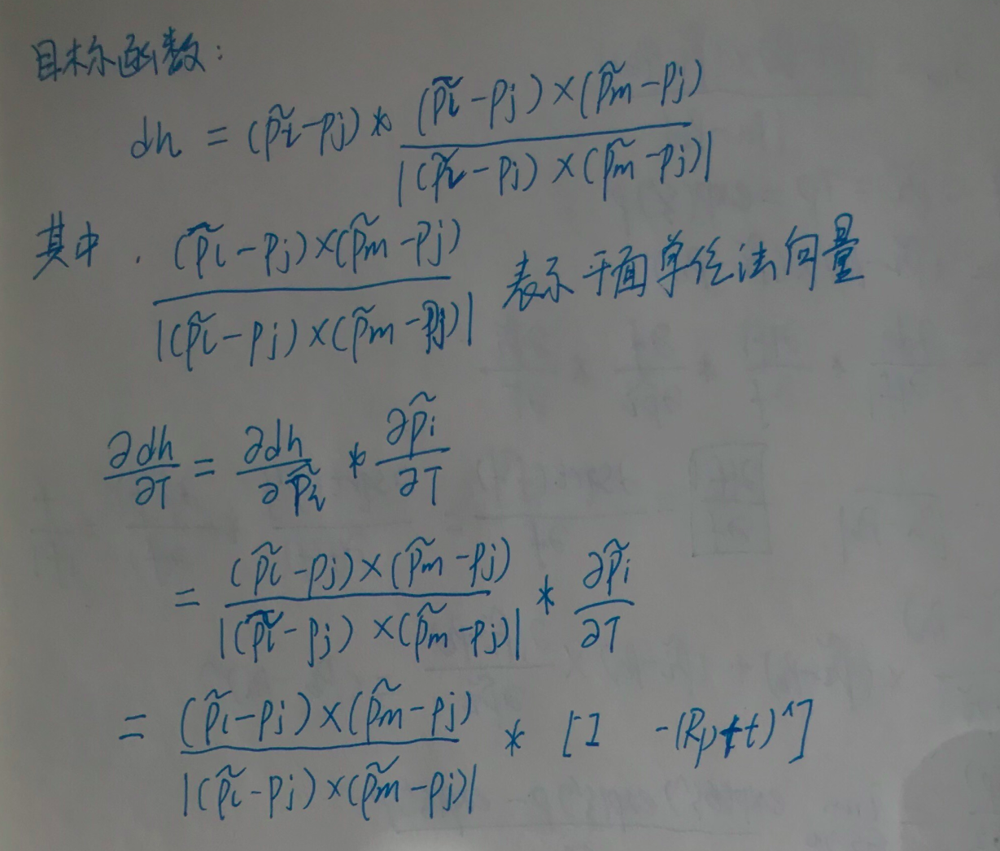
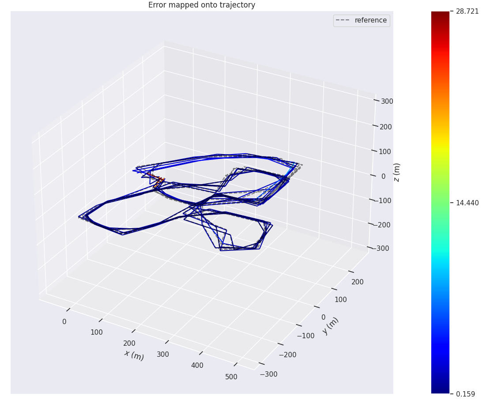

## 内容：

## 请使用以下残差模型，推导相应的雅可比，并在F-LOAM或A-LOAM基于该模型，实现解析式求导。

## 线特征残差：


## 面特征残差：


## 评价标准：

## 1）及格：推导雅可比，且结果正确；

## 2）良好：在及格的基础上，编程实现新模型的解析式求导，且结果正常；

## 3）优秀：在良好的基础上，给出运行结果的精度评测结果（基于evo）。


## 1）及格：

#### *a.线特征残差雅可比：*


#### *b.面特征残差雅可比：*




#### 2）良好：

#### Ceres库包含了自动求导，数值求导，解析求导，A-LOAM中使用的是自动求导，效率比较低，F-LOAM中使用的是解析求导，本题要求实现解析求导，将第一题的

#### 输入成代码。

#### [Ceres](https://blog.csdn.net/weixin_43991178/article/details/100532618)

#### [Ceres](https://blog.csdn.net/qq_23225073/article/details/103284327)

#### 关于ceres

#### （1）图优化中的顶点是被优化的变量，CERES中被定义为ParameterBlock（参数块）。

#### （2）图优化中的边是观测对变量的约束，CERES中被定义为ResidualBlock（残差块）。


#### *Ceres解析求导：线特征残差*

```c++
// EdgeAnalyticCostFunction
class LidarEdgeAnalyticCostFunction : public ceres::SizedCostFunction<3, 4, 3> {
public:
    LidarEdgeAnalyticCostFunction(Eigen::Vector3d curr_point_, Eigen::Vector3d last_point_a_,
								Eigen::Vector3d last_point_b_, double s_)
		: curr_point(curr_point_), last_point_a(last_point_a_), last_point_b(last_point_b_), s(s_) {}

  	virtual bool Evaluate(double const* const* parameters,
                        double* residuals,
                        double** jacobians) const 
	{
		Eigen::Map<const Eigen::Quaterniond> q_last_curr(parameters[0]);
		Eigen::Map<const Eigen::Vector3d> t_last_curr(parameters[1]);
		Eigen::Vector3d lp;
		Eigen::Vector3d lp_r;
		lp_r = q_last_curr * curr_point; // for computing Jacobian of Rotation: dp_by_dr
		lp = q_last_curr * curr_point + t_last_curr; //new point
		Eigen::Vector3d nu = (lp - last_point_a).cross(lp - last_point_b);
		Eigen::Vector3d de = last_point_a - last_point_b;

		residuals[0] = nu.x() / de.norm();
		residuals[1] = nu.y() / de.norm();
		residuals[2] = nu.z() / de.norm();

		if(jacobians != NULL)
		{
			if(jacobians[0] != NULL)
			{
				Eigen::Vector3d re = last_point_b - last_point_a;
				Eigen::Matrix3d skew_re = skew(re);
				//  Rotation
				Eigen::Matrix3d skew_lp_r = skew(lp_r);
				Eigen::Matrix<double, 3, 3> dp_by_dr;
				dp_by_dr.block<3,3>(0,0) = -skew_lp_r;
				Eigen::Map<Eigen::Matrix<double, 3, 4, Eigen::RowMajor> > J_so3_r(jacobians[0]);
				J_so3_r.setZero();
				J_so3_r.block<3,3>(0,0) = skew_re * dp_by_dr / de.norm();

				// Translation
				Eigen::Matrix<double, 3, 3> dp_by_dt;
				(dp_by_dt.block<3,3>(0,0)).setIdentity();
				Eigen::Map<Eigen::Matrix<double, 3, 3, Eigen::RowMajor> > J_so3_t(jacobians[1]);
				J_so3_t.setZero();
				J_so3_t.block<3,3>(0,0) = skew_re * dp_by_dt / de.norm();	
			}
		}

		return true;
 
	}

protected:
	Eigen::Vector3d curr_point, last_point_a, last_point_b;
	double s;
};
```

并更改problem的costFunction:

```c++
 // ceres::CostFunction *cost_function = LidarEdgeFactor::Create(curr_point, last_point_a, last_point_b, s);
ceres::CostFunction *cost_function = new LidarEdgeAnalyticCostFunction(curr_point, last_point_a, last_point_b, s);  
problem.AddResidualBlock(cost_function, loss_function, para_q, para_t);
```

#### *Ceres解析求导：面特征残差*

```c++
// PlaneAnalyticCostFunction
class LidarPlaneAnalyticCostFunction : public ceres::SizedCostFunction<1, 4, 3> {
public:
    LidarPlaneAnalyticCostFunction(Eigen::Vector3d curr_point_, Eigen::Vector3d last_point_j_,
								Eigen::Vector3d last_point_l_, Eigen::Vector3d last_point_m_, double s_)
		: curr_point(curr_point_), last_point_j(last_point_j_), last_point_l(last_point_l_), last_point_m(last_point_m_), s(s_) {}

  	virtual bool Evaluate(double const* const* parameters,
                        double* residuals,
                        double** jacobians) const 
	{
		Eigen::Map<const Eigen::Quaterniond> q_last_curr(parameters[0]);
		Eigen::Map<const Eigen::Vector3d> t_last_curr(parameters[1]);
		Eigen::Vector3d lp;
		Eigen::Vector3d lp_r;
		lp_r = q_last_curr * curr_point; // for computing Jacobian of Rotation: dp_dr
		lp = q_last_curr * curr_point + t_last_curr; //new point
		Eigen::Vector3d de = (last_point_l-last_point_j).cross(last_point_m-last_point_j);
		double nu = (lp-last_point_j).dot(de);
		
		residuals[0] = nu / de.norm();

		if(jacobians != NULL)
		{
			if(jacobians[0] != NULL)
			{
				Eigen::Vector3d dX_dp = de / de.norm();
				double X = nu / de.norm();
				Eigen::Vector3d ddh_dp = X * dX_dp / std::abs(X);
				//  Rotation
				Eigen::Matrix3d skew_lp_r = skew(lp_r);
				Eigen::Matrix<double, 3, 3> dp_dr;
				dp_dr.block<3,3>(0,0) = -skew_lp_r;
				Eigen::Map<Eigen::Matrix<double, 1, 4, Eigen::RowMajor> > J_so3_r(jacobians[0]);
				J_so3_r.setZero();
				J_so3_r.block<1,3>(0,0) = ddh_dp.transpose() * dp_dr;

				// Translation
				Eigen::Matrix<double, 3, 3> dp_dt;
				(dp_dt.block<3,3>(0,0)).setIdentity();
				Eigen::Map<Eigen::Matrix<double, 1, 3, Eigen::RowMajor> > J_so3_t(jacobians[1]);
				J_so3_t.setZero();
				J_so3_t.block<1,3>(0,0) = ddh_dp.transpose() * dp_dt;
			}
		}

		return true;
 
	}

protected:
	Eigen::Vector3d curr_point, last_point_j, last_point_l, last_point_m;
	double s;
};
```

#### 并更改problem的costFunction：

```c++
// ceres::CostFunction *cost_function = LidarPlaneFactor::Create(curr_point, last_point_a, last_point_b, last_point_c, s);
ceres::CostFunction *cost_function = new LidarPlaneAnalyticCostFunction(curr_point, last_point_a, last_point_b, last_point_c, s);
problem.AddResidualBlock(cost_function, loss_function, para_q, para_t);
```

运行结果：


#### 3）优秀：EVO评测：

#### APE:


#### 运行结果：

```bash
$ evo_ape kitti ground_truth.txt laser_odom.txt -r full --plot --plot_mode xyz
APE w.r.t. full transformation (unit-less)
(not aligned)

       max      48.870402
      mean      17.192162
    median      14.693940
       min      0.000000
      rmse      20.398009
       sse      6819531.048872
       std      10.977629

(base) 
```


#### RPE:




#### 运行结果：

```bash
$ evo_rpe  kitti -a ground_truth.txt laser_odom.txt -r trans_part --delta 100 --plot --plot_mode xyz
RPE w.r.t. translation part (m)
for delta = 100 (frames) using consecutive pairs
(with SE(3) Umeyama alignment)

       max      28.721358
      mean      1.857302
    median      1.042375
       min      0.159371
      rmse      4.277025
       sse      2981.750236
       std      3.852710

(base) 
```


