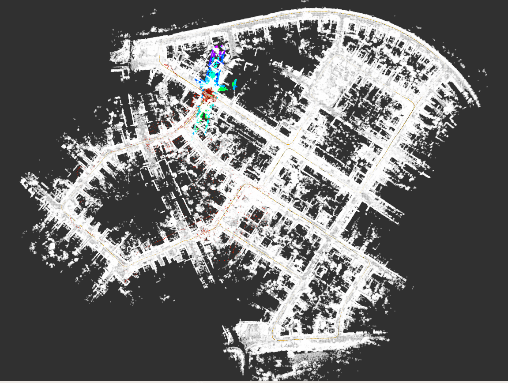
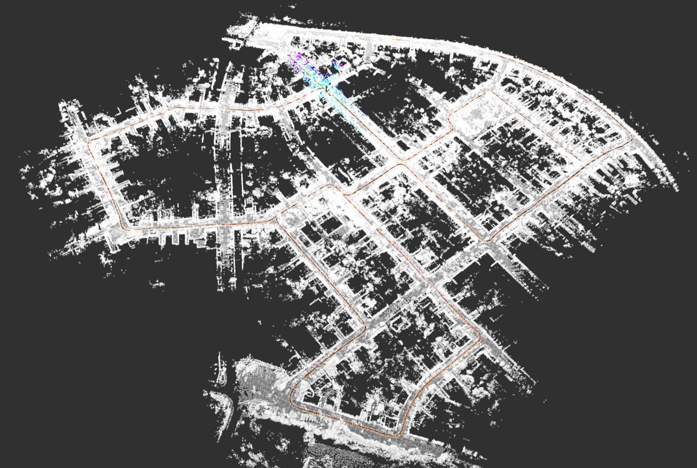

## 内容：

## 1）构建点云地图

## 使用提供的工程代码和bag文件，跑通建图过程，并保存地图。

## 2）基于点云地图定位

##         实际使用时，载体可能处于地图中任意位置，而当雷达点云还没有开始和地图匹配时，它所处的精确位姿是未知的，

##         往往只有GPS

## 或组合导航提供的带有一定误差的粗略位姿。在任意位置，利用粗略位姿作为初始值，通过雷达点云和地图点云匹

## 配，得到精确初始位姿的过程，叫做全局初始化。

##         提供的作业框架中，只能完成在地图原点的初始化，不能实现全局初始化，全局初始化为作业内容。

##         作业要求提供在bag时间的100s，200s，300s，400s处初始化成功的截图。

##         提示：bag可以在指定时间点（例如第100s）播放，指令为"rosbag play xxx.bag -s 100"


## 评价标准：

## 1）及格：跑通建图流程、保存地图，并截图显示完整地图；

## 2）良好：在建图的基础上，加载点云地图，实现在地图原点的初始化（此功能提供的代码中已实现）；

## 3）优秀：在建图的基础上，实现全局初始化的要求。


## 1）及格：

#### 完整地图如下：


#### 主要命令：

```bash
roslaunch lidar_localization mapping.launch
```

## 2）良好:

#### 实现了地图原点初始化，地图map.pcd大小2.7GB。



#### 局部：


#### 主要命令：

```bash
roslaunch lidar_localization matching.launch
```


## 3）优秀：

#### 这里使用scan context或者GNSS完成初始化，使用scan context只需要调用TODO中的函数就可以。如果是GNSS初始化，需要储存建图时原点的经纬度信息。

#### *scan context通过下面代码实现：*

```c++
bool MatchingFlow::UpdateMatching() {
    if (!matching_ptr_->HasInited()) {
        //
        // TODO: implement global initialization here
        if(!(matching_ptr_->SetScanContextPose(current_cloud_data_))){
            return false;
        }
        // Hints: You can use SetGNSSPose & SetScanContextPose from matching.hpp
        //

        // naive implementation:
        ///Eigen::Matrix4f init_pose = Eigen::Matrix4f::Identity();
        
        ///matching_ptr_->SetInitPose(init_pose);
        ///matching_ptr_->SetInited();
    }

    return matching_ptr_->Update(current_cloud_data_, laser_odometry_);
}
```

#### *黄色是真实轨迹，红色是激光数据。*

#### 基于点云地图的匹配，会订阅话题/synced_gnss，它是结合GNSS和IMU得到的里程计，其原点为第一帧满足同步条件的GNSS数据。

#### 0s:

#### 局部：


#### 全局：


#### 后面到要重新在相对应的时间点建图，再进行重定位。保证真实值和激光里程计相对重合。

#### 100s:

#### 使用下面命令从100s播放：

```bash
rosbag play xxx.bag -s 100
```

#### 局部（起点）：


全局：




#### 200s:

#### 使用下面命令从200s播放：

```bash
 rosbag play xxx.bag -s 200
```

#### 局部（起点）：


#### 全局：


#### 可见后面没有地图，定位失败直接飘了。

#### 300s:

#### 使用下面命令从300s播放：

```bash
 rosbag play xxx.bag -s 300
```

#### 局部（起点）：


#### 全局：


#### 400s:

#### 使用下面命令从400s播放：

```bash
 rosbag play xxx.bag -s 400
```

#### 局部（起点）：


#### 全局：


## *GNSS通过下面代码实现：*

#### 首先调用SetGNSSPose():

```c++
bool MatchingFlow::UpdateMatching() {
    if (!matching_ptr_->HasInited()) {
    
        matching_ptr_->SetGNSSPose(current_gnss_data_.pose);        
        // matching_ptr_->SetScanContextPose(current_cloud_data_);
        
    }

    return matching_ptr_->Update(current_cloud_data_, laser_odometry_);
}
```

#### 然后修改gnss_data.cpp文件，fix初始化点的经纬度：

```c++
//静态成员变量必须在类外初始化
double lidar_localization::GNSSData::origin_longitude = 0.0;
double lidar_localization::GNSSData::origin_latitude = 0.0;
double lidar_localization::GNSSData::origin_altitude = 0.0;
bool lidar_localization::GNSSData::origin_position_inited = false;
GeographicLib::LocalCartesian lidar_localization::GNSSData::geo_converter;

namespace lidar_localization {
void GNSSData::InitOriginPosition() {
    std::cout << "GNSS Data: " << std::endl;
    std::cout << "Latitude: " << latitude << std::endl;
    std::cout << "Longitude: " << longitude <<  std::endl;
    std::cout << "Altitude: " << altitude << std::endl << std::endl;
    geo_converter.Reset(48.9827, 8.39046, 116.396);

    origin_longitude = latitude;
    origin_latitude = longitude;
    origin_altitude = altitude;

    std::cout << "origin_GNSS Data: " << std::endl;
    std::cout << "Latitude: " << origin_longitude << std::endl;
    std::cout << "Longitude: " << origin_latitude <<  std::endl;
    std::cout << "Altitude: " << origin_altitude << std::endl;

    origin_position_inited = true;
}
```

#### 0s

#### 全局：


#### 100s

#### 全局：


#### 轨迹：


#### 200s

#### 轨迹：


#### 300s

#### 轨迹：


#### 400s

#### 轨迹：

