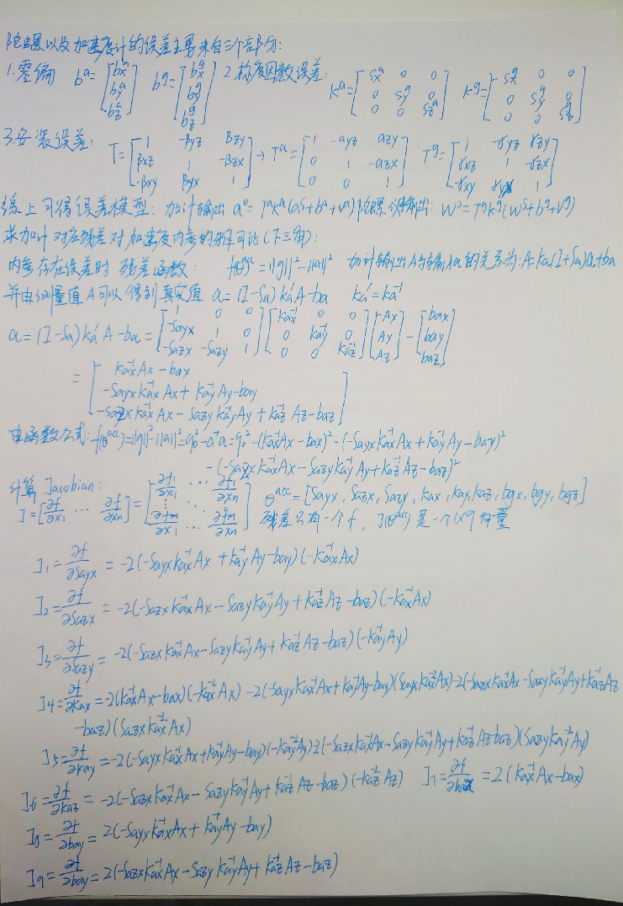
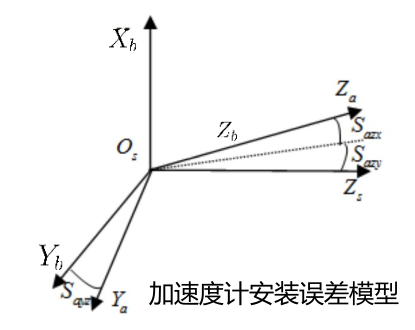
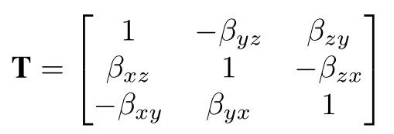
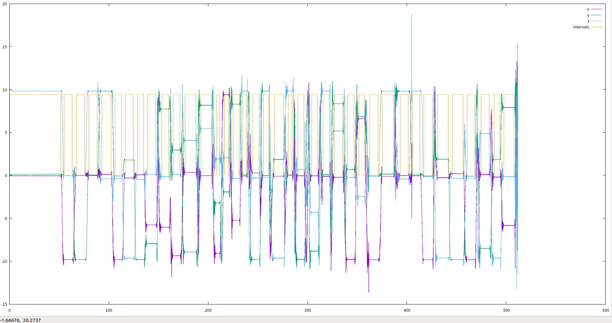
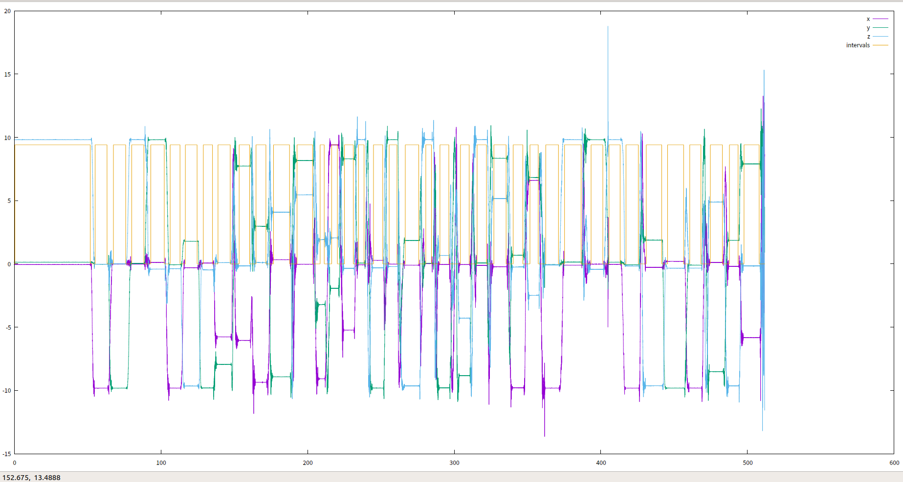

## 内容：

##         按照不需要转台标定方法中给出的内参模型以及残差模型，推导加速度计对应残差对加速度内参的雅可比，在开

## 源代码中按新的内参模型（开源代码中加速度计内参模型是上三角，本课程模型是下三角）改成解析式求导，并使用

## 课程给定的仿真数据做验证。

## 评价标准：

## 1）及格：完成雅可比推导，且正确；

## 2）良好：完成标定，且结果正确，但未使用解析式求导；

## 3）优秀：使用解析式求导完成标定，且结果正确。


## 1）及格：



## 2）良好：

#### 这里换成下三角模型，本质上是选择加速度计的坐标系和载体坐标系哪一个轴重合。



#### 这里认为x轴向重合

#### 修改：



#### 按照上图修改得到下三角矩阵：

```c++
    CalibratedTriad_<_T2> calib_triad( 
      //
      // TODO: implement lower triad model here
      //
      // mis_yz, mis_zy, mis_zx:
      _T2(0), _T2(0), _T2(0),
      // mis_xz, mis_xy, mis_yx:
      params[0], params[1], params[2],
      //    s_x,    s_y,    s_z:
      params[3], params[4], params[5], 
      //    b_x,    b_y,    b_z: 
      params[6], params[7], params[8] 
    );
```

#### 改成对应参数：

```c++
    //
    // TODO: implement lower triad model here
    //
    acc_calib_params[0] = init_acc_calib_.misXZ();
    acc_calib_params[1] = init_acc_calib_.misXY();
    acc_calib_params[2] = init_acc_calib_.misYX();
```

#### 对应九维变量：

```c++
  acc_calib_ = CalibratedTriad_<_T>( 
    //
    // TODO: implement lower triad model here
    //
    0,0,0,
    min_cost_calib_params[0],
    min_cost_calib_params[1],
    min_cost_calib_params[2],
    min_cost_calib_params[3],
    min_cost_calib_params[4],
    min_cost_calib_params[5],
    min_cost_calib_params[6],
    min_cost_calib_params[7],
    min_cost_calib_params[8] 
  );
```

#### 结果：

```bash
# bobododo @ bobododo-G7-7588 in ~/GNC/MSF/shenlan-MSF/chapter5/imu_tk/bin on git:master x [15:30:31] 
$ ./test_imu_calib test_data/xsens_acc.mat test_data/xsens_gyro.mat
Importing IMU data from the Matlab matrix file : test_data/xsens_acc.mat
Importing IMU data from the Matlab matrix file : test_data/xsens_gyro.mat
Accelerometer Calibration: Calibrating...
Accelerometers Calibration: Extracted 42 intervals using threshold multiplier 2 -> Trying calibrate... 
iter      cost      cost_change  |gradient|   |step|    tr_ratio  tr_radius  ls_iter  iter_time  total_time
   0  3.399567e+10    0.00e+00    3.17e+10   0.00e+00   0.00e+00  1.00e+04        0    7.18e-03    7.65e-03
   1  2.700191e+03    3.40e+10    5.32e+06   2.63e+00   1.00e+00  3.00e+04        1    7.33e-03    1.60e-02
   2  2.278048e+01    2.68e+03    6.95e+05   7.16e+02   9.92e-01  9.00e+04        1    7.46e-03    2.35e-02
   3  1.366645e-01    2.26e+01    7.18e+03   3.18e+01   1.00e+00  2.70e+05        1    7.56e-03    3.11e-02
   4  1.347244e-01    1.94e-03    1.18e+00   4.74e-01   1.00e+00  8.10e+05        1    7.19e-03    3.83e-02
residual 0.134724
Accelerometers Calibration: Extracted 40 intervals using threshold multiplier 3 -> Trying calibrate... 
iter      cost      cost_change  |gradient|   |step|    tr_ratio  tr_radius  ls_iter  iter_time  total_time
   0  3.189931e+10    0.00e+00    2.76e+10   0.00e+00   0.00e+00  1.00e+04        0    5.98e-03    6.16e-03
   1  2.343289e+03    3.19e+10    3.46e+06   2.60e+00   1.00e+00  3.00e+04        1    6.74e-03    1.29e-02
   2  2.118105e+01    2.32e+03    6.06e+05   7.18e+02   9.91e-01  9.00e+04        1    6.57e-03    1.95e-02
   3  1.332983e-01    2.10e+01    6.87e+03   3.17e+01   1.00e+00  2.70e+05        1    6.59e-03    2.61e-02
   4  1.313451e-01    1.95e-03    1.04e+00   4.89e-01   1.00e+00  8.10e+05        1    6.67e-03    3.28e-02
residual 0.131345
Accelerometers Calibration: Extracted 39 intervals using threshold multiplier 4 -> Trying calibrate... 
iter      cost      cost_change  |gradient|   |step|    tr_ratio  tr_radius  ls_iter  iter_time  total_time
   0  3.112881e+10    0.00e+00    2.73e+10   0.00e+00   0.00e+00  1.00e+04        0    6.16e-03    6.42e-03
   1  2.310335e+03    3.11e+10    3.40e+06   2.61e+00   1.00e+00  3.00e+04        1    6.76e-03    1.32e-02
   2  2.117401e+01    2.29e+03    6.06e+05   7.18e+02   9.91e-01  9.00e+04        1    6.35e-03    1.96e-02
   3  1.279232e-01    2.10e+01    6.76e+03   3.00e+01   1.00e+00  2.70e+05        1    6.59e-03    2.62e-02
   4  1.261258e-01    1.80e-03    9.99e-01   4.65e-01   1.00e+00  8.10e+05        1    6.57e-03    3.28e-02
residual 0.126126
Accelerometers Calibration: Extracted 38 intervals using threshold multiplier 5 -> Trying calibrate... 
iter      cost      cost_change  |gradient|   |step|    tr_ratio  tr_radius  ls_iter  iter_time  total_time
   0  3.020722e+10    0.00e+00    2.59e+10   0.00e+00   0.00e+00  1.00e+04        0    5.75e-03    5.95e-03
   1  2.236142e+03    3.02e+10    2.96e+06   2.60e+00   1.00e+00  3.00e+04        1    6.25e-03    1.22e-02
   2  2.057339e+01    2.22e+03    5.82e+05   7.19e+02   9.91e-01  9.00e+04        1    6.38e-03    1.86e-02
   3  1.223695e-01    2.05e+01    6.81e+03   3.01e+01   1.00e+00  2.70e+05        1    6.29e-03    2.49e-02
   4  1.205582e-01    1.81e-03    1.02e+00   4.70e-01   1.00e+00  8.10e+05        1    6.25e-03    3.12e-02
residual 0.120558
Accelerometers Calibration: Extracted 38 intervals using threshold multiplier 6 -> Trying calibrate... 
iter      cost      cost_change  |gradient|   |step|    tr_ratio  tr_radius  ls_iter  iter_time  total_time
   0  3.020735e+10    0.00e+00    2.59e+10   0.00e+00   0.00e+00  1.00e+04        0    5.75e-03    5.92e-03
   1  2.236228e+03    3.02e+10    2.96e+06   2.60e+00   1.00e+00  3.00e+04        1    6.37e-03    1.23e-02
   2  2.057615e+01    2.22e+03    5.82e+05   7.19e+02   9.91e-01  9.00e+04        1    6.25e-03    1.86e-02
   3  1.219430e-01    2.05e+01    6.81e+03   3.01e+01   1.00e+00  2.70e+05        1    6.20e-03    2.48e-02
   4  1.201312e-01    1.81e-03    1.02e+00   4.70e-01   1.00e+00  8.10e+05        1    6.12e-03    3.09e-02
residual 0.120131
Accelerometers Calibration: Extracted 38 intervals using threshold multiplier 7 -> Trying calibrate... 
iter      cost      cost_change  |gradient|   |step|    tr_ratio  tr_radius  ls_iter  iter_time  total_time
   0  3.020749e+10    0.00e+00    2.59e+10   0.00e+00   0.00e+00  1.00e+04        0    5.70e-03    5.87e-03
   1  2.236258e+03    3.02e+10    2.96e+06   2.60e+00   1.00e+00  3.00e+04        1    6.23e-03    1.21e-02
   2  2.058955e+01    2.22e+03    5.82e+05   7.19e+02   9.91e-01  9.00e+04        1    6.14e-03    1.83e-02
   3  1.223945e-01    2.05e+01    6.80e+03   3.00e+01   1.00e+00  2.70e+05        1    6.17e-03    2.45e-02
   4  1.205858e-01    1.81e-03    1.02e+00   4.70e-01   1.00e+00  8.10e+05        1    6.35e-03    3.08e-02
residual 0.120586
Accelerometers Calibration: Extracted 38 intervals using threshold multiplier 8 -> Trying calibrate... 
iter      cost      cost_change  |gradient|   |step|    tr_ratio  tr_radius  ls_iter  iter_time  total_time
   0  3.020772e+10    0.00e+00    2.59e+10   0.00e+00   0.00e+00  1.00e+04        0    5.73e-03    5.89e-03
   1  2.236155e+03    3.02e+10    2.96e+06   2.60e+00   1.00e+00  3.00e+04        1    6.13e-03    1.20e-02
   2  2.059116e+01    2.22e+03    5.82e+05   7.19e+02   9.91e-01  9.00e+04        1    6.21e-03    1.83e-02
   3  1.231485e-01    2.05e+01    6.81e+03   3.00e+01   1.00e+00  2.70e+05        1    6.51e-03    2.48e-02
   4  1.213383e-01    1.81e-03    1.02e+00   4.70e-01   1.00e+00  8.10e+05        1    6.25e-03    3.11e-02
residual 0.121338
Accelerometers Calibration: Extracted 38 intervals using threshold multiplier 9 -> Trying calibrate... 
iter      cost      cost_change  |gradient|   |step|    tr_ratio  tr_radius  ls_iter  iter_time  total_time
   0  3.020772e+10    0.00e+00    2.59e+10   0.00e+00   0.00e+00  1.00e+04        0    5.69e-03    5.87e-03
   1  2.236261e+03    3.02e+10    2.96e+06   2.60e+00   1.00e+00  3.00e+04        1    6.24e-03    1.21e-02
   2  2.058975e+01    2.22e+03    5.82e+05   7.19e+02   9.91e-01  9.00e+04        1    6.34e-03    1.85e-02
   3  1.232319e-01    2.05e+01    6.81e+03   3.00e+01   1.00e+00  2.70e+05        1    6.31e-03    2.48e-02
   4  1.214222e-01    1.81e-03    1.02e+00   4.70e-01   1.00e+00  8.10e+05        1    6.17e-03    3.10e-02
residual 0.121422
Accelerometers Calibration: Extracted 38 intervals using threshold multiplier 10 -> Trying calibrate... 
iter      cost      cost_change  |gradient|   |step|    tr_ratio  tr_radius  ls_iter  iter_time  total_time
   0  3.020750e+10    0.00e+00    2.59e+10   0.00e+00   0.00e+00  1.00e+04        0    5.73e-03    5.91e-03
   1  2.237162e+03    3.02e+10    2.96e+06   2.61e+00   1.00e+00  3.00e+04        1    6.32e-03    1.22e-02
   2  2.065169e+01    2.22e+03    5.83e+05   7.19e+02   9.91e-01  9.00e+04        1    6.23e-03    1.85e-02
   3  1.400352e-01    2.05e+01    6.78e+03   2.99e+01   1.00e+00  2.70e+05        1    6.22e-03    2.47e-02
   4  1.382403e-01    1.79e-03    1.05e+00   4.67e-01   1.00e+00  8.10e+05        1    6.24e-03    3.10e-02
residual 0.13824
Accelerometers calibration: Better calibration obtained using threshold multiplier 6 with residual 0.120131
Misalignment Matrix
          1          -0           0
-0.00354989           1          -0
-0.00890444  -0.0213032           1
Scale Matrix
0.00241267          0          0
         0 0.00242659          0
         0          0 0.00241232
Bias Vector
33124.2
33275.2
32364.4

Accelerometers calibration: inverse scale factors:
414.478
412.102
414.538

Press Enter to continue

Gyroscopes calibration: calibrating...
iter      cost      cost_change  |gradient|   |step|    tr_ratio  tr_radius  ls_iter  iter_time  total_time
   0  8.608408e+00    0.00e+00    1.33e+05   0.00e+00   0.00e+00  1.00e+04        0    5.62e-02    5.62e-02
   1  3.325769e-01    8.28e+00    2.64e+04   6.50e-02   1.27e+00  3.00e+04        1    5.77e-02    1.14e-01
   2  1.618295e-03    3.31e-01    3.64e+02   4.35e-02   1.01e+00  9.00e+04        1    5.79e-02    1.72e-01
   3  1.506957e-03    1.11e-04    1.17e+00   2.17e-03   1.00e+00  2.70e+05        1    5.77e-02    2.30e-01
   4  1.506956e-03    1.51e-09    4.85e-03   1.13e-05   1.00e+00  8.10e+05        1    5.75e-02    2.87e-01

Solver Summary (v 2.0.0-eigen-(3.3.4)-lapack-suitesparse-(5.1.2)-cxsparse-(3.1.9)-eigensparse-no_openmp)

                                     Original                  Reduced
Parameter blocks                            1                        1
Parameters                                  9                        9
Residual blocks                            37                       37
Residuals                                 111                      111

Minimizer                        TRUST_REGION

Dense linear algebra library            EIGEN
Trust region strategy     LEVENBERG_MARQUARDT

                                        Given                     Used
Linear solver                        DENSE_QR                 DENSE_QR
Threads                                     1                        1
Linear solver ordering              AUTOMATIC                        1

Cost:
Initial                          8.608408e+00
Final                            1.506956e-03
Change                           8.606901e+00

Minimizer iterations                        5
Successful steps                            5
Unsuccessful steps                          0

Time (in seconds):
Preprocessor                         0.000040

  Residual only evaluation           0.007243 (5)
  Jacobian & residual evaluation     0.280959 (5)
  Linear solver                      0.000060 (5)
Minimizer                            0.288463

Postprocessor                        0.000003
Total                                0.288506

Termination:                      CONVERGENCE (Function tolerance reached. |cost_change|/cost: 1.098767e-11 <= 1.000000e-06)

Gyroscopes calibration: residual 0.00150696
Misalignment Matrix
         1 0.00927517 0.00990014
0.00507442          1 -0.0322229
 0.0162201 -0.0239393          1
Scale Matrix
0.000209338           0           0
          0 0.000209834           0
          0           0 0.000209664
Bias Vector
32777.1
32459.8
32511.8

Gyroscopes calibration: inverse scale factors:
4776.96
4765.68
4769.53

```


## 3）优秀：

#### *代码更改：*

```c++
///改成模板类，解析式class
template <typename _T1>
class MultiPosAccResidual_Analytical : public ceres::SizedCostFunction<1, 9> {
public:
    MultiPosAccResidual_Analytical(const _T1 &g_mag, const Eigen::Matrix< _T1, 3 , 1> &sample
    ) : g_mag_(g_mag), sample_(sample){}


    virtual bool Evaluate(double const* const* parameters,
                          double* residuals,
                          double** jacobians) const
    {
        Eigen::Matrix<double, 3, 1> raw_samp(
                double(sample_(0)),
                double(sample_(1)),
                double(sample_(2))
        );
        /* Apply undistortion transform to accel measurements
             mis_mat_ <<  _T(1)   , -mis_yz  ,  mis_zy  ,
                           mis_xz ,  _T(1)   , -mis_zx  ,
                          -mis_xy ,  mis_yx  ,  _T(1)   ; */
        CalibratedTriad_<double> calib_triad(
                //
                // TODO: implement lower triad model here
                //
                // mis_yz, mis_zy, mis_zx:
                double(0), double(0), double(0),
                // mis_xz, mis_xy, mis_yx:
                parameters[0][0], parameters[0][1], parameters[0][2],
                //    s_x,    s_y,    s_z:
                parameters[0][3], parameters[0][4], parameters[0][5],
                //    b_x,    b_y,    b_z:
                parameters[0][6], parameters[0][7], parameters[0][8]
        );

        // apply undistortion transform:
        Eigen::Matrix< double, 3 , 1> calib_samp = calib_triad.unbiasNormalize( raw_samp );

        residuals[0] = g_mag_*g_mag_ - calib_samp.transpose()*calib_samp;
        // residuals[0] = g_mag_- calib_samp.norm();

        if(jacobians != NULL)
        {
            if(jacobians[0] != NULL)
            {
                double S1 = parameters[0][0];
                double S2 = parameters[0][1];
                double S3 = parameters[0][2];

                double K1 = parameters[0][3];
                double K2 = parameters[0][4];
                double K3 = parameters[0][5];

                double b1 = parameters[0][6];
                double b2 = parameters[0][7];
                double b3 = parameters[0][8];

                double A1 = sample_(0);
                double A2 = sample_(1);
                double A3 = sample_(2);

                // 向量对向量的解析版：
                Eigen::MatrixXd a(3, 1);
                a << K1*(A1-b1), S1*K1*(A1-b1)+K2*(A2-b2), -S2*K1*(A1-b1)+S3*K2*(A2-b2)+K3*(A3-b3);

                Eigen::MatrixXd da_dTheta(3, 9);
                da_dTheta << 0, 0, 0, A1-b1, 0, 0, -K1, 0, 0,
                        K1*(A1-b1), 0, 0, S1*(A1-b1), A2-b2, 0, -S1*K1, -K2, 0,
                        0, -K1*(A1-b1), K2*(A2-b2), -S2*(A1-b1), S3*(A2-b2), A3-b3, S2*K1, -S3*K2, -K3;

                Eigen::Map<Eigen::Matrix<double, 1, 9, Eigen::RowMajor> > Jacob(jacobians[0]);
                Jacob.setZero();
                // 经过化简后，
                // J = - (a / ||a||) * da_dTheta
                // Jacob = - a.transpose() / a.norm() * da_dTheta;
                // Jacob = - calib_samp.transpose() / calib_samp.norm() * da_dTheta;
                Jacob = - 2 * calib_samp.transpose() * da_dTheta;

            }
        }

        return true;
    }

protected:
    const _T1 g_mag_;
    const Eigen::Matrix< _T1, 3 , 1> sample_;
};

```

#### 最后，调用写的类：

```c++
ceres::Problem problem;
for( int i = 0; i < static_samples.size(); i++)
{
  /// ceres::CostFunction* cost_function = MultiPosAccResidual<_T>::Create ( 
  ///  g_mag_, static_samples[i].data() 
  /// );
  ceres::CostFunction *cost_function = new MultiPosAccResidual_Analytical<_T>(g_mag_, static_samples[i].data());

  problem.AddResidualBlock ( 
    cost_function,           /* error fuction */
    NULL,                    /* squared loss */
    acc_calib_params.data()  /* accel deterministic error params */
  ); 
}

ceres::Solver::Options options;
options.linear_solver_type = ceres::DENSE_QR;
options.minimizer_progress_to_stdout = verbose_output_;

ceres::Solver::Summary summary;
ceres::Solve ( options, &problem, &summary );
if( summary.final_cost < min_cost)
{
  min_cost = summary.final_cost;
  min_cost_th = th_mult;
  min_cost_static_intervals_ = static_intervals;
  min_cost_calib_params = acc_calib_params;
} 
cout << "residual " << summary.final_cost << endl;
```

#### *计算residual函数取平方：*




```bash
$ ./test_imu_calib test_data/xsens_acc.mat test_data/xsens_gyro.mat
Importing IMU data from the Matlab matrix file : test_data/xsens_acc.mat
Importing IMU data from the Matlab matrix file : test_data/xsens_gyro.mat
Accelerometer Calibration: Calibrating...
Accelerometers Calibration: Extracted 42 intervals using threshold multiplier 2 -> Trying calibrate... 
iter      cost      cost_change  |gradient|   |step|    tr_ratio  tr_radius  ls_iter  iter_time  total_time
   0  5.794474e+17    0.00e+00    1.13e+18   0.00e+00   0.00e+00  1.00e+04        0    6.92e-04    9.88e-04
   1  3.622984e+16    5.43e+17    1.41e+17   8.88e-01   9.37e-01  3.00e+04        1    1.37e-03    2.38e-03
   2  2.264576e+15    3.40e+16    1.76e+16   4.40e-01   9.37e-01  9.00e+04        1    1.10e-03    3.48e-03
   3  1.415184e+14    2.12e+15    2.20e+15   2.35e-01   9.38e-01  2.70e+05        1    1.09e-03    4.58e-03
   4  8.839032e+12    1.33e+14    2.75e+14   3.16e-01   9.38e-01  8.10e+05        1    1.38e-03    5.97e-03
   5  5.509452e+11    8.29e+12    3.44e+13   1.17e+00   9.38e-01  2.43e+06        1    1.28e-03    7.28e-03
   6  3.406306e+10    5.17e+11    4.30e+12   4.64e+00   9.38e-01  7.29e+06        1    1.21e-03    8.50e-03
   7  2.039306e+09    3.20e+10    5.38e+11   1.82e+01   9.40e-01  2.19e+07        1    1.17e-03    9.68e-03
   8  1.078640e+08    1.93e+09    6.71e+10   6.75e+01   9.47e-01  6.56e+07        1    1.13e-03    1.08e-02
   9  3.744948e+06    1.04e+08    7.84e+09   2.03e+02   9.65e-01  1.97e+08        1    1.10e-03    1.19e-02
  10  4.964761e+04    3.70e+06    6.08e+08   3.19e+02   9.87e-01  5.90e+08        1    1.52e-03    1.35e-02
  11  1.065376e+02    4.95e+04    1.81e+07   1.20e+02   9.99e-01  1.77e+09        1    1.20e-03    1.47e-02
  12  5.193891e+01    5.46e+01    2.33e+04   4.57e+00   1.00e+00  5.31e+09        1    1.13e-03    1.58e-02
  13  5.193882e+01    9.01e-05    3.91e-02   5.95e-03   1.00e+00  1.59e+10        1    1.13e-03    1.69e-02
residual 51.9388
Accelerometers Calibration: Extracted 40 intervals using threshold multiplier 3 -> Trying calibrate... 
iter      cost      cost_change  |gradient|   |step|    tr_ratio  tr_radius  ls_iter  iter_time  total_time
   0  5.351192e+17    0.00e+00    9.51e+17   0.00e+00   0.00e+00  1.00e+04        0    6.44e-04    8.10e-04
   1  3.345773e+16    5.02e+17    1.19e+17   8.84e-01   9.37e-01  3.00e+04        1    1.11e-03    1.94e-03
   2  2.091290e+15    3.14e+16    1.49e+16   4.39e-01   9.37e-01  9.00e+04        1    1.04e-03    2.99e-03
   3  1.306884e+14    1.96e+15    1.86e+15   2.34e-01   9.38e-01  2.70e+05        1    1.04e-03    4.04e-03
   4  8.162405e+12    1.23e+14    2.32e+14   3.15e-01   9.38e-01  8.10e+05        1    1.12e-03    5.16e-03
   5  5.087218e+11    7.65e+12    2.90e+13   1.17e+00   9.38e-01  2.43e+06        1    1.09e-03    6.26e-03
   6  3.144054e+10    4.77e+11    3.63e+12   4.64e+00   9.38e-01  7.29e+06        1    1.04e-03    7.31e-03
   7  1.879415e+09    2.96e+10    4.54e+11   1.82e+01   9.40e-01  2.19e+07        1    1.08e-03    8.40e-03
   8  9.879045e+07    1.78e+09    5.64e+10   6.75e+01   9.47e-01  6.56e+07        1    1.07e-03    9.48e-03
   9  3.347955e+06    9.54e+07    6.47e+09   2.03e+02   9.66e-01  1.97e+08        1    1.10e-03    1.06e-02
  10  4.252457e+04    3.31e+06    4.65e+08   3.19e+02   9.87e-01  5.90e+08        1    1.04e-03    1.16e-02
  11  9.709328e+01    4.24e+04    1.36e+07   1.20e+02   9.99e-01  1.77e+09        1    1.50e-03    1.31e-02
  12  5.063683e+01    4.65e+01    1.75e+04   4.57e+00   1.00e+00  5.31e+09        1    1.24e-03    1.44e-02
  13  5.063676e+01    7.65e-05    2.92e-02   5.94e-03   1.00e+00  1.59e+10        1    1.07e-03    1.55e-02
residual 50.6368
Accelerometers Calibration: Extracted 39 intervals using threshold multiplier 4 -> Trying calibrate... 
iter      cost      cost_change  |gradient|   |step|    tr_ratio  tr_radius  ls_iter  iter_time  total_time
   0  5.231289e+17    0.00e+00    9.42e+17   0.00e+00   0.00e+00  1.00e+04        0    6.33e-04    7.98e-04
   1  3.270789e+16    4.90e+17    1.18e+17   8.83e-01   9.37e-01  3.00e+04        1    1.05e-03    1.87e-03
   2  2.044418e+15    3.07e+16    1.47e+16   4.39e-01   9.37e-01  9.00e+04        1    1.02e-03    2.90e-03
   3  1.277592e+14    1.92e+15    1.84e+15   2.34e-01   9.38e-01  2.70e+05        1    1.07e-03    3.98e-03
   4  7.979481e+12    1.20e+14    2.30e+14   3.16e-01   9.38e-01  8.10e+05        1    1.02e-03    5.00e-03
   5  4.973264e+11    7.48e+12    2.88e+13   1.17e+00   9.38e-01  2.43e+06        1    1.02e-03    6.03e-03
   6  3.073760e+10    4.67e+11    3.60e+12   4.64e+00   9.38e-01  7.29e+06        1    1.02e-03    7.06e-03
   7  1.837720e+09    2.89e+10    4.49e+11   1.82e+01   9.40e-01  2.19e+07        1    1.10e-03    8.16e-03
   8  9.667199e+07    1.74e+09    5.59e+10   6.75e+01   9.47e-01  6.56e+07        1    1.08e-03    9.24e-03
   9  3.288035e+06    9.34e+07    6.42e+09   2.03e+02   9.66e-01  1.97e+08        1    1.02e-03    1.03e-02
  10  4.222513e+04    3.25e+06    4.63e+08   3.19e+02   9.87e-01  5.90e+08        1    1.02e-03    1.13e-02
  11  9.487330e+01    4.21e+04    1.35e+07   1.20e+02   9.99e-01  1.77e+09        1    1.07e-03    1.24e-02
  12  4.862511e+01    4.62e+01    1.74e+04   4.57e+00   1.00e+00  5.31e+09        1    1.02e-03    1.34e-02
  13  4.862503e+01    7.62e-05    2.91e-02   5.94e-03   1.00e+00  1.59e+10        1    1.49e-03    1.49e-02
residual 48.625
Accelerometers Calibration: Extracted 38 intervals using threshold multiplier 5 -> Trying calibrate... 
iter      cost      cost_change  |gradient|   |step|    tr_ratio  tr_radius  ls_iter  iter_time  total_time
   0  5.059871e+17    0.00e+00    8.90e+17   0.00e+00   0.00e+00  1.00e+04        0    6.59e-04    8.78e-04
   1  3.163608e+16    4.74e+17    1.11e+17   8.82e-01   9.37e-01  3.00e+04        1    1.03e-03    1.93e-03
   2  1.977423e+15    2.97e+16    1.39e+16   4.39e-01   9.37e-01  9.00e+04        1    1.05e-03    2.98e-03
   3  1.235724e+14    1.85e+15    1.74e+15   2.34e-01   9.38e-01  2.70e+05        1    9.94e-04    3.98e-03
   4  7.717947e+12    1.16e+14    2.17e+14   3.15e-01   9.38e-01  8.10e+05        1    9.93e-04    4.98e-03
   5  4.810166e+11    7.24e+12    2.72e+13   1.17e+00   9.38e-01  2.43e+06        1    9.94e-04    5.98e-03
   6  2.972722e+10    4.51e+11    3.40e+12   4.64e+00   9.38e-01  7.29e+06        1    1.04e-03    7.03e-03
   7  1.776755e+09    2.80e+10    4.25e+11   1.82e+01   9.40e-01  2.19e+07        1    9.93e-04    8.03e-03
   8  9.335086e+07    1.68e+09    5.28e+10   6.75e+01   9.47e-01  6.56e+07        1    9.93e-04    9.03e-03
   9  3.162689e+06    9.02e+07    6.05e+09   2.03e+02   9.66e-01  1.97e+08        1    1.06e-03    1.01e-02
  10  4.059730e+04    3.12e+06    4.32e+08   3.19e+02   9.87e-01  5.90e+08        1    1.04e-03    1.11e-02
  11  9.103416e+01    4.05e+04    1.26e+07   1.20e+02   9.99e-01  1.77e+09        1    9.94e-04    1.21e-02
  12  4.647850e+01    4.46e+01    1.62e+04   4.56e+00   1.00e+00  5.31e+09        1    1.08e-03    1.32e-02
  13  4.647842e+01    7.34e-05    2.72e-02   5.93e-03   1.00e+00  1.59e+10        1    9.97e-04    1.42e-02
residual 46.4784
Accelerometers Calibration: Extracted 38 intervals using threshold multiplier 6 -> Trying calibrate... 
iter      cost      cost_change  |gradient|   |step|    tr_ratio  tr_radius  ls_iter  iter_time  total_time
   0  5.059922e+17    0.00e+00    8.90e+17   0.00e+00   0.00e+00  1.00e+04        0    6.13e-04    7.67e-04
   1  3.163640e+16    4.74e+17    1.11e+17   8.82e-01   9.37e-01  3.00e+04        1    1.09e-03    1.87e-03
   2  1.977443e+15    2.97e+16    1.39e+16   4.39e-01   9.37e-01  9.00e+04        1    1.06e-03    2.94e-03
   3  1.235737e+14    1.85e+15    1.74e+15   2.34e-01   9.38e-01  2.70e+05        1    1.22e-03    4.17e-03
   4  7.718025e+12    1.16e+14    2.17e+14   3.15e-01   9.38e-01  8.10e+05        1    1.11e-03    5.29e-03
   5  4.810215e+11    7.24e+12    2.72e+13   1.17e+00   9.38e-01  2.43e+06        1    1.13e-03    6.44e-03
   6  2.972753e+10    4.51e+11    3.40e+12   4.64e+00   9.38e-01  7.29e+06        1    1.05e-03    7.50e-03
   7  1.776774e+09    2.80e+10    4.25e+11   1.82e+01   9.40e-01  2.19e+07        1    9.95e-04    8.50e-03
   8  9.335202e+07    1.68e+09    5.28e+10   6.75e+01   9.47e-01  6.56e+07        1    9.95e-04    9.50e-03
   9  3.162751e+06    9.02e+07    6.05e+09   2.03e+02   9.66e-01  1.97e+08        1    1.04e-03    1.06e-02
  10  4.059841e+04    3.12e+06    4.32e+08   3.19e+02   9.87e-01  5.90e+08        1    9.93e-04    1.15e-02
  11  9.087078e+01    4.05e+04    1.26e+07   1.20e+02   9.99e-01  1.77e+09        1    1.06e-03    1.26e-02
  12  4.631409e+01    4.46e+01    1.62e+04   4.56e+00   1.00e+00  5.31e+09        1    9.91e-04    1.36e-02
  13  4.631402e+01    7.34e-05    2.72e-02   5.93e-03   1.00e+00  1.59e+10        1    1.04e-03    1.47e-02
residual 46.314
Accelerometers Calibration: Extracted 38 intervals using threshold multiplier 7 -> Trying calibrate... 
iter      cost      cost_change  |gradient|   |step|    tr_ratio  tr_radius  ls_iter  iter_time  total_time
   0  5.059970e+17    0.00e+00    8.90e+17   0.00e+00   0.00e+00  1.00e+04        0    6.29e-04    7.90e-04
   1  3.163670e+16    4.74e+17    1.11e+17   8.82e-01   9.37e-01  3.00e+04        1    1.05e-03    1.86e-03
   2  1.977461e+15    2.97e+16    1.39e+16   4.39e-01   9.37e-01  9.00e+04        1    1.02e-03    2.89e-03
   3  1.235749e+14    1.85e+15    1.74e+15   2.34e-01   9.38e-01  2.70e+05        1    1.02e-03    3.92e-03
   4  7.718099e+12    1.16e+14    2.17e+14   3.15e-01   9.38e-01  8.10e+05        1    1.02e-03    4.94e-03
   5  4.810261e+11    7.24e+12    2.72e+13   1.17e+00   9.38e-01  2.43e+06        1    1.02e-03    5.97e-03
   6  2.972781e+10    4.51e+11    3.40e+12   4.64e+00   9.38e-01  7.29e+06        1    1.02e-03    6.99e-03
   7  1.776791e+09    2.80e+10    4.25e+11   1.82e+01   9.40e-01  2.19e+07        1    1.02e-03    8.02e-03
   8  9.335306e+07    1.68e+09    5.28e+10   6.75e+01   9.47e-01  6.56e+07        1    1.03e-03    9.06e-03
   9  3.162804e+06    9.02e+07    6.06e+09   2.03e+02   9.66e-01  1.97e+08        1    1.05e-03    1.01e-02
  10  4.059907e+04    3.12e+06    4.32e+08   3.19e+02   9.87e-01  5.90e+08        1    1.07e-03    1.12e-02
  11  9.104086e+01    4.05e+04    1.26e+07   1.20e+02   9.99e-01  1.77e+09        1    1.02e-03    1.22e-02
  12  4.648928e+01    4.46e+01    1.62e+04   4.56e+00   1.00e+00  5.31e+09        1    1.02e-03    1.33e-02
  13  4.648921e+01    7.34e-05    2.71e-02   5.93e-03   1.00e+00  1.59e+10        1    1.02e-03    1.43e-02
residual 46.4892
Accelerometers Calibration: Extracted 38 intervals using threshold multiplier 8 -> Trying calibrate... 
iter      cost      cost_change  |gradient|   |step|    tr_ratio  tr_radius  ls_iter  iter_time  total_time
   0  5.060046e+17    0.00e+00    8.90e+17   0.00e+00   0.00e+00  1.00e+04        0    6.39e-04    8.70e-04
   1  3.163717e+16    4.74e+17    1.11e+17   8.82e-01   9.37e-01  3.00e+04        1    1.04e-03    1.93e-03
   2  1.977491e+15    2.97e+16    1.39e+16   4.39e-01   9.37e-01  9.00e+04        1    1.02e-03    2.96e-03
   3  1.235767e+14    1.85e+15    1.74e+15   2.34e-01   9.38e-01  2.70e+05        1    1.02e-03    3.99e-03
   4  7.718214e+12    1.16e+14    2.17e+14   3.15e-01   9.38e-01  8.10e+05        1    1.03e-03    5.02e-03
   5  4.810333e+11    7.24e+12    2.72e+13   1.17e+00   9.38e-01  2.43e+06        1    1.02e-03    6.05e-03
   6  2.972826e+10    4.51e+11    3.40e+12   4.64e+00   9.38e-01  7.29e+06        1    1.02e-03    7.07e-03
   7  1.776818e+09    2.80e+10    4.25e+11   1.82e+01   9.40e-01  2.19e+07        1    1.02e-03    8.10e-03
   8  9.335451e+07    1.68e+09    5.28e+10   6.75e+01   9.47e-01  6.56e+07        1    1.02e-03    9.13e-03
   9  3.162849e+06    9.02e+07    6.06e+09   2.03e+02   9.66e-01  1.97e+08        1    1.09e-03    1.02e-02
  10  4.059897e+04    3.12e+06    4.32e+08   3.19e+02   9.87e-01  5.90e+08        1    1.02e-03    1.13e-02
  11  9.132724e+01    4.05e+04    1.26e+07   1.20e+02   9.99e-01  1.77e+09        1    1.02e-03    1.23e-02
  12  4.677953e+01    4.45e+01    1.62e+04   4.56e+00   1.00e+00  5.31e+09        1    1.02e-03    1.33e-02
  13  4.677946e+01    7.33e-05    2.71e-02   5.93e-03   1.00e+00  1.59e+10        1    1.02e-03    1.43e-02
residual 46.7795
Accelerometers Calibration: Extracted 38 intervals using threshold multiplier 9 -> Trying calibrate... 
iter      cost      cost_change  |gradient|   |step|    tr_ratio  tr_radius  ls_iter  iter_time  total_time
   0  5.060030e+17    0.00e+00    8.90e+17   0.00e+00   0.00e+00  1.00e+04        0    6.93e-04    8.58e-04
   1  3.163708e+16    4.74e+17    1.11e+17   8.82e-01   9.37e-01  3.00e+04        1    1.16e-03    2.03e-03
   2  1.977485e+15    2.97e+16    1.39e+16   4.39e-01   9.37e-01  9.00e+04        1    1.15e-03    3.20e-03
   3  1.235763e+14    1.85e+15    1.74e+15   2.34e-01   9.38e-01  2.70e+05        1    1.07e-03    4.29e-03
   4  7.718191e+12    1.16e+14    2.17e+14   3.15e-01   9.38e-01  8.10e+05        1    1.04e-03    5.34e-03
   5  4.810318e+11    7.24e+12    2.72e+13   1.17e+00   9.38e-01  2.43e+06        1    1.02e-03    6.37e-03
   6  2.972817e+10    4.51e+11    3.40e+12   4.64e+00   9.38e-01  7.29e+06        1    1.02e-03    7.40e-03
   7  1.776812e+09    2.80e+10    4.25e+11   1.82e+01   9.40e-01  2.19e+07        1    1.02e-03    8.43e-03
   8  9.335412e+07    1.68e+09    5.28e+10   6.75e+01   9.47e-01  6.56e+07        1    1.02e-03    9.45e-03
   9  3.162818e+06    9.02e+07    6.06e+09   2.03e+02   9.66e-01  1.97e+08        1    1.02e-03    1.05e-02
  10  4.059645e+04    3.12e+06    4.32e+08   3.19e+02   9.87e-01  5.90e+08        1    1.02e-03    1.15e-02
  11  9.134801e+01    4.05e+04    1.26e+07   1.20e+02   9.99e-01  1.77e+09        1    1.02e-03    1.25e-02
  12  4.681186e+01    4.45e+01    1.62e+04   4.56e+00   1.00e+00  5.31e+09        1    1.02e-03    1.36e-02
  13  4.681179e+01    7.33e-05    2.71e-02   5.92e-03   1.00e+00  1.59e+10        1    1.02e-03    1.46e-02
residual 46.8118
Accelerometers Calibration: Extracted 38 intervals using threshold multiplier 10 -> Trying calibrate... 
iter      cost      cost_change  |gradient|   |step|    tr_ratio  tr_radius  ls_iter  iter_time  total_time
   0  5.059980e+17    0.00e+00    8.90e+17   0.00e+00   0.00e+00  1.00e+04        0    6.29e-04    7.94e-04
   1  3.163677e+16    4.74e+17    1.11e+17   8.82e-01   9.37e-01  3.00e+04        1    1.05e-03    1.87e-03
   2  1.977466e+15    2.97e+16    1.39e+16   4.39e-01   9.37e-01  9.00e+04        1    1.05e-03    2.93e-03
   3  1.235751e+14    1.85e+15    1.74e+15   2.34e-01   9.38e-01  2.70e+05        1    1.11e-03    4.05e-03
   4  7.718116e+12    1.16e+14    2.17e+14   3.16e-01   9.38e-01  8.10e+05        1    1.07e-03    5.14e-03
   5  4.810272e+11    7.24e+12    2.72e+13   1.17e+00   9.38e-01  2.43e+06        1    1.05e-03    6.19e-03
   6  2.972788e+10    4.51e+11    3.40e+12   4.64e+00   9.38e-01  7.29e+06        1    1.08e-03    7.29e-03
   7  1.776797e+09    2.80e+10    4.25e+11   1.82e+01   9.40e-01  2.19e+07        1    1.05e-03    8.35e-03
   8  9.335374e+07    1.68e+09    5.28e+10   6.75e+01   9.47e-01  6.56e+07        1    1.02e-03    9.39e-03
   9  3.162893e+06    9.02e+07    6.06e+09   2.03e+02   9.66e-01  1.97e+08        1    1.02e-03    1.04e-02
  10  4.060352e+04    3.12e+06    4.32e+08   3.19e+02   9.87e-01  5.90e+08        1    1.02e-03    1.14e-02
  11  9.778083e+01    4.05e+04    1.26e+07   1.20e+02   9.99e-01  1.77e+09        1    1.02e-03    1.25e-02
  12  5.327235e+01    4.45e+01    1.62e+04   4.56e+00   1.00e+00  5.31e+09        1    1.02e-03    1.35e-02
  13  5.327228e+01    7.31e-05    2.70e-02   5.91e-03   1.00e+00  1.59e+10        1    1.02e-03    1.45e-02
residual 53.2723
Accelerometers calibration: Better calibration obtained using threshold multiplier 6 with residual 46.314
Misalignment Matrix
          1          -0           0
 -0.0035492           1          -0
-0.00890406  -0.0213032           1
Scale Matrix
0.00241267          0          0
         0 0.00242658          0
         0          0 0.00241232
Bias Vector
33124.2
33275.2
32364.4

Accelerometers calibration: inverse scale factors:
414.478
412.102
414.538

Press Enter to continue

Gyroscopes calibration: calibrating...
iter      cost      cost_change  |gradient|   |step|    tr_ratio  tr_radius  ls_iter  iter_time  total_time
   0  8.608411e+00    0.00e+00    1.33e+05   0.00e+00   0.00e+00  1.00e+04        0    5.79e-02    5.80e-02
   1  3.325772e-01    8.28e+00    2.64e+04   6.50e-02   1.27e+00  3.00e+04        1    5.91e-02    1.17e-01
   2  1.618284e-03    3.31e-01    3.64e+02   4.35e-02   1.01e+00  9.00e+04        1    5.85e-02    1.76e-01
   3  1.506946e-03    1.11e-04    1.17e+00   2.17e-03   1.00e+00  2.70e+05        1    5.74e-02    2.33e-01
   4  1.506945e-03    1.51e-09    4.85e-03   1.13e-05   1.00e+00  8.10e+05        1    5.71e-02    2.90e-01

Solver Summary (v 2.0.0-eigen-(3.3.4)-lapack-suitesparse-(5.1.2)-cxsparse-(3.1.9)-eigensparse-no_openmp)

                                     Original                  Reduced
Parameter blocks                            1                        1
Parameters                                  9                        9
Residual blocks                            37                       37
Residuals                                 111                      111

Minimizer                        TRUST_REGION

Dense linear algebra library            EIGEN
Trust region strategy     LEVENBERG_MARQUARDT

                                        Given                     Used
Linear solver                        DENSE_QR                 DENSE_QR
Threads                                     1                        1
Linear solver ordering              AUTOMATIC                        1

Cost:
Initial                          8.608411e+00
Final                            1.506945e-03
Change                           8.606904e+00

Minimizer iterations                        5
Successful steps                            5
Unsuccessful steps                          0

Time (in seconds):
Preprocessor                         0.000058

  Residual only evaluation           0.007184 (5)
  Jacobian & residual evaluation     0.284234 (5)
  Linear solver                      0.000063 (5)
Minimizer                            0.291654

Postprocessor                        0.000003
Total                                0.291715

Termination:                      CONVERGENCE (Function tolerance reached. |cost_change|/cost: 1.089839e-11 <= 1.000000e-06)

Gyroscopes calibration: residual 0.00150694
Misalignment Matrix
         1 0.00927489 0.00989988
0.00507464          1  -0.032223
 0.0162203 -0.0239393          1
Scale Matrix
0.000209338           0           0
          0 0.000209834           0
          0           0 0.000209664
Bias Vector
32777.1
32459.8
32511.8

Gyroscopes calibration: inverse scale factors:
4776.96
4765.68
4769.53
(base) 

```


#### 计算residual函数不取平方：



```bash
$ ./test_imu_calib test_data/xsens_acc.mat test_data/xsens_gyro.mat
Importing IMU data from the Matlab matrix file : test_data/xsens_acc.mat
Importing IMU data from the Matlab matrix file : test_data/xsens_gyro.mat
Accelerometer Calibration: Calibrating...
Accelerometers Calibration: Extracted 42 intervals using threshold multiplier 2 -> Trying calibrate... 
iter      cost      cost_change  |gradient|   |step|    tr_ratio  tr_radius  ls_iter  iter_time  total_time
   0  3.399567e+10    0.00e+00    3.17e+10   0.00e+00   0.00e+00  1.00e+04        0    7.94e-04    1.16e-03
   1  2.700191e+03    3.40e+10    5.32e+06   2.63e+00   1.00e+00  3.00e+04        1    1.44e-03    2.62e-03
   2  2.278048e+01    2.68e+03    6.95e+05   7.16e+02   9.92e-01  9.00e+04        1    1.21e-03    3.84e-03
   3  1.366645e-01    2.26e+01    7.18e+03   3.18e+01   1.00e+00  2.70e+05        1    1.24e-03    5.08e-03
   4  1.347244e-01    1.94e-03    1.18e+00   4.74e-01   1.00e+00  8.10e+05        1    1.21e-03    6.29e-03
residual 0.134724
Accelerometers Calibration: Extracted 40 intervals using threshold multiplier 3 -> Trying calibrate... 
iter      cost      cost_change  |gradient|   |step|    tr_ratio  tr_radius  ls_iter  iter_time  total_time
   0  3.189931e+10    0.00e+00    2.76e+10   0.00e+00   0.00e+00  1.00e+04        0    7.29e-04    9.17e-04
   1  2.343289e+03    3.19e+10    3.46e+06   2.60e+00   1.00e+00  3.00e+04        1    1.20e-03    2.13e-03
   2  2.118105e+01    2.32e+03    6.06e+05   7.18e+02   9.91e-01  9.00e+04        1    1.33e-03    3.46e-03
   3  1.332983e-01    2.10e+01    6.87e+03   3.17e+01   1.00e+00  2.70e+05        1    1.14e-03    4.61e-03
   4  1.313451e-01    1.95e-03    1.04e+00   4.89e-01   1.00e+00  8.10e+05        1    1.26e-03    5.88e-03
residual 0.131345
Accelerometers Calibration: Extracted 39 intervals using threshold multiplier 4 -> Trying calibrate... 
iter      cost      cost_change  |gradient|   |step|    tr_ratio  tr_radius  ls_iter  iter_time  total_time
   0  3.112881e+10    0.00e+00    2.73e+10   0.00e+00   0.00e+00  1.00e+04        0    7.14e-04    8.97e-04
   1  2.310335e+03    3.11e+10    3.40e+06   2.61e+00   1.00e+00  3.00e+04        1    1.14e-03    2.05e-03
   2  2.117401e+01    2.29e+03    6.06e+05   7.18e+02   9.91e-01  9.00e+04        1    1.20e-03    3.25e-03
   3  1.279232e-01    2.10e+01    6.76e+03   3.00e+01   1.00e+00  2.70e+05        1    1.15e-03    4.41e-03
   4  1.261258e-01    1.80e-03    9.99e-01   4.65e-01   1.00e+00  8.10e+05        1    1.13e-03    5.55e-03
residual 0.126126
Accelerometers Calibration: Extracted 38 intervals using threshold multiplier 5 -> Trying calibrate... 
iter      cost      cost_change  |gradient|   |step|    tr_ratio  tr_radius  ls_iter  iter_time  total_time
   0  3.020722e+10    0.00e+00    2.59e+10   0.00e+00   0.00e+00  1.00e+04        0    7.20e-04    9.19e-04
   1  2.236142e+03    3.02e+10    2.96e+06   2.60e+00   1.00e+00  3.00e+04        1    1.09e-03    2.03e-03
   2  2.057339e+01    2.22e+03    5.82e+05   7.19e+02   9.91e-01  9.00e+04        1    1.08e-03    3.11e-03
   3  1.223695e-01    2.05e+01    6.81e+03   3.01e+01   1.00e+00  2.70e+05        1    1.08e-03    4.19e-03
   4  1.205582e-01    1.81e-03    1.02e+00   4.70e-01   1.00e+00  8.10e+05        1    1.07e-03    5.27e-03
residual 0.120558
Accelerometers Calibration: Extracted 38 intervals using threshold multiplier 6 -> Trying calibrate... 
iter      cost      cost_change  |gradient|   |step|    tr_ratio  tr_radius  ls_iter  iter_time  total_time
   0  3.020735e+10    0.00e+00    2.59e+10   0.00e+00   0.00e+00  1.00e+04        0    6.86e-04    8.76e-04
   1  2.236228e+03    3.02e+10    2.96e+06   2.60e+00   1.00e+00  3.00e+04        1    1.10e-03    1.99e-03
   2  2.057615e+01    2.22e+03    5.82e+05   7.19e+02   9.91e-01  9.00e+04        1    1.07e-03    3.08e-03
   3  1.219430e-01    2.05e+01    6.81e+03   3.01e+01   1.00e+00  2.70e+05        1    1.07e-03    4.15e-03
   4  1.201312e-01    1.81e-03    1.02e+00   4.70e-01   1.00e+00  8.10e+05        1    1.08e-03    5.24e-03
residual 0.120131
Accelerometers Calibration: Extracted 38 intervals using threshold multiplier 7 -> Trying calibrate... 
iter      cost      cost_change  |gradient|   |step|    tr_ratio  tr_radius  ls_iter  iter_time  total_time
   0  3.020749e+10    0.00e+00    2.59e+10   0.00e+00   0.00e+00  1.00e+04        0    6.74e-04    8.37e-04
   1  2.236258e+03    3.02e+10    2.96e+06   2.60e+00   1.00e+00  3.00e+04        1    1.12e-03    1.97e-03
   2  2.058955e+01    2.22e+03    5.82e+05   7.19e+02   9.91e-01  9.00e+04        1    1.08e-03    3.05e-03
   3  1.223945e-01    2.05e+01    6.80e+03   3.00e+01   1.00e+00  2.70e+05        1    1.07e-03    4.13e-03
   4  1.205858e-01    1.81e-03    1.02e+00   4.70e-01   1.00e+00  8.10e+05        1    1.07e-03    5.21e-03
residual 0.120586
Accelerometers Calibration: Extracted 38 intervals using threshold multiplier 8 -> Trying calibrate... 
iter      cost      cost_change  |gradient|   |step|    tr_ratio  tr_radius  ls_iter  iter_time  total_time
   0  3.020772e+10    0.00e+00    2.59e+10   0.00e+00   0.00e+00  1.00e+04        0    6.78e-04    8.63e-04
   1  2.236155e+03    3.02e+10    2.96e+06   2.60e+00   1.00e+00  3.00e+04        1    1.10e-03    1.98e-03
   2  2.059116e+01    2.22e+03    5.82e+05   7.19e+02   9.91e-01  9.00e+04        1    1.08e-03    3.07e-03
   3  1.231485e-01    2.05e+01    6.81e+03   3.00e+01   1.00e+00  2.70e+05        1    1.08e-03    4.15e-03
   4  1.213383e-01    1.81e-03    1.02e+00   4.70e-01   1.00e+00  8.10e+05        1    1.08e-03    5.24e-03
residual 0.121338
Accelerometers Calibration: Extracted 38 intervals using threshold multiplier 9 -> Trying calibrate... 
iter      cost      cost_change  |gradient|   |step|    tr_ratio  tr_radius  ls_iter  iter_time  total_time
   0  3.020772e+10    0.00e+00    2.59e+10   0.00e+00   0.00e+00  1.00e+04        0    6.77e-04    8.59e-04
   1  2.236261e+03    3.02e+10    2.96e+06   2.60e+00   1.00e+00  3.00e+04        1    1.17e-03    2.04e-03
   2  2.058975e+01    2.22e+03    5.82e+05   7.19e+02   9.91e-01  9.00e+04        1    1.11e-03    3.16e-03
   3  1.232319e-01    2.05e+01    6.81e+03   3.00e+01   1.00e+00  2.70e+05        1    1.08e-03    4.25e-03
   4  1.214222e-01    1.81e-03    1.02e+00   4.70e-01   1.00e+00  8.10e+05        1    1.08e-03    5.33e-03
residual 0.121422
Accelerometers Calibration: Extracted 38 intervals using threshold multiplier 10 -> Trying calibrate... 
iter      cost      cost_change  |gradient|   |step|    tr_ratio  tr_radius  ls_iter  iter_time  total_time
   0  3.020750e+10    0.00e+00    2.59e+10   0.00e+00   0.00e+00  1.00e+04        0    6.87e-04    8.66e-04
   1  2.237162e+03    3.02e+10    2.96e+06   2.61e+00   1.00e+00  3.00e+04        1    1.10e-03    1.98e-03
   2  2.065169e+01    2.22e+03    5.83e+05   7.19e+02   9.91e-01  9.00e+04        1    1.08e-03    3.06e-03
   3  1.400352e-01    2.05e+01    6.78e+03   2.99e+01   1.00e+00  2.70e+05        1    1.08e-03    4.15e-03
   4  1.382403e-01    1.79e-03    1.05e+00   4.67e-01   1.00e+00  8.10e+05        1    1.08e-03    5.23e-03
residual 0.13824
Accelerometers calibration: Better calibration obtained using threshold multiplier 6 with residual 0.120131
Misalignment Matrix
          1          -0           0
-0.00354989           1          -0
-0.00890444  -0.0213032           1
Scale Matrix
0.00241267          0          0
         0 0.00242659          0
         0          0 0.00241232
Bias Vector
33124.2
33275.2
32364.4

Accelerometers calibration: inverse scale factors:
414.478
412.102
414.538

Press Enter to continue

Gyroscopes calibration: calibrating...
iter      cost      cost_change  |gradient|   |step|    tr_ratio  tr_radius  ls_iter  iter_time  total_time
   0  8.608408e+00    0.00e+00    1.33e+05   0.00e+00   0.00e+00  1.00e+04        0    5.60e-02    5.60e-02
   1  3.325769e-01    8.28e+00    2.64e+04   6.50e-02   1.27e+00  3.00e+04        1    5.71e-02    1.13e-01
   2  1.618295e-03    3.31e-01    3.64e+02   4.35e-02   1.01e+00  9.00e+04        1    5.70e-02    1.70e-01
   3  1.506957e-03    1.11e-04    1.17e+00   2.17e-03   1.00e+00  2.70e+05        1    5.72e-02    2.27e-01
   4  1.506956e-03    1.51e-09    4.85e-03   1.13e-05   1.00e+00  8.10e+05        1    5.66e-02    2.84e-01

Solver Summary (v 2.0.0-eigen-(3.3.4)-lapack-suitesparse-(5.1.2)-cxsparse-(3.1.9)-eigensparse-no_openmp)

                                     Original                  Reduced
Parameter blocks                            1                        1
Parameters                                  9                        9
Residual blocks                            37                       37
Residuals                                 111                      111

Minimizer                        TRUST_REGION

Dense linear algebra library            EIGEN
Trust region strategy     LEVENBERG_MARQUARDT

                                        Given                     Used
Linear solver                        DENSE_QR                 DENSE_QR
Threads                                     1                        1
Linear solver ordering              AUTOMATIC                        1

Cost:
Initial                          8.608408e+00
Final                            1.506956e-03
Change                           8.606901e+00

Minimizer iterations                        5
Successful steps                            5
Unsuccessful steps                          0

Time (in seconds):
Preprocessor                         0.000043

  Residual only evaluation           0.007089 (5)
  Jacobian & residual evaluation     0.278150 (5)
  Linear solver                      0.000065 (5)
Minimizer                            0.285477

Postprocessor                        0.000003
Total                                0.285523

Termination:                      CONVERGENCE (Function tolerance reached. |cost_change|/cost: 1.103444e-11 <= 1.000000e-06)

Gyroscopes calibration: residual 0.00150696
Misalignment Matrix
         1 0.00927517 0.00990014
0.00507442          1 -0.0322229
 0.0162201 -0.0239393          1
Scale Matrix
0.000209338           0           0
          0 0.000209834           0
          0           0 0.000209664
Bias Vector
32777.1
32459.8
32511.8

Gyroscopes calibration: inverse scale factors:
4776.96
4765.68
4769.53
(base) 

```


