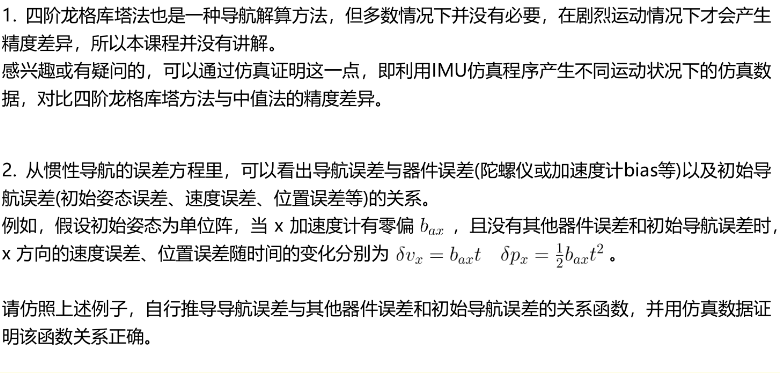
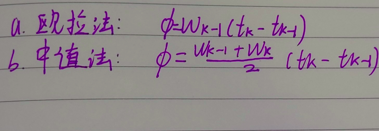
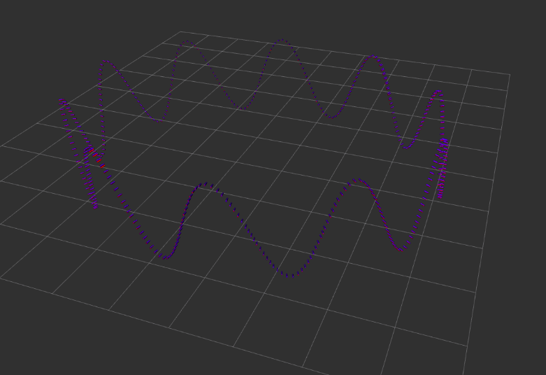
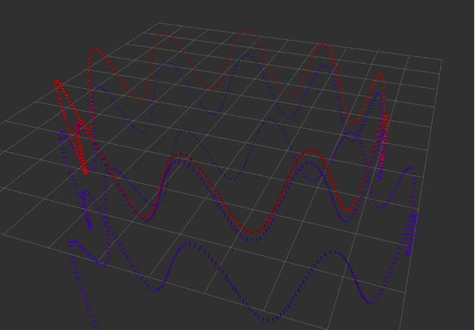

## 利用IMU仿真数据，进行惯性导航解算，并通过计算与ground truth之间的误差，对比欧拉法与中值法的精度差

## 异。

## 评价标准：

## 1）及格：根据课程给定的数据，完成基于中值法的解算；

## 2）良好：根据课程给定的数据，完成基于中值法、欧拉法的解算，并对精度做对比分析；

## 3）优秀：利用IMU仿真程序，自己生成不同运动状况（静止，匀速，加减速、快速转弯等）的仿真数据，对比两种

## 解算方法精度差异与运动状况的关系，并给出原因分析。

## [IMU数据仿真程序](https://github.com/Aceinna/gnss-ins-sim)

## 附加题：



## 1）及格



#### 中值法需要用到前后两相邻帧的信息，但是程序里用的是消息队列，所以设置两个索引号，0和1，索引imu_data_buffer得到相邻的imu，用于更新位姿，然后

#### pop掉最早的imu，如此循环更新位姿即可。

#### 基本步骤：

#### *更新角度增量->更新增量->更新速度->更新位置*

#### *code:*

```c++
 //
        // TODO: implement your estimation here
        //
        /// 中值积分：
        /// get deltas:
        Eigen::Vector3d angular_delta;
        Eigen::Vector3d velocity_delta;
        Eigen::Matrix3d R_curr;
        Eigen::Matrix3d R_prev;
        size_t current_idx = 1, prev_idx = 0;
        double delta_time =
            imu_data_buff_.at(current_idx).time - imu_data_buff_.at(prev_idx).time;
        GetAngularDelta(current_idx, prev_idx, angular_delta);
        /// update orientation:
        UpdateOrientation(angular_delta, R_curr, R_prev);
        /// get velocity delta:
        GetVelocityDelta(current_idx, prev_idx, R_curr, R_prev, delta_time,
                         velocity_delta);
        /// update position:
        UpdatePosition(delta_time, velocity_delta);
        SavePoseTUM(imu_data_buff_.at(current_idx).time, pose_, outfile_);
        // move forward -- 
        // NOTE: this is NOT fixed. you should update your buffer according to the method of your choice:
        imu_data_buff_.pop_front();
```

#### 在类Activity里定义一个新的函数，用于保存轨迹值到txt文件：

#### *code:*

```c++
void Activity::SavePoseTUM(const double &time, const Eigen::Matrix4d &pose, std::ofstream &filename) {
    Eigen::Quaterniond q(pose_.block<3,3>(0,0));
    Eigen::Vector3d t = pose_.block<3,1>(0,3);
    filename.precision(9);
    filename << time << " ";
    filename.precision(5);
    filename << t(0) << " "
                << t(1) << " "
                << t(2) << " "
                << q.x() << " "
                << q.y() << " "
                << q.z() << " "
                << q.w() << std::endl;
}
```

#### 创建一个txt文件：

#### *code:*

```c++
{
    outfile_.open("/home/bobododo/GNC/MSF/chapter6/estimation.txt");
}
```

#### 结果：



## 2）良好

#### 改成基于欧拉法的解算

#### *code:*

```c++
// angular_delta = 0.5*delta_t*(angular_vel_curr + angular_vel_prev); // 中值法
angular_delta = delta_t*angular_vel_prev; // 欧拉法

// velocity_delta = 0.5*delta_t*(linear_acc_curr + linear_acc_prev); // 中值法
velocity_delta = delta_t*linear_acc_curr; // 欧拉法
```

#### 结果：



#### 红色为groundtruth，蓝色为算法解算得到的轨迹，可以看出中值法精度更好。

## 3）优秀