在提供的工程的框架中，补全代码，实现基于地图的融合定位，并与不加滤波时的定位结果进行比较。

## 评价标准：

1）及格：补全代码，且滤波功能正常。

2）良好：补全代码，功能正常，且经过调试参数，滤波后性能比滤波前好。（详细的误差对比结果提供在作业中）

3）优秀：在前面模型推导过程中，考虑了器件误差中的随机游走，请给出不考虑随机游走模型时的推导过程，并在工程框架中实现。对比这两种方法性能的差异。另外，kalman滤波的性能对噪声的设置较为敏感，在提供结果的同时，给出不同噪声设置情况下的结果对比（至少5组参数）。

附加题：

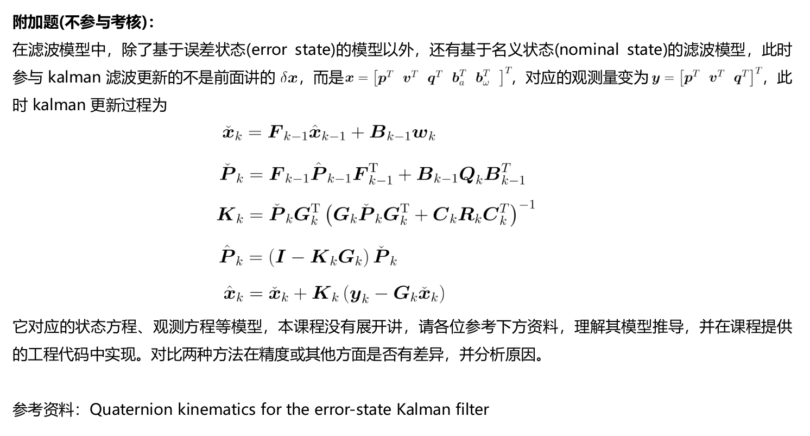

## 1）及格：

相关环境的配置与编译比较繁琐，注意要使用protoc 3.14.0版本。

protoc安装的参考链接：https://www.cnblogs.com/penuel/p/11334421.html

解决了环境的问题之后，完成及格部分的代码，这里主要参考chapter7课件中的Error-State-Kalman-Filter公式。

这里修改error_state_kalman_filter.cpp。


*预测部分：*

```c++
///
///TODO:perform kalman prediction
///   
X_ = F*X_;
P_ = F*P_*F.transpose()+B*Q_*B.transpose();
```


*误差部分：*

```c++
///
///TODO:set measurement
///
Eigen::Vector3d P_nn_obs = pose_.block<3,1>(0,3) - T_nb.block<3,1>(0,3);
Eigen::Matrix3d R_nn_obs = T_nb.block<3,3>(0,0).transpose() * pose_.block<3,3>(0,0);

YPose_.block<3,1>(0,0) = P_nn_obs;
YPose_.block<3,1>(3,0) = Sophus::SO3d::vee(R_nn_obs - Eigen::Matrix3d::Identity());
Y = YPose_;
```


*量测公式：*

```c++
//set measurement equation:
G = GPose_;
```


*设定kalman增益：*

```c++
//
//TODO: set Kalman gain:
//
MatrixRPose R = RPose_;
MatrixCPose C = Eigen::MatrixXd::Identity(6,6); 
K = P_ * G.transpose() * (G * P_ * G.transpose() + C * R * C.transpose()).inverse();
```


*有观测时的量测更新：*

```c++
//
//TODO: perform Kalman correct
//
P_ = (MatrixP::Identity() - K*G) * P_;
X_ = X_ + K * (Y - G*X_);
```


*有观测时计算后验值：*

```c++
//
//TODO: correct state estimation using the state of ESKF
//
//a.position:
pose_.block<3,1>(0,3) = 
       pose_.block<3,1>(0,3) - X_.block<3,1>(INDEX_ERROR_POS, 0);
//b.velocity:
vel_ = vel_ - X_.block<3,1>(INDEX_ERROR_VEL, 0);
//c.orientation:
Eigen::Matrix3d R_nn = 
    Sophus::SO3d::hat(X_.block<3,1>(INDEX_ERROR_ORI, 0)).matrix();
pose_.block<3,3>(0,0) = pose_.block<3,3>(0,0) * (Eigen::MatrixXd::Identity(3,3) - R_nn);

//d.gyro bias:
if(IsCovStable(INDEX_ERROR_GYRO)){
     gyro_bias_ += X_.block<3,1>(INDEX_ERROR_GYRO, 0); 
}
//e.accel bias:
if(IsCovStable(INDEX_ERROR_ACCEL)){
    accl_bias_ += X_.block<3,1>(INDEX_ERROR_ACCEL, 0);
}
```

*运行命令：*

```bash
# build:
catkin config --install && catkin build lidar_localization
# set up session:
source install/setup.bash
# launch:
roslaunch lidar_localization kitti_localization.launch
# play ROS bag, lidar-only KITTI:
rosbag play kitti_lidar_only_2011_10_03_drive_0027_synced.bag
```

*运行结果：*

黄色轨迹为GNSS Localization，此处作为Ground Truth

蓝色轨迹为ESKF Fused Estimation

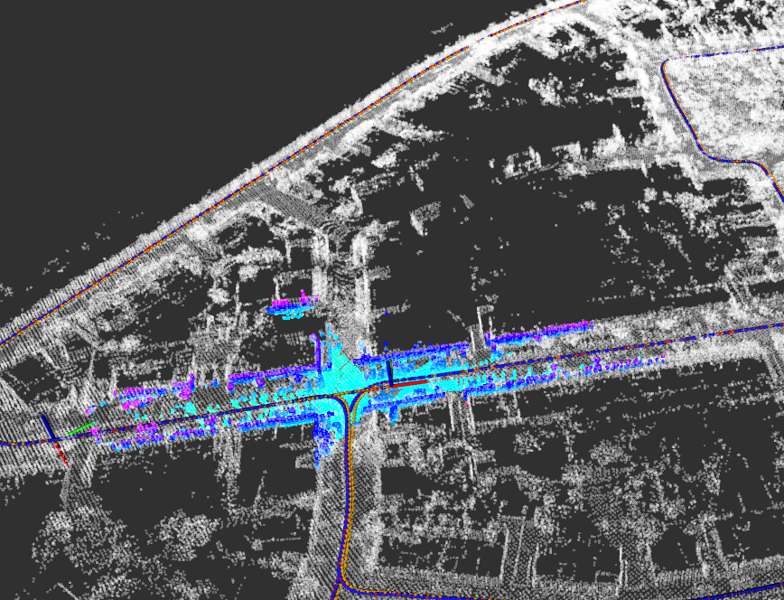

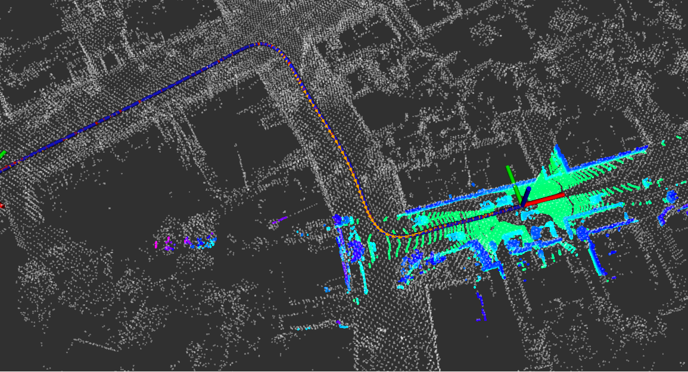


## 2）良好：

用evo评估轨迹的输出：

```bash
# set up session:
source install/setup.bash
# save odometry:
rosservice call /save_odometry  
# run evo evaluation:
# a. laser:
evo_ape kitti ground_truth.txt laser.txt -r full --plot --plot_mode xy
# b. fused:
evo_ape kitti ground_truth.txt fused.txt -r full --plot --plot_mode xy
```

参数1：

```yaml
        process:
            gyro: 1.0e-4
            accel: 2.5e-3
            bias_accel: 2.5e-3
            bias_gyro: 1.0e-4
        measurement:
            pose:
                pos: 1.0e-4
                ori: 1.0e-4
            pos: 1.0e-4
            vel: 2.5e-3
```


滤波前：

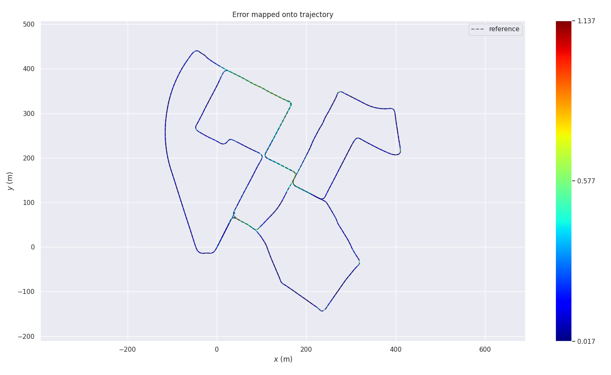

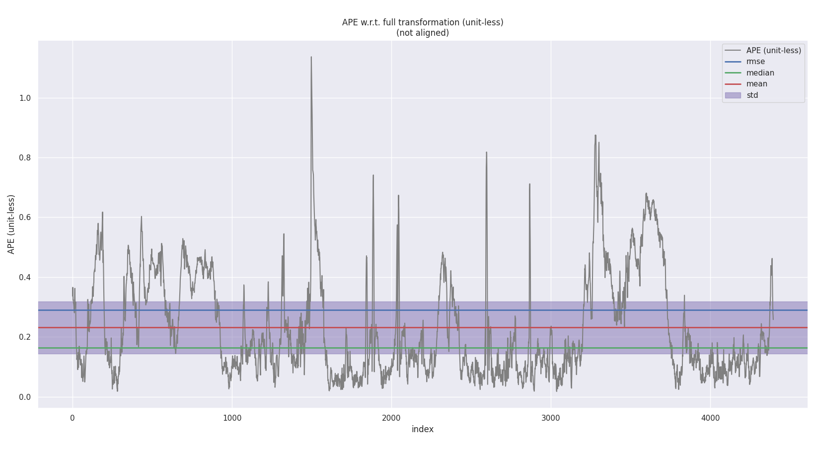


```bash
$ evo_ape kitti ground_truth.txt laser.txt -r full --plot --plot_mode xy 
APE w.r.t. full transformation (unit-less)
(not aligned)

       max      1.136680
      mean      0.231077
    median      0.163719
       min      0.017465
      rmse      0.289223
       sse      367.642727
       std      0.173936

(base) 
       
```


滤波后：

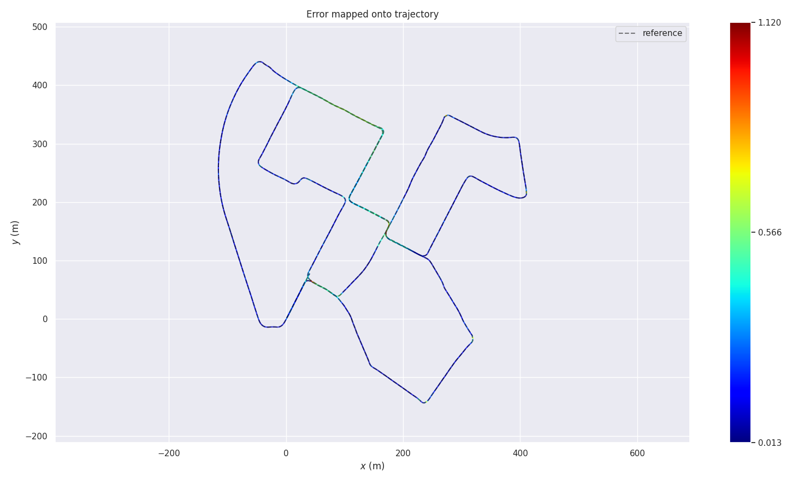

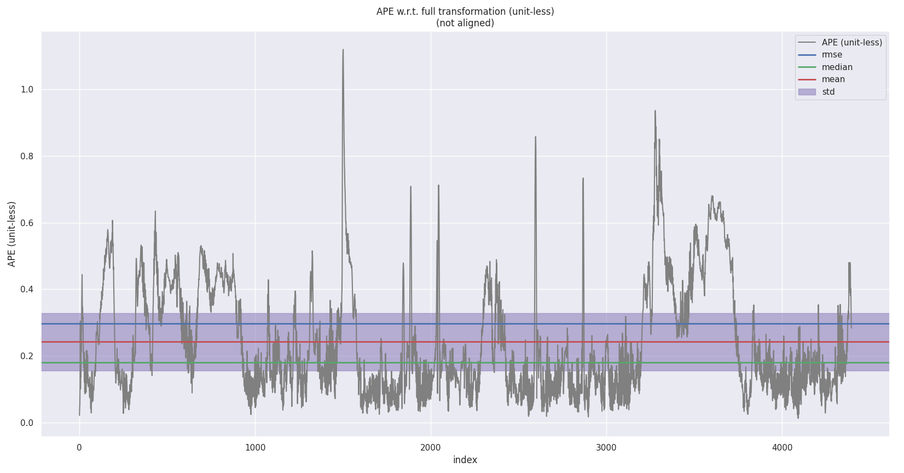


```bash
$ evo_ape kitti ground_truth.txt fused.txt -r full --plot --plot_mode xy
APE w.r.t. full transformation (unit-less)
(not aligned)

       max      1.119961
      mean      0.242563
    median      0.180933
       min      0.012636
      rmse      0.297372
       sse      388.649642
       std      0.172026

(base) 

```


参数2：

```yaml
        process:
            gyro: 1.0e-6
            accel: 2.5e-5
            bias_accel: 2.5e-5
            bias_gyro: 1.0e-6
        measurement:
            pose:
                pos: 1.0e-6
                ori: 1.0e-6
            pos: 1.0e-6
            vel: 2.5e-5
```

滤波前：

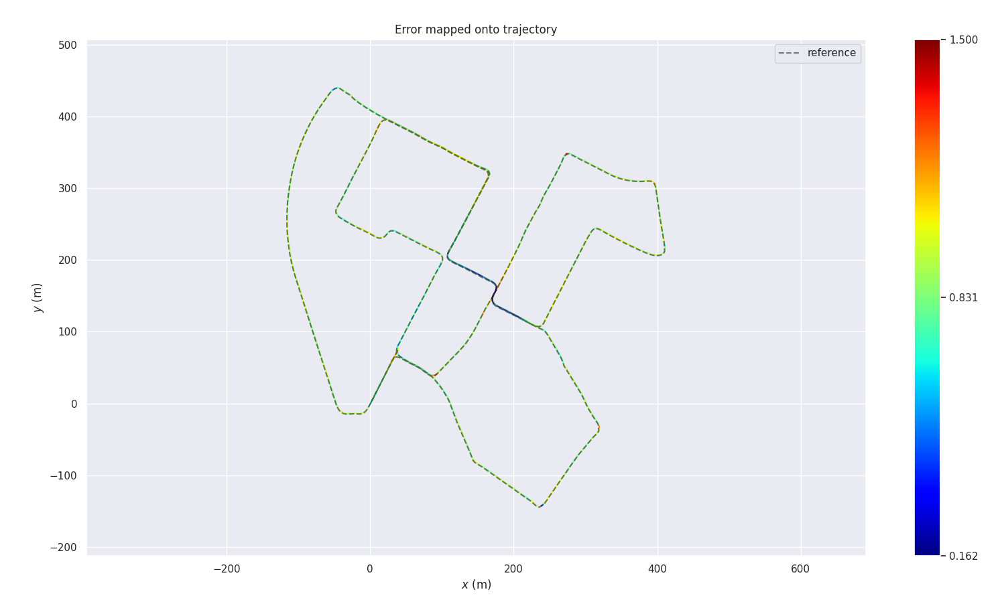


```bash
$ evo_ape kitti ground_truth.txt laser.txt -r full --plot --plot_mode xy
APE w.r.t. full transformation (unit-less)
(not aligned)

       max      1.500344
      mean      0.901536
    median      0.893552
       min      0.161967
      rmse      0.916567
       sse      3687.179716
       std      0.165312

(base)
```


滤波后：

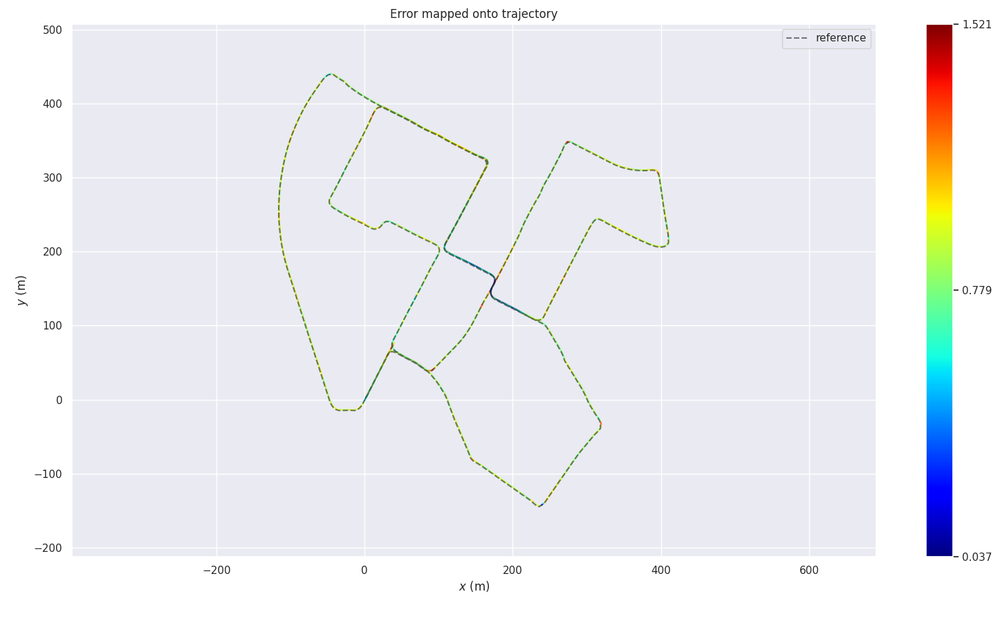

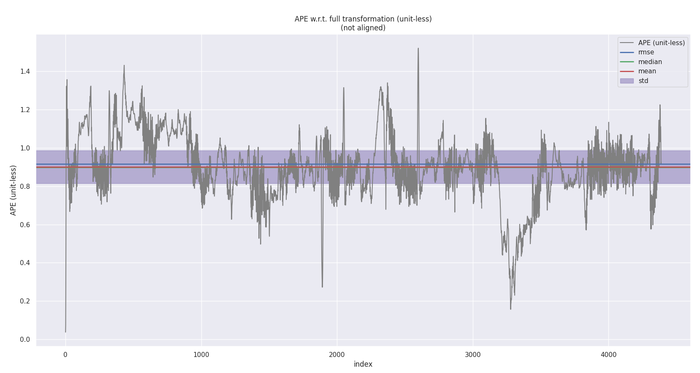

```bash
$ evo_ape kitti ground_truth.txt fused.txt -r full --plot --plot_mode xy
APE w.r.t. full transformation (unit-less)
(not aligned)

       max      1.521206
      mean      0.900285
    median      0.898876
       min      0.037265
      rmse      0.916731
       sse      3688.493718
       std      0.172863

(base) 

```


参数3：

```yaml
        process:
            gyro: 1.0e-2
            accel: 2.5e-3
            bias_accel: 2.5e-3
            bias_gyro: 1.0e-2
        measurement:
            pose:
                pos: 1.0e-2
                ori: 1.0e-2
            pos: 1.0e-2
            vel: 2.5e-1
```


滤波前：

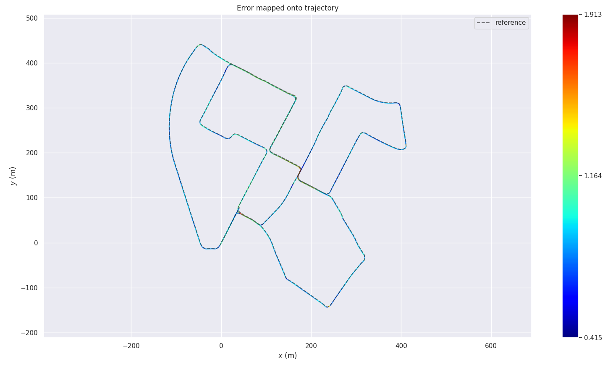

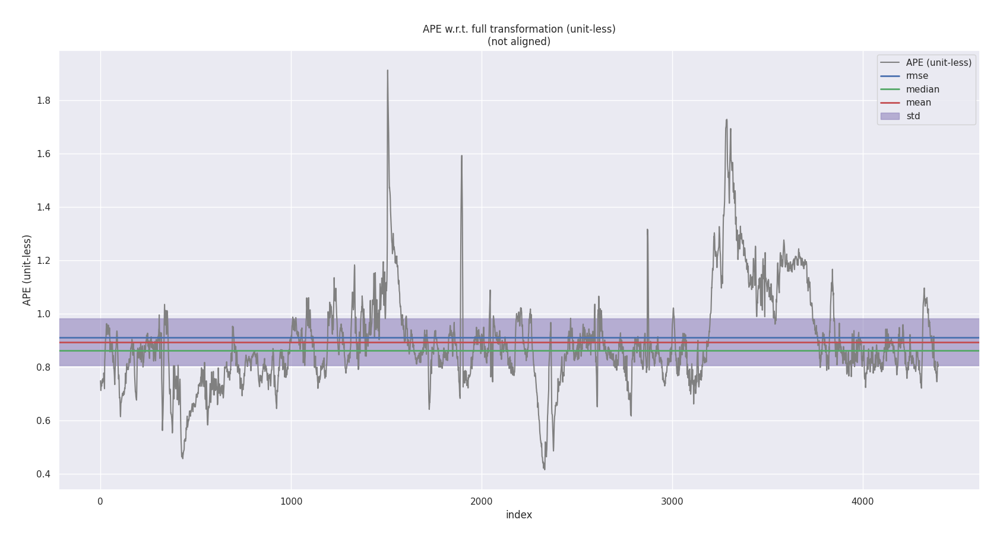

```bash
 evo_ape kitti ground_truth.txt laser.txt -r full --plot --plot_mode xy
APE w.r.t. full transformation (unit-less)
(not aligned)

       max      1.912693
      mean      0.894382
    median      0.863311
       min      0.415304
      rmse      0.911538
       sse      3653.472484
       std      0.176018

```


滤波后：

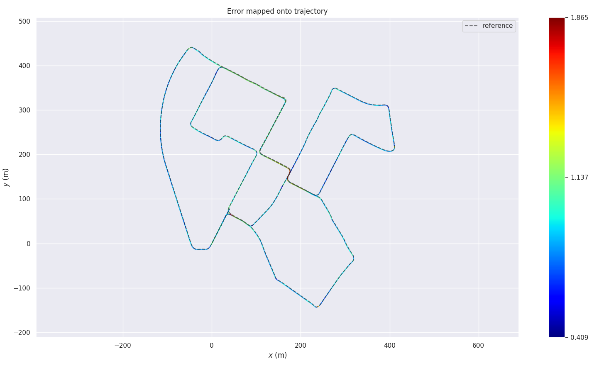

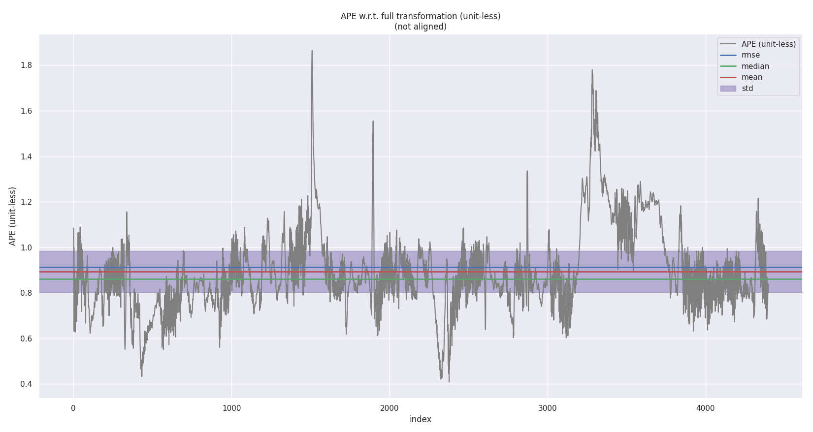

```bash
$ evo_ape kitti ground_truth.txt fused.txt -r full --plot --plot_mode xy
APE w.r.t. full transformation (unit-less)
(not aligned)

       max      1.865000
      mean      0.894174
    median      0.861327
       min      0.409404
      rmse      0.912564
       sse      3661.702406
       std      0.182281

(base) 

```

## 3）优秀：

```c++
 // d. gyro bias:
        if (COV.PROCESS.BIAS_FLAG && IsCovStable(INDEX_ERROR_GYRO)) {
            gyro_bias_ += X_.block<3, 1>(INDEX_ERROR_GYRO, 0);
        }

        // e. accel bias:
        if (COV.PROCESS.BIAS_FLAG && IsCovStable(INDEX_ERROR_ACCEL)) {
            accl_bias_ += X_.block<3, 1>(INDEX_ERROR_ACCEL, 0);
        }
```

这里设置了bias_flag，设为false，所以不考虑器件误差的随机游走。

滤波后:

```bash
$ evo_ape kitti ground_truth.txt fused.txt -r full --plot --plot_mode xy
APE w.r.t. full transformation (unit-less)
(not aligned)

       max      1.865994
      mean      0.893985
    median      0.861140
       min      0.369832
      rmse      0.912816
       sse      3634.565774
       std      0.184457

(base) 

```


滤波后（考虑随机游走）：

```bash
$ evo_ape kitti ground_truth.txt fused.txt -r full --plot --plot_mode xy
APE w.r.t. full transformation (unit-less)
(not aligned)

       max      1.866675
      mean      0.894021
    median      0.859678
       min      0.422663
      rmse      0.912531
       sse      3651.443221
       std      0.182863

(base) 

```

基本没有差别