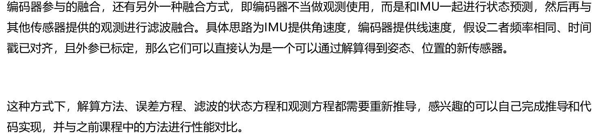
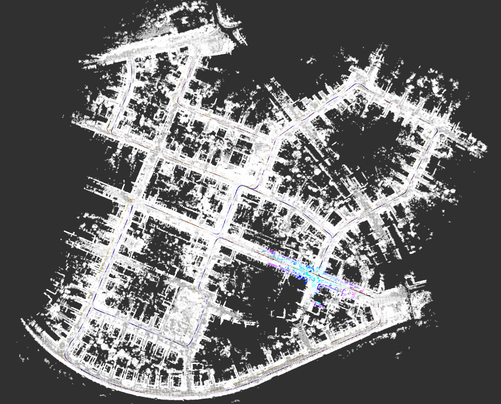
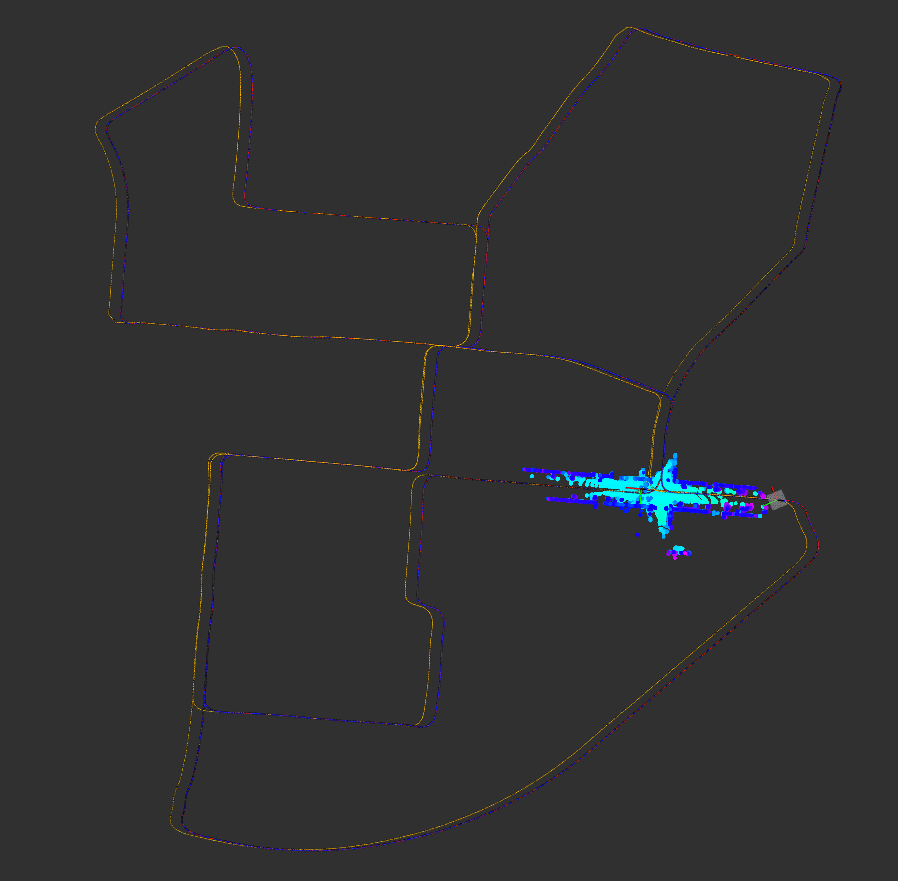
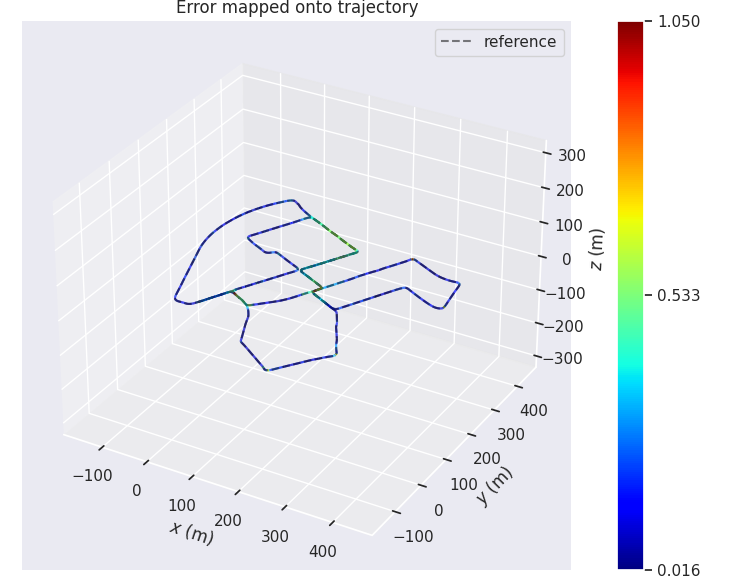
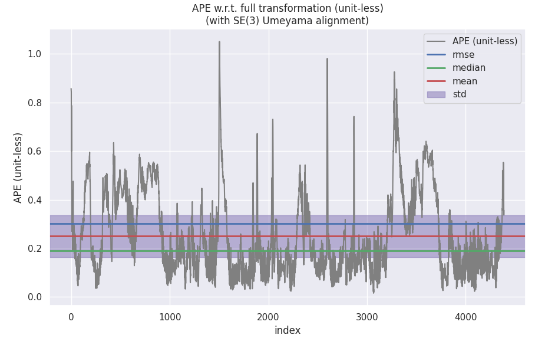
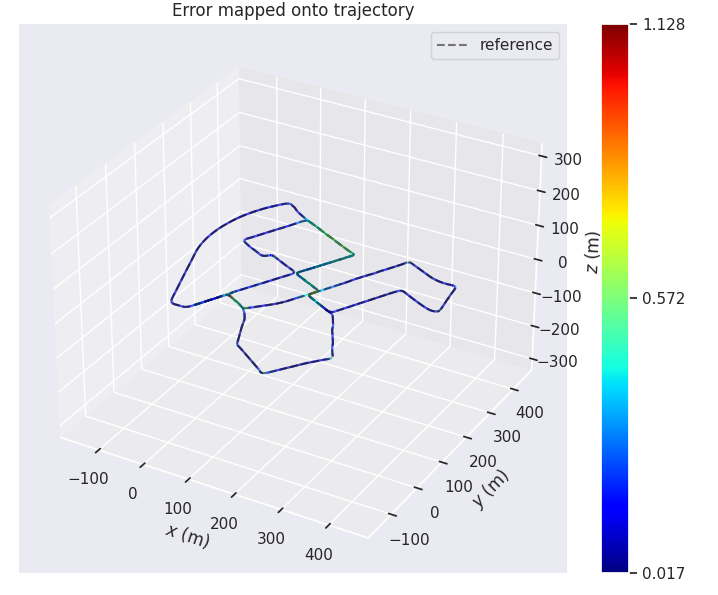
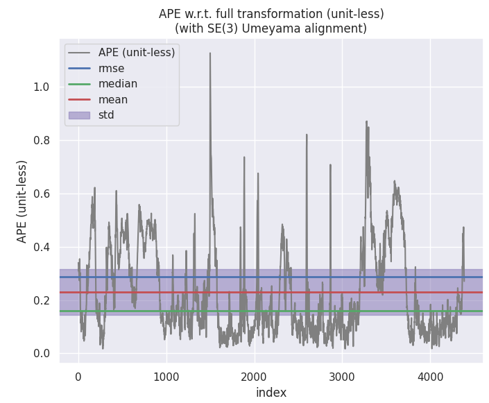

## 在第七章作业中实现的滤波方案的基础上，实现融合运动模型的滤波方法，并对比加入运动模型约束前后，滤波精度

## 的变化。由于运动模型约束更多的是改善速度的波动，而且是y向和z向的波动，所以要展示结果时候，提供b系y向

## 和z向速度误差的曲线与指标。

## 注：同样由于kitti数据集质量的问题，效果的改善不一定在所有路段都能体现，可以挑选效果好的路段重点展示。


## 评价标准：

## 1）及格：实现新模型，且功能正常

## 2）良好：实现新模型，且部分路段性能有改善

## 3）优秀：在良好的基础上，增加编码器融合的内容，具体如下：

## 使用仿真数据（仿真数据需要依据下方链接中的仿真程序自己生成），实现以GPS位置和编码器速度为观测量的融合

## 方法，并分析其精度。

#### [仿真程序](https://github.com/Aceinna/gnss-ins-sim)

## 附加题：



## 1）及格：实现新模型，且功能正常

#### 运动约束，是指在没有速度的测量的时候添加的一种约束方式，利用车体只有前进方向有速度，yz方向的速度为0，这个0就是一个观测，误差量就可以根据测量出

#### 来的值在这两个方向上和0的偏差计算出来。为了在body系加入在对Y和Z系的约束，需要修改代码中的ErrorStateKalmanFilter::CorrectErrorEstimationPose


#### （1）公式推导：

#### <font color='green'>由于导航解算得到的是w系下的速度，而速度观测是b系下的，因此需要推导两者之间的误差关系，才能得到相应的观测方程。</font>

#### 1）写出不考虑误差时的方程：

$$
\boldsymbol{v}^{b}=\boldsymbol{R}_{b w} \boldsymbol{v}^{w}
$$
#### 2）写出考虑误差时的方程：

$$
\tilde{\boldsymbol{v}}^{b}=\tilde{\boldsymbol{R}}_{b w} \tilde{\boldsymbol{v}}^{w}
$$
#### 3）写出真实值和理想值之间的关系：

$$
\begin{array}{l}
\tilde{\boldsymbol{v}}^{b}=\boldsymbol{v}^{b}+\delta \boldsymbol{v}^{b} \\
\tilde{\boldsymbol{v}}^{w}=\boldsymbol{v}^{w}+\delta \boldsymbol{v}^{w} \\
\tilde{\boldsymbol{R}}_{b w}=\tilde{\boldsymbol{R}}_{w b}^{T}=\left(\boldsymbol{R}_{w b}\left(\boldsymbol{I}+[\delta \boldsymbol{\theta}]_{\times}\right)\right)^{T}=\left(\boldsymbol{I}-[\delta \boldsymbol{\theta}]_{\times}\right) \boldsymbol{R}_{b w}
\end{array}
$$
#### 4）把3）中的关系带入2）式

$$
\boldsymbol{v}^{b}+\delta \boldsymbol{v}^{b}=\left(\boldsymbol{I}-[\delta \boldsymbol{\theta}]_{\times}\right) \boldsymbol{R}_{b w}\left(\boldsymbol{v}^{w}+\delta \boldsymbol{v}^{w}\right)
$$
#### 5）把1）中的关系带入4）式

$$
\boldsymbol{R}_{b w} \boldsymbol{v}^{w}+\delta \boldsymbol{v}^{b}=\left(\boldsymbol{I}-[\delta \boldsymbol{\theta}]_{\times}\right) \boldsymbol{R}_{b w}\left(\boldsymbol{v}^{w}+\delta \boldsymbol{v}^{w}\right)
$$
#### 6）化简方程

$$
\delta \boldsymbol{v}^{b}=\boldsymbol{R}_{b w} \delta \boldsymbol{v}^{w}-[\delta \boldsymbol{\theta}]_{\times} \boldsymbol{R}_{b w} \boldsymbol{v}^{w}=\boldsymbol{R}_{b w} \delta \boldsymbol{v}^{w}-[\delta \boldsymbol{\theta}]_{\times} \boldsymbol{v}^{b}=\boldsymbol{R}_{b w} \delta \boldsymbol{v}^{w}+\left[\boldsymbol{v}^{b}\right]_{\times} \delta \boldsymbol{\theta}
$$
#### 已经知道状态量如下所示：

$$
\delta \boldsymbol{x}=\left[\begin{array}{c}
\delta \boldsymbol{p} \\
\delta \boldsymbol{v} \\
\delta \boldsymbol{\theta} \\
\delta \boldsymbol{b}_{a} \\
\delta \boldsymbol{b}_{\omega}
\end{array}\right]
$$
#### 而融合编码器以后，观测量变为：

$$
\boldsymbol{y}=\left[\begin{array}{c}
\delta \overline{\boldsymbol{p}} \\
\delta \overline{\boldsymbol{v}}^{b} \\
\delta \overline{\boldsymbol{\theta}}
\end{array}\right]
$$
#### 其中，$\delta \overline{\boldsymbol{v}}^{b}$的观测值可以通过下式获得：

$$
\delta \overline{\boldsymbol{v}}_{b}=\tilde{\boldsymbol{v}}^{b}-\boldsymbol{v}^{b}=\tilde{\boldsymbol{R}}_{b w} \tilde{\boldsymbol{v}}^{w}-\left[\begin{array}{c}
\boldsymbol{v}_{m} \\
0 \\
0
\end{array}\right]
$$
#### 此时的观测方程$\boldsymbol{y}=\boldsymbol{G}_{t} \delta \boldsymbol{x}+\boldsymbol{C}_{t} \boldsymbol{n}$的各变量应重写为:

$$
\boldsymbol{G}_{t}=\left[\begin{array}{ccccc}
\boldsymbol{I}_{3} & \mathbf{0} & \mathbf{0} & \mathbf{0} & \mathbf{0} \\
\mathbf{0} & \boldsymbol{R}_{b w} & {\left[\boldsymbol{v}^{b}\right]_{\times}} & \mathbf{0} & \mathbf{0} \\
\mathbf{0} & \mathbf{0} & \boldsymbol{I}_{3} & \mathbf{0} & \mathbf{0}
\end{array}\right]
$$

$$
\boldsymbol{C}_{t}=\left[\begin{array}{ccc}
\boldsymbol{I}_{3} & \mathbf{0} & \mathbf{0} \\
\mathbf{0} & \boldsymbol{I}_{3} & \mathbf{0} \\
\mathbf{0} & \mathbf{0} & \boldsymbol{I}_{3}
\end{array}\right]
$$

$$
\boldsymbol{n}=\left[\begin{array}{lllllllll}
n_{\delta \bar{p}_{x}} & n_{\delta \bar{p}_{y}} & n_{\delta \bar{p}_{z}} & n_{\delta \bar{v}_{x}^{b}} & n_{\delta \bar{v}_{y}^{b}} & n_{\delta \bar{v}_{z}^{b}} & n_{\delta \bar{\theta}_{x}} & n_{\delta \bar{\theta}_{y}} & n_{\delta \bar{\theta}_{z}}
\end{array}\right]^{T}
$$

#### 大部分情况，硬件平台并没有编码器，不能直接使用编码器模型，但结合车本身的运动特性（侧向和天向速度为零）仍然可以使用，可以得到新的观测量：

$$
\boldsymbol{y}=\left[\begin{array}{c}
\delta \overline{\boldsymbol{p}} \\
{\left[\delta \overline{\boldsymbol{v}}^{b}\right]_{y z}} \\
\delta \overline{\boldsymbol{\theta}}
\end{array}\right]
$$
#### 对观测量带来的改变仅仅是少了一个维度，观测方程$\boldsymbol{y}=\boldsymbol{G}_{t} \delta \boldsymbol{x}+\boldsymbol{C}_{t} \boldsymbol{n}$中的各变量重新写为：

$$
\begin{aligned}
\boldsymbol{G}_{t} &=\left[\begin{array}{ccccc}
\boldsymbol{I}_{3} & \mathbf{0} & \mathbf{0} & \mathbf{0} & \mathbf{0} \\
\mathbf{0} & {\left[\boldsymbol{R}_{b w}\right]_{y z}} & {\left[\left[\boldsymbol{v}^{b}\right]_{\times}\right]_{y z}} & \mathbf{0} & \mathbf{0} \\
\mathbf{0} & \mathbf{0} & \boldsymbol{I}_{3} & \mathbf{0} & \mathbf{0}
\end{array}\right] \\
\end{aligned}
$$

$$
\boldsymbol{C}_{t}=\left[\begin{array}{ccc}
\boldsymbol{I}_{3} & \mathbf{0} & \mathbf{0} \\
\mathbf{0} & \boldsymbol{I}_{2} & \mathbf{0} \\
\mathbf{0} & \mathbf{0} & \boldsymbol{I}_{3}
\end{array}\right]
$$

$$
\boldsymbol{n}=\left[\begin{array}{llllllll}
n_{\delta \bar{p}_{x}} & n_{\delta \bar{p}_{y}} & n_{\delta \bar{p}_{z}} & n_{\delta \bar{v}_{y}^{b}} & n_{\delta \bar{v}_{z}^{b}} & n_{\delta \bar{\theta}_{x}} & n_{\delta \bar{\theta}_{y}} & n_{\delta \bar{\theta}_{z}}
\end{array}\right]^{T}
$$


#### （2）代码补充：

#### ESKF接口定义[here](src/lidar_localization/include/lidar_localization/models/kalman_filter/error_state_kalman_filter.hpp)

#### 添加了对curr_raw_gyro_的定义。

```c++
Eigen::Vector3d curr_raw_gyro_ = Eigen::Vector3d::Zero();
```

#### ESKF实现[here](src/lidar_localization/src/models/kalman_filter/error_state_kalman_filter.cpp)

#### 在body系加入对Y和Z系的约束，转弯时，ESKF对应的观测在body系下的速度在Y和Z方向的分量其值并不接近0，ESKF实际估计的是IMU的速度，并不是真正的

#### 质心速度，所以会在旋转时产生速度分量，所以需要检测当前旋转角速度的大小，当其值过大时，则不强加在Y轴和Z轴上的限制。

```c++
void ErrorStateKalmanFilter::CorrectErrorEstimationPose(
    const Eigen::Matrix4d &T_nb, Eigen::VectorXd &Y, Eigen::MatrixXd &G, Eigen::MatrixXd &K)
    {
    //
    // TODO: set measurement:
    //
    Eigen::Vector3d P_nn_obs = pose_.block<3, 1>(0,3) - T_nb.block<3, 1>(0,3);
    Eigen::Matrix3d C_nn_obs = T_nb.block<3, 3>(0,0).transpose() * pose_.block<3, 3>(0,0);

    //check whether we apply the motion constraint or not based on the angular rate.
    bool apply_motion_constraint = GetUnbiasedAngularVel(curr_raw_gyro_, pose_.block<3, 3>(0,0)).norm() < 0.15;
    //apply motion constraint = false;
    LOG(INFO) << "apply_motion_constraint?" << apply_motion_constraint;

    YPose_.block<3, 1>(0, 0) = P_nn_obs;
    YPose_.block<3, 1>(3, 0) = Sophus::SO3d::vee(C_nn_obs - Eigen::Matrix3d::Identity());

    const Eigen::Matrix3d rx_robot_world = pose_.block<3, 3>(0,0).transpose();
    const Eigen::Vector3d velocity_robot = rx_robot_world * vel_;
    if(apply_motion_constraint){
        Y = Eigen::MatrixXd::Zero(8, 1);
        Y.block<3, 1>(0,0) = YPose_.block<3,1>(0,0);
        Y.block<2, 1>(0,0) = velocity_robot.block<2,1>(1,0);
        Y.block<3, 1>(5,0) = YPose_.block<3,1>(3,0);
    }else {
        Y = YPose_;
    }
    // set measurement equation:
    if (apply_motion_constraint){
      G = Eigen::MatrixXd::Zero(8, 15);
      G.block<3, 3>(0, INDEX_ERROR_POS) = Eigen::Matrix3d::Identity();
      G.block<2, 3>(3, INDEX_ERROR_VEL) = rx_robot_world.block<2,3>(1,0);
      G.block<2, 3>(3, INDEX_ERROR_ORI) = Sophus::SO3d::hat(velocity_robot).block<2, 3>(1,0);
      G.block<3, 3>(5, INDEX_ERROR_ORI) = Eigen::Matrix3d::Identity();
    }else {
        G = GPose_;
    }

    Eigen::MatrixXd R;
    if(apply_motion_constraint) {
      R = Eigen::MatrixXd::Zero(8, 8);
      R.block<3, 3>(0, 0) = RPose_.block<3, 3>(0, 0);
      R.block<2, 2>(3, 3) = Eigen::Matrix2d::Identity() * 0.01;
      R.block<3, 3>(5, 5) = RPose_.block<3, 3>(3, 3);
    } else{
      R = CPose_ * RPose_ * CPose_.transpose();
    }
    // set Kalman gain:
    K = P_ * G.transpose() * (G * P_ * G.transpose() + R).inverse();
}

```


#### （3）运行结果：

#### 地图匹配定位结果:



#### 运行轨迹：



## 2）良好：实现新模型，且部分路段性能有改善

#### 融合结果：

```bash
$ evo_ape kitti ground_truth.txt fused.txt -r full --plot --plot_mode xyz -a
APE w.r.t. full transformation (unit-less)
(with SE(3) Umeyama alignment)

       max	1.050466
      mean	0.250131
    median	0.189233
       min	0.015881
      rmse	0.303132
       sse	403.302031
       std	0.171241
```






#### 不融合结果：

```bash
$ evo_ape kitti ground_truth.txt laser.txt -r full --plot --plot_mode xyz -a
APE w.r.t. full transformation (unit-less)
(with SE(3) Umeyama alignment)

       max	1.127733
      mean	0.230251
    median	0.160840
       min	0.016747
      rmse	0.287870
       sse	363.713858
       std	0.172782
```





#### 从结果可以看出差别不大。

## 3）优秀：在良好的基础上，增加编码器融合的内容，具体如下：

#### 使用仿真数据（仿真数据需要依据下方链接中的仿真程序自己生成），实现以GPS位置和编码器速度为观测量的融合方法，并分析其精度。

