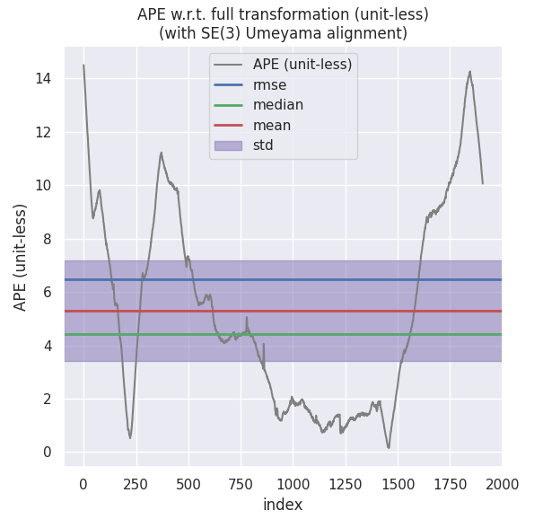

#### <font color='green'>本作业旨在加深对基于图优化的建图方法理解，在IMU预积分中，课程只提供了残差对部分变量的雅可比，并在建图流程代码中补全基于IMU预积分的融合方法中的待填内容，随后和不加IMU融合时的效果进行对比。</font>

## 评价标准：

1）及格：公式推导正确，且补全代码之后功能正常

2）良好：及格基础上，实现和不加IMU时的效果对比和分析

3）优秀：良好基础上，完成融合编码器时预积分公式的推导（方差递推、残差对状态量雅可比、bias更新等）

## 1）及格：

对位姿、速度、bias的求导以扰动的方式进行，所以此处状态量实际是扰动

#### 扰动如下：

$$
\left[\begin{array}{llllllllll}
\delta \mathbf{p}_{w b_{i}} & \delta \theta_{w b_{i}} & \delta \mathbf{v}_{i}^{w} & \delta \mathbf{b}_{i}^{a} & \delta \mathbf{b}_{i}^{g} & \delta \mathbf{p}_{w b_{j}} & \delta \theta_{w b_{j}} & \delta \mathbf{v}_{j}^{w} & \delta \mathbf{b}_{j}^{a} & \delta \mathbf{b}_{j}^{g}
\end{array}\right]
$$

#### 残差如下：

$$
\left[\begin{array}{c}
\mathbf{r}_{p} \\
\mathbf{r}_{\theta} \\
\mathbf{r}_{v} \\
\mathbf{r}_{b^{a}} \\
\mathbf{r}_{b^{g}}
\end{array}\right]=\left[\begin{array}{c}
\mathbf{q}_{w b_{i}}^{*}\left(\mathbf{p}_{w b_{j}}-\mathbf{p}_{w b_{i}}-\mathbf{v}_{i}^{w} \Delta t+\frac{1}{2} \mathbf{g}^{w} \Delta t^{2}-\mathbf{q}_{w b_{i}} \alpha_{b_{i} b_{j}}\right) \\
2\left[\mathbf{q}_{b_{i} b_{j}}^{*} \otimes\left(\mathbf{q}_{w b_{i}}^{*} \otimes \mathbf{q}_{w b_{j}}\right)\right]_{x y z} \\
\mathbf{q}_{w b_{i}}^{*}\left(\mathbf{v}_{j}^{w}-\mathbf{v}_{i}^{w}+\mathbf{g}^{w} \Delta t-\mathbf{q}_{w b_{i}} \beta_{b_{i} b_{j}}\right) \\
\mathbf{b}_{j}^{a}-\mathbf{b}_{i}^{a} \\
\mathbf{b}_{j}^{g}-\mathbf{b}_{i}^{g}
\end{array}\right]=\left[\begin{array}{c}
\mathbf{q}_{w b_{i}}^{*}\left(\mathbf{p}_{w b_{j}}-\mathbf{p}_{w b_{i}}-\mathbf{v}_{i}^{w} \Delta t+\frac{1}{2} \mathbf{g}^{w} \Delta t^{2}\right)-\alpha_{b_{i} b_{j}} \\
2\left[\mathbf{q}_{b_{i} b_{j}}^{*} \otimes\left(\mathbf{q}_{w b_{i}}^{*} \otimes \mathbf{q}_{w b_{j}}\right)\right]_{x y z} \\
\mathbf{q}_{w b_{i}}^{*}\left(\mathbf{v}_{j}^{w}-\mathbf{v}_{i}^{w}+\mathbf{g}^{w} \Delta t\right)-\beta_{b_{i} b_{j}} \\
\mathbf{b}_{j}^{a}-\mathbf{b}_{i}^{a} \\
\mathbf{b}_{j}^{g}-\mathbf{b}_{i}^{g}
\end{array}\right]
$$

#### 对p残差求导：

i时刻：
$$
\frac{\partial \mathbf{r}_{p}}{\partial \delta \mathbf{p}_{w b_{i}}}=\frac{\partial-\mathbf{q}_{w b_{i}}^{*}\left(\mathbf{p}_{w b_{i}}+\delta \mathbf{p}_{w b_{i}}\right)}{\partial \delta \mathbf{p}_{w b_{i}}}=-\mathbf{R}_{b_{i} w}
$$

$$
\begin{aligned}
\frac{\partial \mathbf{r}_{p}}{\partial \delta \theta_{w b_{i}}} &=\frac{\partial\left(\mathbf{q}_{w b_{i}} \otimes\left[\begin{array}{c}
1 \\
\frac{1}{2} \delta \theta_{w b_{i}}
\end{array}\right]\right)^{*}\left(\mathbf{p}_{w b_{j}}-\mathbf{p}_{w b_{i}}-\mathbf{v}_{i}^{w} \Delta t+\frac{1}{2} \mathbf{g}^{w} \Delta t^{2}\right)}{\partial \delta \theta_{w b_{i}}} \\
&=\frac{\partial\left(\mathbf{R}_{w b_{i}} \exp \left(\delta \theta_{w b_{i}}^{\wedge}\right)\right)^{-1}\left(\mathbf{p}_{w b_{j}}-\mathbf{p}_{w b_{i}}-\mathbf{v}_{i}^{w} \Delta t+\frac{1}{2} \mathbf{g}^{w} \Delta t^{2}\right)}{\partial \delta \theta_{w b_{i}}} \\
&=\frac{\partial \exp \left(\left(-\delta \theta_{w b_{i}}\right)^{\wedge}\right) \mathbf{R}_{b_{i} w}\left(\mathbf{p}_{w b_{j}}-\mathbf{p}_{w b_{i}}-\mathbf{v}_{i}^{w} \Delta t+\frac{1}{2} \mathbf{g}^{w} \Delta t^{2}\right)}{\partial \delta \theta_{w b_{i}}} \\
& \approx \frac{\partial\left(\mathbf{I}-\delta \theta_{w b_{i}}^{\wedge}\right) \mathbf{R}_{b_{i} w}\left(\mathbf{p}_{w b_{j}}-\mathbf{p}_{w b_{i}}-\mathbf{v}_{i}^{w} \Delta t+\frac{1}{2} \mathbf{g}^{w} \Delta t^{2}\right)}{\partial \delta \theta_{w b_{i}}} \\
&=\left(\mathbf{R}_{b_{i} w}\left(\mathbf{p}_{w b_{j}}-\mathbf{p}_{w b_{i}}-\mathbf{v}_{i}^{w} \Delta t+\frac{1}{2} \mathbf{g}^{w} \Delta t^{2}\right)\right)^{\wedge}
\end{aligned}
$$

$$
\frac{\partial \mathbf{r}_{p}}{\partial \delta \mathbf{v}_{i}^{w}}=-\mathbf{R}_{b_{i} w} \Delta t
$$

$$
\frac{\partial \mathbf{r}_{p}}{\partial \delta \mathbf{b}_{i}^{a}}=\frac{\partial-\left(\bar{\alpha}_{b_{i} b_{j}}+\mathbf{J}_{b_{i}^{a}}^{\alpha} \delta \mathbf{b}_{i}^{a}+\mathbf{J}_{b_{i}^{g}}^{\alpha} \delta \mathbf{b}_{i}^{g}\right)}{\partial \delta \mathbf{b}_{i}^{a}}=-\mathbf{J}_{b_{i}^{a}}^{\alpha}
$$

$$
\frac{\partial \mathbf{r}_{p}}{\partial \delta \mathbf{b}_{i}^{g}}=-\mathbf{J}_{b_{i}^{g}}^{\alpha}
$$

j时刻：
$$
\begin{aligned}
\frac{\partial \mathbf{r}_{p}}{\partial \delta \mathbf{p}_{w b_{j}}} &=\mathbf{R}_{b_{i} w} \\
\frac{\partial \mathbf{r}_{p}}{\partial \delta \theta_{w b_{j}}} &=\mathbf{0} \\
\frac{\partial \mathbf{r}_{p}}{\partial \delta \mathbf{v}_{j}^{w}} &=\mathbf{0} \\
\frac{\partial \mathbf{r}_{p}}{\partial \delta \mathbf{b}_{j}^{a}} &=\mathbf{0} \\
\frac{\partial \mathbf{r}_{p}}{\partial \delta \mathbf{b}_{j}^{g}} &=\mathbf{0}
\end{aligned}
$$

#### 对theta残差求导：

i时刻：
$$
\frac{\partial \mathbf{r}_{\theta}}{\partial \delta \mathbf{p}_{w b_{i}}}=\mathbf{0}
$$


$$
\begin{aligned}
\frac{\partial \mathbf{r}_{\theta}}{\partial \delta \mathbf{v}_{i}^{w}} &=\mathbf{0} \\
\frac{\partial \mathbf{r}_{\theta}}{\partial \delta \mathbf{b}_{i}^{a}} &=\mathbf{0}
\end{aligned}
$$

$$
\begin{aligned}
\frac{\partial \mathbf{r}_{\theta}}{\partial \delta \mathbf{b}_{i}^{g}} &=\frac{\partial 2\left[\left(\mathbf{q}_{b_{i} b_{j}} \otimes\left[\begin{array}{c}
1 \\
\frac{1}{2} \mathbf{J}_{b_{i}^{q}}^{q} \delta \mathbf{b}_{i}^{g}
\end{array}\right]\right)^{*} \otimes \mathbf{q}_{w b_{i}}^{*} \otimes \mathbf{q}_{w b_{j}}\right]_{x y z}}{\partial \delta \mathbf{b}_{i}^{g}} \\
&=-2\left[\begin{array}{ll}
0 & \mathbf{I}
\end{array}\right]\left[\mathbf{q}_{w b_{j}}^{*} \otimes \mathbf{q}_{w b_{i}} \mathbf{q}_{b_{i} b_{j}}\right]_{L}\left[\begin{array}{c}
1 \\
\frac{1}{2} \mathbf{J}_{b_{i}^{g}}^{q}
\end{array}\right]
\end{aligned}
$$

j时刻：
$$
\frac{\partial \mathbf{r}_{\theta}}{\partial \delta \mathbf{p}_{w b_{j}}}=\mathbf{0}
$$

$$
\frac{\partial \mathbf{r}_{\theta}}{\partial \delta \theta_{w b_{j}}}=\frac{\partial 2\left[\mathbf{q}_{b_{i} b_{j}}^{*} \otimes \mathbf{q}_{w b_{i}}^{*} \otimes \mathbf{q}_{w b_{j}} \otimes\left[\begin{array}{c}
1 \\
\frac{1}{2} \delta \theta_{w b_{j}}
\end{array}\right]\right]_{x y z}}{\partial \delta \theta_{w b_{j}}}=2\left[\begin{array}{ll}
0 & \mathbf{I}
\end{array}\right]\left[\mathbf{q}_{b_{i} b_{j}}^{*} \otimes \mathbf{q}_{w b_{i}}^{*} \otimes \mathbf{q}_{w b_{j}}\right]_{L}\left[\begin{array}{c}
1 \\
\frac{1}{2} \mathbf{I}
\end{array}\right]
$$

$$
\begin{aligned}
\frac{\partial \mathbf{r}_{\theta}}{\partial \delta \mathbf{v}_{j}^{w}} &=\mathbf{0} \\
\frac{\partial \mathbf{r}_{\theta}}{\partial \delta \mathbf{b}_{j}^{a}} &=\mathbf{0} \\
\frac{\partial \mathbf{r}_{\theta}}{\partial \delta \mathbf{b}_{j}^{g}} &=\mathbf{0}
\end{aligned}
$$

#### 对V残差求导：

i时刻：
$$
\begin{aligned}
\frac{\partial \mathbf{r}_{v}}{\partial \delta \mathbf{p}_{w b_{i}}} &=\mathbf{0} \\
\frac{\partial \mathbf{r}_{v}}{\partial \delta \theta_{w b_{i}}} &=\left(\mathbf{R}_{b_{i} w}\left(\mathbf{v}_{w b_{j}}-\mathbf{v}_{w b_{i}}+\mathbf{g}^{w} \Delta t\right)\right)^{\wedge} \\
\frac{\partial \mathbf{r}_{v}}{\partial \delta \mathbf{v}_{i}^{w}} &=-\mathbf{R}_{b_{i} w} \\
\frac{\partial \mathbf{r}_{v}}{\partial \delta \mathbf{b}_{i}^{a}} &=\frac{\partial-\left(\bar{\beta}_{b_{i} b_{j}}+\mathbf{J}_{b_{i}^{a}}^{\beta} \delta \mathbf{b}_{i}^{a}+\mathbf{J}_{b_{i}^{g}}^{\beta} \delta \mathbf{b}_{i}^{g}\right)}{\partial \delta \mathbf{b}_{i}^{a}}=-\mathbf{J}_{b_{i}^{a}}^{\beta} \\
\frac{\partial \mathbf{r}_{v}}{\partial \delta \mathbf{b}_{i}^{g}} &=-\mathbf{J}_{b_{i}^{g}}^{\beta}
\end{aligned}
$$
j时刻：
$$
\begin{aligned}
\frac{\partial \mathbf{r}_{v}}{\partial \delta \mathbf{p}_{w b_{j}}} &=\mathbf{0} \\
\frac{\partial \mathbf{r}_{v}}{\partial \delta \theta_{w b_{j}}} &=\mathbf{0} \\
\frac{\partial \mathbf{r}_{v}}{\partial \delta \mathbf{v}_{j}^{w}} &=\mathbf{R}_{b_{i} w} \\
\frac{\partial \mathbf{r}_{v}}{\partial \delta \mathbf{b}_{j}^{a}} &=\mathbf{0} \\
\frac{\partial \mathbf{r}_{v}}{\partial \delta \mathbf{b}_{j}^{g}} &=\mathbf{0}
\end{aligned}
$$

#### 对ba，bg残差求导：


#### 补全代码：

#### 相关配置汇总如下：

**IMU Pre-Integration** [here](src/lidar_localization/src/models/pre_integrator/imu_pre_integrator.cpp#L178)

##### 代码补全：

```c++
    //
    // TODO: a. update mean: 更新值
    //
   //中值：w_mid, a_mid
  //积分项：theta_ij（姿态），alpha_ij（位置），beta_ij（速度） 
    // 1. get w_mid:
    w_mid = 0.5 * (prev_w + curr_w);
    // 2. update relative orientation, so3:
    prev_theta_ij = state.theta_ij_;
    d_theta_ij = Sophus::SO3d::exp(w_mid * T);
    state.theta_ij_ *= d_theta_ij;
    curr_theta_ij = state.theta_ij_;
    // 3. get a_mid:
    a_mid = 0.5 * (prev_theta_ij * prev_a + curr_theta_ij * curr_a);
    // 4. update relative translation:
    state.alpha_ij_ += state.beta_ij_ * T + 0.5 * a_mid * T * T;
    // 5. update relative velocity:
    state.beta_ij_ += a_mid * T;
    //
    // TODO: b. update covariance: 更新方差
    //
    // 1. intermediate results:
    dR_inv = d_theta_ij.inverse().matrix();
    prev_R = prev_theta_ij.matrix();
    curr_R = curr_theta_ij.matrix();
    prev_R_a_hat = prev_R * Sophus::SO3d::hat(prev_a);
    curr_R_a_hat = curr_R * Sophus::SO3d::hat(curr_a);
    //
    // TODO: 2. set up F:  设定F矩阵
    //
    // F12 & F32:
    F_.block<3, 3>(INDEX_ALPHA, INDEX_THETA) = -0.25 * T * (prev_R_a_hat + curr_R_a_hat * dR_inv);
    F_.block<3, 3>(INDEX_BETA, INDEX_THETA) = -0.5 * (prev_R_a_hat + curr_R_a_hat * dR_inv);
    // F14 & F34:
    F_.block<3, 3>(INDEX_ALPHA, INDEX_B_A) = -0.25 * T * (prev_R + curr_R);
    F_.block<3, 3>(INDEX_BETA, INDEX_B_A) = -0.5 * (prev_R + curr_R);
    // F15 & F35:
    F_.block<3, 3>(INDEX_ALPHA, INDEX_B_G) = 0.25 * T * T * curr_R_a_hat;
    F_.block<3, 3>(INDEX_BETA, INDEX_B_G) = 0.5 * T * curr_R_a_hat;
    // F22:
    F_.block<3, 3>(INDEX_THETA, INDEX_THETA) = -Sophus::SO3d::hat(w_mid);
    //
    // TODO: 3. set up B: 设定B矩阵
    //
    // B11 & B31:
    B_.block<3, 3>(INDEX_ALPHA, INDEX_M_ACC_PREV) = 0.25 * T * prev_R;
    B_.block<3, 3>(INDEX_BETA, INDEX_M_ACC_PREV) = 0.5 * prev_R;
    // B12 & B32:
    B_.block<3, 3>(INDEX_ALPHA, INDEX_M_GYR_PREV) = -0.125 * T * T * curr_R_a_hat;
    B_.block<3, 3>(INDEX_BETA, INDEX_M_GYR_PREV) = -0.25 * T * curr_R_a_hat;
    // B13 & B33:
    B_.block<3, 3>(INDEX_ALPHA, INEX_M_ACC_CURR) = 0.25 * T * curr_R;
    B_.block<3, 3>(INDEX_BETA, INDEX_M_ACC_CURR) = 0.5 * curr_R;
    // B14 & B34:
    B_.block<3, 3>(INDEX_ALPHA, INDEX_M_GYR_CURR) = -0.125 * T * T * curr_R_a_hat;
    B_.block<3, 3>(INDEX_BETA, INDEX_M_GYR_CURR) = -0.25 * T * curr_R_a_hat;

    // TODO: 4. update P_:
    const MatrixF F = MatrixF::Identity() + T * F_;
    const MatrixB B = T * B_;
    P_ = F * P_ * F.transpose() + B * Q_ * B.transpose();
    // 
    // TODO: 5. update Jacobian: 更新雅可比矩阵
    //
    J_ = F * J_;
```

**G2O Vertex / Edge for IMU Pre-Integration**

​       **Key Frame Vertex** [here](src/lidar_localization/include/lidar_localization/models/graph_optimizer/g2o/vertex/vertex_prvag.hpp)

#####        Vertex plus operation

```c++
virtual void oplusImpl(const double *update) override {
        //
        // TODO: do update
        //
        const Eigen::Vector3d delta_pos = Eigen::Vector3d(
             update[PRVAG::INDEX_POS + 0], update[PRVAG::INDEX_POS + 1], update[PRVAG::INDEX_POS + 2]
        );
        const Eigen::Vector3d delta_ori = Sophus::SO3d::exp(Eigen::Vector3d(
             update[PRVAG::INDEX_ORI + 0], update[PRVAG::INDEX_ORI + 1], update[PRVAG::INDEX_ORI + 2]
        ));
        const Eigen::Vector3d delta_vel = Eigen::Vector3d(
             update[PRVAG::INDEX_VEL + 0], update[PRVAG::INDEX_VEL + 1], update[PRVAG::INDEX_VEL + 2]
        );
        const Eigen::Vector3d delta_b_a = Eigen::Vector3d(
             update[PRVAG::INDEX_B_A + 0], update[PRVAG::INDEX_B_A + 1], update[PRVAG::INDEX_B_A + 2]
        );
        const Eigen::Vector3d delta_b_g = Eigen::Vector3d(
             update[PRVAG::INDEX_B_G + 0], update[PRVAG::INDEX_B_G + 1], update[PRVAG::INDEX_B_G + 2]
        );

        _estimate.pos += delta_pos;
        _estimate.ori *= delta_ori;
        _estimate.vel += delta_vel;
        _estimate.b_a += delta_b_a;
        _estimate.b_g += delta_b_g;
        updateDeltaBiases(delta_b_a, delta_b_g);
    }
```

​       

​       **IMU Pre-Integration Edge** [here](src/lidar_localization/include/lidar_localization/models/graph_optimizer/g2o/edge/edge_prvag_imu_pre_integration.hpp)

```c++
	virtual void computeError() override {
        g2o::VertexPRVAG* v0 = dynamic_cast<g2o::VertexPRVAG*>(_vertices[0]);
        g2o::VertexPRVAG* v1 = dynamic_cast<g2o::VertexPRVAG*>(_vertices[1]);

		const Eigen::Vector3d &pos_i = v0->estimate().pos;
		const Sophus::SO3d    &ori_i = v0->estimate().ori;
		const Eigen::Vector3d &vel_i = v0->estimate().vel;
		const Eigen::Vector3d &b_a_i = v0->estimate().b_a;
		const Eigen::Vector3d &b_g_i = v0->estimate().b_g;

		const Eigen::Vector3d &pos_j = v1->estimate().pos;
		const Sophus::SO3d    &ori_j = v1->estimate().ori;
		const Eigen::Vector3d &vel_j = v1->estimate().vel;
		const Eigen::Vector3d &b_a_j = v1->estimate().b_a;
		const Eigen::Vector3d &b_g_j = v1->estimate().b_g;

		//
		// TODO: update pre-integration measurement caused by bias change:
		// 
        Eigen::Vector3d d_b_a_i, d_b_g_i;
        v0->getDeltaBiases(d_b_a_i, d_b_g_i);
        updateMeasurement(d_b_a_i, d_b_g_i);
        
        const Eigen::Vector3d &alpha_ij = _measurement.block<3,1>(INDEX_P, 0);
        const Eigen::Vector3d &theta_ij = _measurement.block<3,1>(INDEX_R,0);
        const Eigen::Vector3d &beta_ij = _measurement.block<3,1>(INDEX_V,0);
        
		//
		// TODO: compute error: 计算残差
		//
		_error.block<3, 1>(INDEX_P, 0) =
		    ori_i.inverse() * (pos_j - pos_i - vel_i * T_ + 0.5 * g_ * T_ * T_) - alpha_ij;
		_error.block<3, 1>(INDEX_R, 0) =
		    2 * (Sophus::SO3d::exp(theta_ij).inverse() * ori_i.inverse() * ori_j).log();
		_error.block<3, 1>(INDEX_V, 0) =
		    ori_i.inverse() * (vel_j - vel_i + g_ * T_) -beta_ij;
		_error.block<3, 1>(INDEX_A, 0) = b_a_j - b_a_i;
		_error.block<3, 1>(INDEX_G, 0) = b_g_j - b_g_i;
    }
```

**Module Hyper Params.**

​       **LIO Backend Config** [here](src/lidar_localization/config/mapping/lio_back_end.yaml)


运行结果：


## 2）良好：（在及格基础上，实现和不加IMU时的效果对比和分析）

备注：1，对比是全方位的，既包括轨迹精度的对比，也包括地图的质量对比（因为IMU会增加估计的平滑性）；

### 定位效果比较：

### optimized(with imu pre-integration) 

使用命令

```bash
evo_ape kitti ground_truth.txt optimized.txt -r full --plot --plot_mode xy -a
```

结果：

```bash
APE w.r.t. full transformation (unit-less)
(with SE(3) Umeyama alignment)

       max	15.537255
      mean	4.505834
    median	4.125689
       min	0.137593
      rmse	5.171096
       sse	51261.031133
       std	2.537261

```


### optimized(without imu pre-integration)

结果：

```bash
APE w.r.t. full transformation (unit-less)
(with SE(3) Umeyama alignment)

       max	14.742472
      mean	5.309308
    median	4.459892
       min	0.180858
      rmse	6.501416
       sse	80605.860279
       std	3.752287

```


可以看出加与不加IMU的定位精度结果都差不多。下面为使用laser_odom的定位结果：

```bash
APE w.r.t. full transformation (unit-less)
(with SE(3) Umeyama alignment)

       max	14.503599
      mean	5.288139
    median	4.405506
       min	0.148823
      rmse	6.488785
       sse	80292.950198
       std	3.760307

```




可以看出结果也差不多。

### 建图效果比较：

融合IMU的建图局部效果：


不融合IMU的建图局部效果：


可以明显看出融合IMU垂直方向上有重影，所以可以推断部分IMU数据在垂直方向或俯仰角上有问题。

## 3）优秀：融合编码器时的预积分公式推导（方差递推、残差对状态量雅可比、bias更新等）

融合了编码器之后，IMU提供角速率，轮速里程计提供线速度：
$$
\omega_{k}^{b}=\left[\begin{array}{l}
\omega_{x k} \\
\omega_{y k} \\
\omega_{z k}
\end{array}\right]，\mathbf{v}_{k}^{b}=\left[\begin{array}{c}
v_{x k} \\
0 \\
0
\end{array}\right]
$$
从时刻i到时刻j的积分：
$$
\mathbf{p}_{w b_{j}}=\mathbf{p}_{w b_{i}}+\int_{t \in[i, j]} \mathbf{q}_{w b_{t}} \mathbf{v}_{t}^{b} \delta t=\mathbf{p}_{w b_{i}}+\mathbf{q}_{w b_{i}} \int_{t \in[i, j]}\left(\mathbf{q}_{b_{i} b_{t}} \mathbf{v}_{t}^{b}\right) \delta t
$$

$$
\mathbf{q}_{w b_{j}}=\int_{t \in[i, j]} \mathbf{q}_{w b_{t}} \otimes\left[\begin{array}{c}
0 \\
\frac{1}{2} \omega_{t}^{b}
\end{array}\right] \delta t=\mathbf{q}_{w b_{i}} \int_{t \in[i, j]} \mathbf{q}_{b_{i} b_{t}} \otimes\left[\begin{array}{c}
0 \\
\frac{1}{2} \omega_{t}^{b}
\end{array}\right] \delta t
$$

定义预积分项：
$$
\alpha_{b_{i} b_{j}}=\int_{t \in[i, j]}\left(\mathbf{q}_{b_{i} b_{t}} \mathbf{v}_{t}^{b}\right) \delta t
$$

$$
\mathbf{q}_{b_{i} b_{j}}=\int_{t \in[i, j]} \mathbf{q}_{b_{i} b_{t}} \otimes\left[\begin{array}{c}
0 \\
\frac{1}{2} \omega_{t}^{b}
\end{array}\right] \delta t
$$

使用中值法：
$$
\omega^{b}=\frac{1}{2}\left[\left(\omega^{b_{k}}-\mathbf{b}_{k}^{g}\right)+\left(\omega^{b_{k+1}}-\mathbf{b}_{k}^{g}\right)\right]
$$

$$
\mathbf{v}^{b}=\frac{1}{2}\left(\mathbf{q}_{b_{i} b_{k}} \mathbf{v}^{b_{k}}+\mathbf{q}_{b_{i} b_{k+1}} \mathbf{v}^{b_{k+1}}\right)
$$

离散迭代形式如下：
$$
\begin{aligned}
\alpha_{b_{i} b_{k+1}} &=\alpha_{b_{i} b_{k}}+\mathbf{v}^{b} \delta t \\
\mathbf{q}_{b_{i} b_{k+1}} &=\mathbf{q}_{b_{i} b_{k}} \otimes\left[\begin{array}{c}
0 \\
\frac{1}{2} \omega^{b} \delta t
\end{array}\right]
\end{aligned}
$$
残差表示如下：
$$
\left[\begin{array}{c}
\mathbf{r}_{p} \\
\mathbf{r}_{\theta} \\
\mathbf{r}_{b^{g}}
\end{array}\right]=\left[\begin{array}{c}
\mathbf{q}_{w b_{i}}^{*}\left(\mathbf{p}_{w b_{j}}-\mathbf{p}_{w b_{i}}\right)-\alpha_{b_{i} b_{j}} \\
2\left[\mathbf{q}_{b_{i} b_{j}}^{*} \otimes\left(\mathbf{q}_{w b_{i}}^{*} \otimes \mathbf{q}_{w b_{j}}\right)\right]_{x y z} \\
\mathbf{b}_{j}^{g}-\mathbf{b}_{i}^{g}
\end{array}\right]
$$
状态表示如下：
$$
\left[\begin{array}{llll}
\delta \mathbf{p}_{w b_{i}} & \delta \theta_{w b_{i}} & \delta \mathbf{p}_{w b_{j}} & \delta \theta_{w b_{j}}
\end{array}\right]
$$
对应雅可比如下：
$$
\frac{\partial \mathbf{r}_{p}}{\partial \delta \mathbf{p}_{w b_{i}}}=\frac{\partial-\mathbf{q}_{w b_{i}}^{*}\left(\mathbf{p}_{w b_{i}}+\delta \mathbf{p}_{w b_{i}}\right)}{\partial \delta \mathbf{p}_{w b_{i}}}=-\mathbf{R}_{b_{i} w}
$$

$$
\frac{\partial \mathbf{r}_{p}}{\partial \delta \theta_{w b_{i}}}=\frac{\partial\left(\mathbf{q}_{w b_{i}} \otimes\left[\begin{array}{c}
1 \\
\frac{1}{2} \delta \theta_{w b_{i}}
\end{array}\right]\right)^{*}\left(\mathbf{p}_{w b_{j}}-\mathbf{p}_{w b_{i}}\right)}{\partial \delta \theta_{w b_{i}}}=\left(\mathbf{R}_{b_{i} w}\left(\mathbf{p}_{w b_{j}}-\mathbf{p}_{w b_{i}}\right)\right)^{\wedge}
$$

$$
\frac{\partial \mathbf{r}_{\theta}}{\partial \delta \mathbf{p}_{w b_{i}}}=\mathbf{0}
$$

$$
\frac{\partial \mathbf{r}_{\theta}}{\partial \delta \theta_{w b_{i}}}=\frac{\partial 2\left[\mathbf{q}_{b_{i} b_{j}}^{*} \otimes\left(\mathbf{q}_{w b_{i}} \otimes\left[\begin{array}{c}
1 \\
\frac{1}{2} \delta \theta_{w b_{i}}
\end{array}\right]\right)^{*} \otimes \mathbf{q}_{w b_{j}}\right]_{x y z}}{\partial \delta \theta_{w b_{i}}}=-2\left[\begin{array}{ll}
0 & \mathbf{I}
\end{array}\right]\left[\mathbf{q}_{w b_{j}}^{*} \otimes \mathbf{q}_{w b_{i}}\right]_{L}\left[\mathbf{q}_{b_{i} b_{j}}\right]_{R}\left[\begin{array}{c}
1 \\
\frac{1}{2} \mathbf{I}
\end{array}\right]
$$

$$
\frac{\partial \mathbf{r}_{b^{g}}}{\partial \delta \mathbf{p}_{w b_{i}}}=\mathbf{0}
$$

$$
\frac{\partial \mathbf{r}_{b^{g}}}{\partial \delta \theta_{w b_{i}}}=\mathbf{0}
$$

为了传递方差，需要计算状态转移公式：
$$
\begin{aligned}
\dot{\mathbf{x}} &=\mathbf{F}_{t} \mathbf{x}+\mathbf{B}_{t} \mathbf{w} \\
\mathbf{P}_{i, k+1}=& \mathbf{F}_{k} \mathbf{P}_{i, k} \mathbf{F}_{k}^{T}+\mathbf{B}_{k} \mathbf{Q} \mathbf{B}_{k}
\end{aligned}
$$
由如下微分方程：
$$
\begin{array}{l}
\delta \dot{\alpha}_{t}^{b_{k}}=-\mathbf{R}_{t}^{w b} v_{t}^{\wedge} \delta \theta_{t}^{b_{k}}+\mathbf{R}_{t}^{w b} \mathbf{n}_{v} \\
\delta \dot{\theta}_{t}^{b_{k}}=-\left(\omega_{t}-\mathbf{b}_{\omega_{t}}\right)^{\wedge} \delta \theta_{t}^{b_{k}}+\mathbf{n}_{\omega}
\end{array}
$$
得到离散化形式：
$$
\mathbf{x}_{k+1}=\mathbf{F}_{k} \mathbf{x}_{k}+\mathbf{B}_{k} \mathbf{w}_{k}
$$

$$
\mathbf{x}_{k+1}=\left[\begin{array}{c}
\delta \alpha_{k+1} \\
\delta \theta_{k+1}
\end{array}\right] \quad \mathbf{x}_{k}=\left[\begin{array}{c}
\delta \alpha_{k} \\
\delta \theta_{k}
\end{array}\right] \quad \mathbf{w}_{k}=\left[\begin{array}{c}
\delta \mathbf{n}_{v_{k}} \\
\delta \mathbf{n}_{\omega_{k}} \\
\delta \mathbf{n}_{v_{k+1}} \\
\delta \mathbf{n}_{\omega_{k+1}}
\end{array}\right]
$$

$$
\begin{aligned}
\delta \dot{\theta}_{k} &=-\left(\frac{\omega_{k}+\omega_{k+1}}{2}-\mathbf{b}_{\omega_{t}}\right)^{\wedge} \delta \theta_{k}+\frac{\mathbf{n}_{\omega_{k}}+\mathbf{n}_{\omega_{k+1}}}{2} \\
\delta \theta_{k+1} &=\left(\mathbf{I}-\bar{\omega}^{\wedge} \delta t\right) \delta \theta_{k}+\frac{\delta t}{2} \mathbf{n}_{\omega_{k}}+\frac{\delta t}{2} \mathbf{n}_{\omega_{k+1}}
\end{aligned}
$$

$$
\begin{aligned}
\delta \dot{\alpha}_{k}=&-\frac{1}{2} \mathbf{R}_{k} \mathbf{v}_{k}^{\wedge} \delta \theta_{k}-\frac{1}{2} \mathbf{R}_{k+1} \mathbf{v}_{k+1}^{\wedge} \delta \theta_{k+1}+\frac{1}{2} \mathbf{R}_{k} \mathbf{n}_{v_{k}}+\frac{1}{2} \mathbf{R}_{k+1} \mathbf{n}_{v_{k+1}} \\
=&-\frac{1}{2} \mathbf{R}_{k} \mathbf{v}_{k}^{\wedge} \delta \theta_{k}-\frac{1}{2} \mathbf{R}_{k+1} \mathbf{v}_{k+1}^{\wedge}\left(\left(\mathbf{I}-\bar{\omega}^{\wedge} \delta t\right) \delta \theta_{k}+\frac{\delta t}{2} \mathbf{n}_{\omega_{k}}+\frac{\delta t}{2} \mathbf{n}_{\omega_{k+1}}\right) \\
&+\frac{1}{2} \mathbf{R}_{k} \mathbf{n}_{v_{k}}+\frac{1}{2} \mathbf{R}_{k+1} \mathbf{n}_{v_{k+1}} \\
=&-\frac{1}{2}\left[\mathbf{R}_{k} \mathbf{v}_{k}^{\wedge}+\mathbf{R}_{k+1} \mathbf{v}_{k+1}^{\wedge}\left(\mathbf{I}-\bar{\omega}^{\wedge} \delta t\right)\right] \delta \theta_{k} \\
&-\frac{\delta t}{4} \mathbf{R}_{k+1} \mathbf{v}_{k+1}^{\wedge} \mathbf{n}_{\omega_{k}} \\
&-\frac{\delta t}{4} \mathbf{R}_{k+1} \mathbf{v}_{k+1}^{\wedge} \mathbf{n}_{\omega_{k+1}} \\
&+\frac{1}{2} \mathbf{R}_{k} \mathbf{n}_{v_{k}} \\
&+\frac{1}{2} \mathbf{R}_{k+1} \mathbf{n}_{v_{k+1}}
\end{aligned}
$$

$$
\begin{aligned}
\delta \alpha_{k+1}=& \delta \alpha_{k} \\
&-\frac{\delta t}{2}\left[\mathbf{R}_{k} \mathbf{v}_{k}^{\wedge}+\mathbf{R}_{k+1} \mathbf{v}_{k+1}^{\wedge}\left(\mathbf{I}-\bar{\omega}^{\wedge} \delta t\right)\right] \delta \theta_{k} \\
&-\frac{\delta t^{2}}{4} \mathbf{R}_{k+1} \mathbf{v}_{k+1}^{\wedge} \mathbf{n}_{\omega_{k}} \\
&-\frac{\delta t^{2}}{4} \mathbf{R}_{k+1} \mathbf{v}_{k+1}^{\wedge} \mathbf{n}_{\omega_{k+1}} \\
&+\frac{\delta t}{2} \mathbf{R}_{k} \mathbf{n}_{v_{k}} \\
&+\frac{\delta t}{2} \mathbf{R}_{k+1} \mathbf{n}_{v_{k+1}}
\end{aligned}
$$

所以可得F和B矩阵如下：
$$
\begin{array}{c}
\mathbf{F}_{k}=\mathbf{I}_{6}+\delta t\left[\begin{array}{ccc}
0 & -\frac{1}{2}\left[\mathbf{R}_{k} \mathbf{v}_{k}^{\wedge}+\mathbf{R}_{k+1} \mathbf{v}_{k+1}^{\wedge}\left(\mathbf{I}-\bar{\omega}^{\wedge} \delta t\right)\right] \\
0 & -\bar{\omega}^{\wedge}
\end{array}\right] \\
\mathbf{B}_{k}=\delta t\left[\begin{array}{cccc}
\frac{1}{2} \mathbf{R}_{k} & -\frac{\delta t}{4} \mathbf{R}_{k+1} \mathbf{v}_{k+1}^{\wedge} & \frac{1}{2} \mathbf{R}_{k+1} & -\frac{\delta t}{4} \mathbf{R}_{k+1} \mathbf{v}_{k+1}^{\wedge} \\
0 & \frac{1}{2} \mathbf{I} & 0 & \frac{1}{2} \mathbf{I}
\end{array}\right]
\end{array}
$$
雅可比更新公式：
$$
\mathbf{J}_{k+1}=\mathbf{F}_{k} \mathbf{J}_{k}
$$
