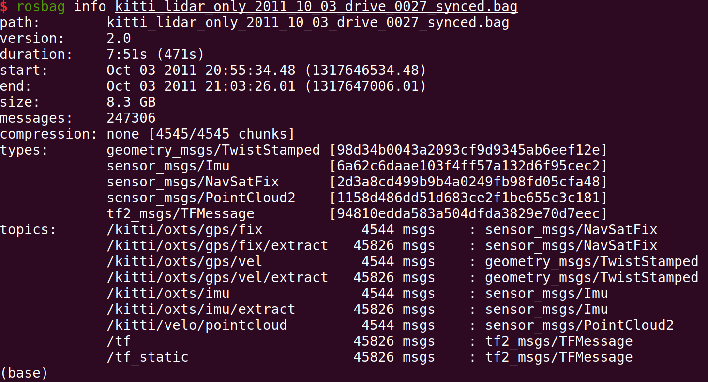
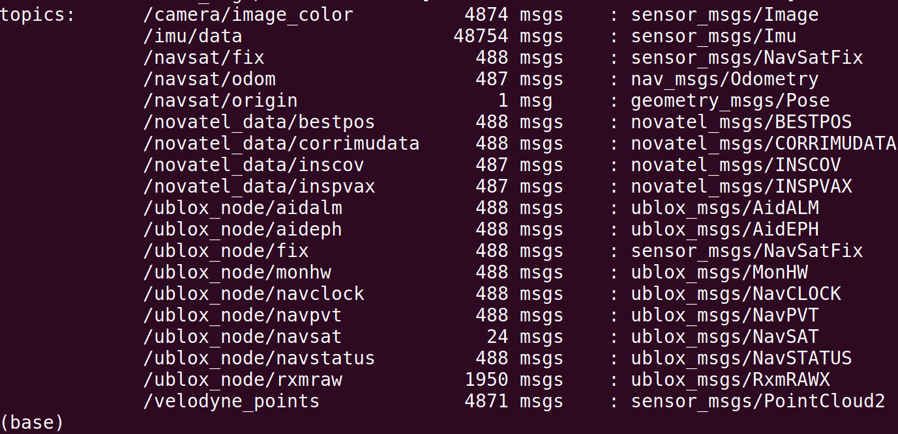
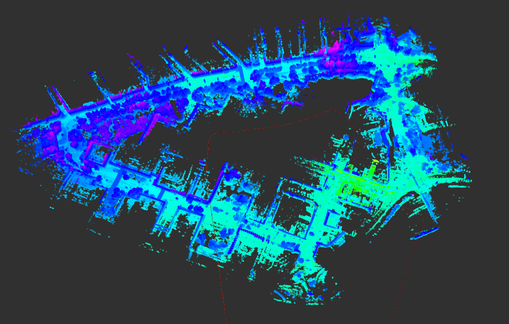
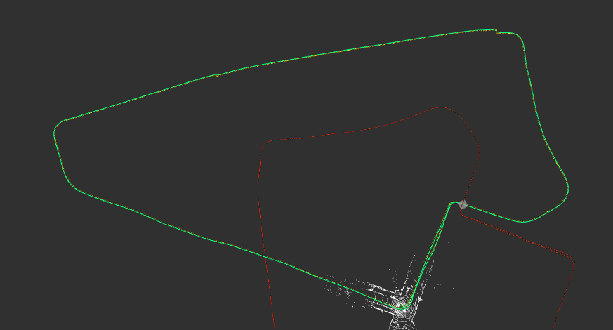
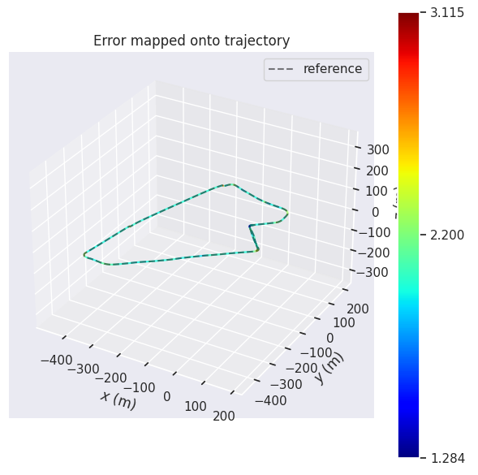
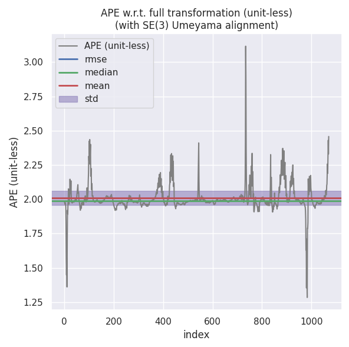
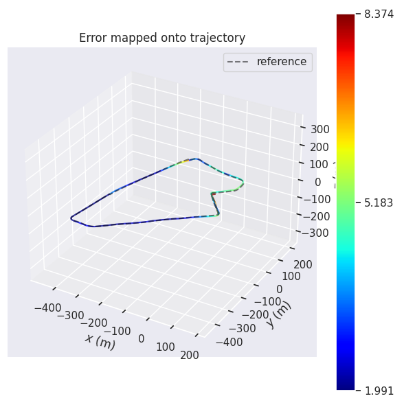
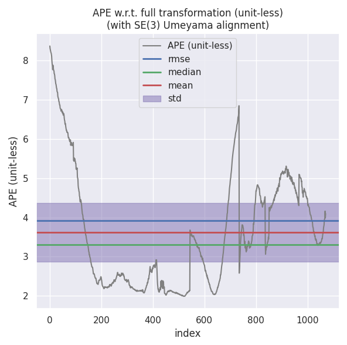

### <font color='green'>掌握在不同数据集上适配算法的能力，并理解不同数据的质量对算法效果的影响</font>

### <font color='blue'>新的数据集链接为：https://github.com/weisongwen/UrbanNavDataset，请根据链接中的readme了解数据构成以及使用方法，并下载数据。请结合课程工程代码，在该数据集上实现以下功能：</font>

### <font color='purple'>1，建图</font>

#### <font color='green'>使用新数据集，实现</font>

#### <font color='green'>1.1 测试基于“激光里程计+RTK位置”的建图（第4讲）</font>

#### <font color='green'>1.2 测试基于“使用预积分的融合”的建图（第9讲）</font>

#### <font color='green'>1.3 将两种方法结果与groundtruth对比，作精度分析</font>

### <font color='purple'>2，定位</font>

#### <font color='green'>使用新数据集，实现</font>

#### <font color='green'>2.1 测试不加融合的定位（第4讲）</font>

#### <font color='green'>2.2 测试基于滤波的定位（第7讲）</font>

#### <font color='green'>2.3 测试基于滤波+运动约束的定位（第8讲）</font>

#### <font color='green'>2.4 测试基于滑动窗口的定位（第10讲）</font>

#### <font color='green'>2.5 对比不同定位方法的精度</font>


#### [数据集链接](https://www.polyu-ipn-lab.com/download)

#### 数据集情况：

```bash
path:        2019-04-28-20-58-02.bag
version:     2.0
duration:    8:07s (487s)
start:       Apr 28 2019 20:58:03.04 (1556456283.04)
end:         Apr 28 2019 21:06:10.57 (1556456770.57)
size:        40.5 GB
```

### <font color='red'>特别说明</font>

####         数据集中的先验位置，有组合导航（诺瓦泰）和 gnss（ublox），另外还有一个低精度IMU。理论上，融合的时候应该使用 ublox、低精度 IMU 和 lidar 做融

#### 合，使用组合导航做groundtruth，这样对比的精度才更合理。但是， ublox 提供的是原始 renix 格式数据，而不是解算好的 RTK 位置。 要得到位置， 需要先使

#### 用 RTKLib 做一些数据处理， 但熟悉 RTKLib 要花一定的精力，而且要理解它又牵扯到 GNSS 的专业知识，这并不在我们的课程范围内。因此，大作业允许在融合

#### 的时候使用组合导航的位置代替 RTK 作为先验观测（但不允许使用组合导航的姿态参与融合， IMU 数据请使用数据集里的低精度 IMU），这会使融合比预期的

#### 好，并且会使精度分析环节得到的结论略有偏差（因为融合与 groundtruth 使用了同样的位置数据），各位可以忽略这方面的问题，把重点放在过程的掌握上。

#### 当然，我们并不排斥自己去做 ublox 数据的解算，以更严谨的方式做对比实验。

### <font color='red'>评价标准</font>

#### 1）及格：在新数据集上，任选一个场景（新数据集一共三个场景）完成 1.1、 2.1、 2.2、2.3 的测试；

#### 2）良好：在及格基础上，使用同一个场景数据，完成 1.2、 2.4 的测试；

#### 3）优秀：在良好的基础上，将测试范围扩大到全部三个场景，并完成不同场景、不同方法的精度分析（即 1.3、 2.5） 。


### 1）及格：

#### <font color='green'>1.1 测试基于“激光里程计+RTK位置”的建图（第4讲）</font>

#### 修改对应的代码框架文件：03-mapping-and-matching

#### <font color='red'>程序修改要点说明</font>

#### 1）数据订阅说明：

#### 主要对程序data_pretreat_flow.cpp进行修改：

#### 原rosbag的信息如下图：



#### 新rosbag的信息如下图：



#### 点云数据的topic由/kitti/velo/pointcloud替换为/velodyne_points。

#### imu数据的topic由/kitti/oxts/imu替换为/imu/data。

#### 速度数据虽然按照原来方式订阅，但是由于新的rosbag中没有相应的topic，所以不会订阅到，相关的使用速度数据的代码也做了修改。

#### 位置数据的topic由/kitti/oxts/gps/fix替换为/navsat/fix。

#### Lidar和IMU之间的位姿变换topic按照原来方式订阅，同样得不到有效的数据，将对应的解读数据的函数内容替换成新的数据集系统的Lidar和IMU外参。

#### 2）时间同步策略：

####          原KITTI数据集在数据预处理data_pretreat_flow.cpp中使用的点云，gnss和imu数据的频率都是10Hz。而UrbanNav数据集用于数据预处理的组合导航数

#### 据频率为1Hz，点云数据为10Hz，IMU为100Hz。 

####          按照对原来代码框架的理解，时间同步的关键参数有两个，一个是data_pretreat_flow.cpp中函数ValidData()里判断多个传感器数据是否同步的参数0.05，

#### 这里选用的是同步基准点云数据周期0.1s的一半，不需要修改。另一个参数是gnss_data.cpp和imu_data.cpp中数据同步函数SyncData中的参数0.2，这里的物

#### 理意义是相应数据周期的两倍，所以分别修改为2和0.02，对应于可以容忍的数据丢失个数。

#### 3）安装新的rosmsg类型novatel msgs

#### novatel msgs相关问题，用下面命令安装，注意修改为电脑对应的ROS版本。

```bash
2.1 测试不加融合的定位（第4讲）sudo apt-get install ros-melodic-novatel-msgs
```

#### 4）去除运动畸变

#### 采用速度信息进行运动畸变去除。

### 仿真结果：

#### 优化后的点云效果：



#### 优化后的轨迹效果：



#### 精度评估：

#### 使用如下命令：

```bash
evo_ape kitti ground_truth.txt optimized.txt -r full --plot --plot_mode xyz -a
```

#### 对optimized_odom进行评估：





```bash
2.1 测试不加融合的定位（第4讲）$ evo_ape kitti ground_truth.txt optimized.txt -r full --plot --plot_mode xyz -a
APE w.r.t. full transformation (unit-less)
(with SE(3) Umeyama alignment)

       max      3.115397
      mean      2.008470
    median      1.989222
       min      1.283760
      rmse      2.011232
       sse      4332.253587
       std      0.105379
```

#### 对laser_odom进行评估：





```bash
$ evo_ape kitti ground_truth.txt laser_odom.txt -r full --plot --plot_mode xyz -a 
APE w.r.t. full transformation (unit-less)
(with SE(3) Umeyama alignment)

       max      8.374424
      mean      3.622871
    median      3.310359
       min      1.990645
      rmse      3.917855
       sse      16439.409030
       std      1.491439
```

#### 从RMSE值可以明显看出，融合后的定位精度更高。


#### <font color='green'>2.1 测试不加融合的定位（第4讲）</font>


#### <font color='green'>2.2 测试基于滤波的定位（第7讲）</font>

#### 修改对应的代码框架文件：07-filtering-advanced

#### <font color='red'>程序修改要点说明</font>

#### 修改重力参数